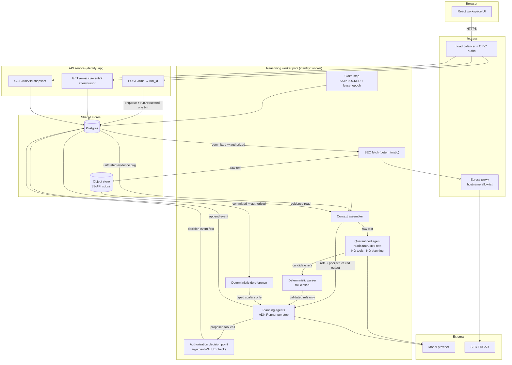

# Runtime architecture — Company Intelligence Desk

**Author(s):** eugenelim
**Status:** Draft — revision r6
**Last updated:** 2026-09-09
**Sign-off:** outstanding. Open gaps are recorded under *Known at ship*; the
Phase 0 spikes in *Rollout* gate ratification.
**Evidence:** [`prompt-injection-defence-survey.md`](../../product/research/prompt-injection-defence-survey.md)

> **Scope:** execution topology, data ownership, identity and authorization,
> injection defence, and the human approval gate. Four concerns are deferred to
> two commissioned companion documents — see *Scope*.

## TL;DR

Build a governed multi-agent research workbench where the application — not the
agent framework — owns run state, the event log, and the authorization boundary,
with ADK used as a step-level reasoning library behind a stable seam. Injection
defence is **structural, not detection-based**: every detection approach
*evaluated* in the published literature has lost under adaptive attack. No
impossibility result exists, so this is an empirical bet with a shelf life, not a
proof. The reader is asked to accept that ownership split and the structural
defence that follows.

## Context

Engineers evaluating how to build a governed multi-agent system have no
inspectable, production-shaped example to reason from. This project answers that
with a working diligence workbench: a user analyses one public company as of an
explicit date, and the workflow, evidence, agent context, policy decisions, and
evaluations are all open to inspection.

Ratified constraints (owner-set): containerized; React UI in a container separate
from the API; multiple workspace views; Storybook; **Google ADK** as the agent
runtime; deployed on **AWS**; **model access via workload identity with no static
API key**; an explicit context service; SEC filings as the initial evidence tier;
AWS services only where justified **and substitutable**; no unrestricted shell,
network, or infrastructure access for production agents.

**Portability is ratified.** The system must be deployable to another cloud with
bounded, known work. AWS remains the production target. This is *portable*, not
*simultaneously multi-cloud* — no cross-cloud replication or split-brain is in
scope.

### Scope

| Deferred concern | Owning intent | Companion |
| --- | --- | --- |
| Telemetry boundary, redaction, payload inlining | `governed-observable-and-evaluable-operation` | Observability + evaluation |
| Evaluation architecture, fixture versioning, release gates | `governed-observable-and-evaluable-operation` | Observability + evaluation |
| UI/API presentation contract, workspace IA, Storybook's role | `multi-workspace-inspectable-experience` | Experience / presentation |
| Approval UI surface | `multi-workspace-inspectable-experience` | Experience / presentation |

Seams those companions must respect: the **event log** is the observability
substrate; the **run state machine** carries human intervention; **typed
artifacts** are the presentation contract. The event *envelope* is specified here
because the stream is this document's own interface; only payload inlining and
redaction policy are deferred.

### Four grounded facts

**Detection-based injection defence does not survive adaptive attack.** Eight
defences on AgentDojo were bypassed at ASR above 50% (arXiv:2503.00061); in-band
detection "collapsed from near-zero to >90% success" (arXiv:2606.26479); six
production guardrails including Azure Prompt Shield and Meta Prompt Guard were
evaded at up to 100% (arXiv:2504.11168). Rated `[high]` in the survey across four
independent author groups.

**Structural defences held — Progent and ScopeGate under adaptive attack, CaMeL
largely statically — at `[moderate]` confidence.** Progent fell to 2.6% ASR under adaptive attack; ScopeGate allowed
0/29 unauthorised calls under a 40-iteration adaptive budget; CaMeL "practically
solves" AgentDojo security at a 7-point capability cost. **Every one of these is
evaluated by its own authors, and CaMeL largely statically. No disinterested
party has re-run any of them.** The survey's downgrade factor is *self-evaluation*
and this design does not claim more.

**The managed guardrail does not cover this workload class.** AWS states verbatim
on [`guardrails-use-converse-api`](https://docs.aws.amazon.com/bedrock/latest/userguide/guardrails-use-converse-api.html)
that guardrails do not evaluate tool-use fields — `toolResult` content,
`toolSpec.description`/`inputSchema`, and the model's generated `toolUse.input` —
and this holds for every filter type. Separately, AWS documents that Bedrock
*Agents* does not pass tool input and output through guardrails by default. AWS
publishes no accuracy figures for `PROMPT_ATTACK`; the only two evaluations in
existence were run by competing vendors.

**ADK has no native Bedrock path and an unstable session seam.** *Established by
reading the published source tree and release notes, not from documentation* —
the docs are silent on both. No `bedrock_llm.py` in the model registry; the only
route is `LiteLlm`, whose workload-identity path is documented only by LiteLLM.
`BaseSessionService` is a four-method ABC not presented as a public extension
point, and ADK 2.0 changed the `Event` schema with release notes stating custom
session storage requires updates.

## Goals and Non-goals

### Quality attributes, ranked

**Legibility as a reference implementation is a satisfaction condition, not a
ranked attribute.** A design that is correct but unteachable does not satisfy the
project's purpose: the charter commits the project to serve as an engineering
reference, and `adoptable-reference-implementation` owns that outcome. It is
therefore not traded against the four below — it gates them. Legibility is not a
fifth ranked attribute, and treating it as one would let it lose a trade it must
never lose.

The four attributes below *are* ranked, by business-importance ×
architectural-risk. The ordering is load-bearing — it is the stated reason two
alternatives are rejected.

1. **Inspectability / auditability** — it *is* the product; not retrofittable.
2. **Security of the untrusted-content and agent-authority boundaries** — no
   managed control covers it and detection will not either.
3. **Run durability** — tens of minutes, multi-agent, no-notice host replacement,
   at-least-once tool semantics.
4. **Portability through explicit contracts** — ratified; cheap at a seam.

### Goals

- **Reconstructable runs.** A reconstruction script rebuilds the published report
  from the event log alone, with no model calls, byte-matching on the claim set
  and evidence-locator set. *"Event log" means the `events` table plus the
  immutable payload objects its `payload_ref`s address.* Verified in Phase 1.
- **Claim provenance.** 100% of published claims resolve to an evidence item with
  a content-addressed locator, or to a deterministic calculation with recorded
  inputs. Zero unresolved claims is the release gate.
- **Host-loss survival.** A run whose worker is killed reacquires its lease within
  **2 × lease TTL + poll interval (≤ 150 s)** with no operator action. Verified by
  the Phase 1 kill test.
- **Stream continuity.** Across 100 forced disconnects — including tab reload and
  simulated sleep, **with concurrent writers active** — zero missed and zero
  re-applied events, by sequence-completeness assertion at the sink.
- **Replayable context.** The context package each step received is re-readable
  verbatim from the event log without re-running any model. *Replay, not
  re-execution.*
- **Provider portability.** Swapping the model provider changes one adapter behind
  `BaseLlm` and zero files under the domain package.
- **Cloud portability.** No AWS SDK import exists outside `adapters/`, proven by a
  dependency-direction test. Each managed dependency — ECS/Fargate, Postgres, the
  object store, ALB + OIDC, the egress proxy, the model provider — carries a
  written substitution note naming its GCP and Azure equivalent. Verified in
  Phase 1.
- **Bounded agent authority.** No tool invocation succeeds whose arguments fall
  outside the acting agent role's ceiling, **or** outside the initiating user's
  entitlements, **or** whose role ceiling is not a subset of its parent's.
  Verified by an authorization suite including well-typed unauthorised calls.
- **Attributable action.** 100% of tool invocations record run, step, acting agent
  role, and initiating user principal, with a policy decision event. Absence of a
  decision event fails the run.

### Non-goals

- **A general-purpose agent platform.** One execution plane; ingestion is a named
  future plane with a defined seam.
- **Exactly-once tool execution.** ADK resumability is at-least-once; idempotency
  keys instead.
- **Agent-authored UI.** Typed domain artifacts only.
- **Multi-tenant isolation in MVP.** Single-tenant, single-operator; workspace is
  an organizational scope, not a security boundary. Load-bearing: it is also why
  authorization is coarse and self-approval is the default.
- **Detection-based injection defence.** Excluded on evidence. Cheap local checks
  are a layer, never the boundary.
- **Prompt and context caching.** Deliberately unused because it makes stating
  what context a step received harder. Costs concurrency headroom, not only money
  — caching reduces the input term deducted from the token bucket at request
  start.

## Proposal

### Ownership split

The application owns the run: state machine, durable event log, checkpoints, and
authorization decisions. ADK is invoked *inside a step* and is never the system of
record for anything a user inspects.

### Two execution planes

MVP builds the **reasoning plane**; ingestion is deterministic fetch code invoked
by the worker. The plane boundary — a worker consuming typed work items and
writing evidence through the same store contracts — is where an ingestion agent
attaches later.

### Structure



Six things carry the design.

**The stream reads the log, not the worker.** `SSE` is a cursor-served projection
over committed events, so run duration and stream-session duration are
independent and no ingress limit constrains run length. This converts the
undocumented ALB client-keepalive behaviour from a design risk into a reconnect.

**The quarantined agent emits references only.** `QA` reads raw filing text and
holds **no tools and no planning authority**. It returns *symbolic references* and
*closed-vocabulary classifications* — never free prose.

**What a planning agent may receive — the boundary's actual guarantee.** Three
things and nothing else: symbolic references, closed-vocabulary labels, and
**typed scalars** (decimals, dates, enumerated units, content-addressed
locators). `DEREF` is deterministic code outside any model and its output domain
is type-restricted; a free-text value cannot cross even as a "resolved value" or
a "prior structured output", which is the indirect path that would otherwise
reopen the boundary through Postgres.

The scalar channel is load-bearing, not a concession: without it the brief's
deterministic financial calculation and its competing interpretations have no
data path at all. The precise guarantee is therefore *"a planning agent receives
no attacker-authored **free text**"* — **not** *"no attacker-influenced signal"*.
See *Named residual risks* for what that distinction leaves open.

**The handoff is validated by a parser, not by an instruction.** `PARSE` is
deterministic and fail-closed: non-conforming `QA` output fails the step. It is
*not* enforced by `output_schema`, which ADK's own documentation says "may not
work reliably" on non-Gemini models — a security control must not rest on a
mechanism its vendor calls unreliable.

**The context assembler is constrained.** It may place untrusted evidence text
only in `QA`'s package. `PA` packages carry references, closed-vocabulary labels,
and typed scalars — the same three admitted across the boundary, so re-assembly
from stored state cannot widen what a planning agent sees.

**Authorization checks argument values, not schemas.** `PDP` policy lives outside
any model's context window. Checking tool names and argument *types* is the
documented anti-pattern — LangChain, LlamaIndex, and the Stripe Agent Toolkit all
do it, and a well-typed but unauthorised call is executed.

**The decision event commits before the action.** `PDP` is not a fork. The
`policy.decision` event must commit *before* the authorized invocation is issued;
a failed decision append is a **denial, not a retry**. Otherwise an action can
take effect while its decision record is lost, which would make the
attributable-action goal measure below 100% for reasons that are correct
behaviour.

**The worker leases steps; it does not own runs.** Fargate replaces hosts with no
notice, caps graceful shutdown at 120 s, and never replaces standalone tasks.

### Injection defence

Two threat classes with **different controls**.

**Retrieved filing content (indirect).** Filings are written by the entity under
analysis. Control: the quarantine boundary. Untrusted text never reaches an agent
that can act, and never crosses as prose.

*How filing-language change analysis survives this.* The brief requires detecting
material wording changes. Under references-only, the diff between two filing
sections is computed **deterministically**, stored as its own evidence item with a
content-addressed locator, and `QA` returns a reference to that diff plus a
classification drawn from a **closed vocabulary** (e.g. `risk-factor-added`,
`litigation-language-strengthened`). A fixed enumeration is not attacker-
controlled text; free prose would be. The capability is preserved; the boundary
holds.

**User prompt (direct).** The user's text legitimately *is* the instruction, so
"treat as data" is unavailable. Control: authorization bounds — what an agent can
be persuaded to attempt is bounded by what it is permitted to do, with policy
outside the model context, deterministic and fail-closed.

**Cheap local checks are a layer, not the boundary.** Tool-result protocol
validation, structural anomaly detection on retrieved chunks (entropy, repeated
n-grams, character runs, size caps), and YARA code-injection patterns are
implemented directly. Free, model-free, catch unsophisticated attempts. Not
described as closing anything.

**Named residual risks.** Compositional authorization across turns is unsolved in
the literature. A quarantined model may be induced to forge references. No
structural defence has been tested under an unlimited adaptive budget. No
benchmark exists for long-document financial filings — this system's exact
workload class. All carried in *Risks*, none mitigated into invisibility.

### Event log and stream mechanism

**Per-run monotonic sequence allocated inside the append transaction.** A
`bigserial` is allocated before commit, so with concurrent writers a reader can
observe event 105 while 104 is uncommitted and skip 104 forever. Each event's
`seq` instead comes from a per-run counter updated in the same transaction.

There are **two append paths**, and `next_seq` is never bumped outside them.

*Worker path* — fenced, for step-scoped events:

```
BEGIN;
  SELECT 1 FROM steps WHERE step_id = $1 AND lease_epoch = $2 FOR UPDATE;
  -- zero rows ⇒ fenced ⇒ ROLLBACK, abort with no ADDITIONAL side effects
  UPDATE runs SET next_seq = next_seq + 1 WHERE run_id = $3 RETURNING next_seq;
  INSERT INTO events (...) VALUES (...);
COMMIT;
```

*Run-lifecycle path* — unfenced, `step_id` null, used by `api` for
`run.requested` and `run.cancelled`, which are appended before any step exists:

```
BEGIN;
  UPDATE runs SET next_seq = next_seq + 1
   WHERE run_id = $1 AND state NOT IN ('completed','failed','cancelled')
   RETURNING next_seq;
  -- zero rows ⇒ already terminal ⇒ ROLLBACK; a late cancel is a no-op
  INSERT INTO events (step_id = NULL, ...) VALUES (...);
COMMIT;
```

The terminal-state guard matters because the stream closes on a terminal event: a
`run.cancelled` committing after `run.completed` would be invisible to every live
client while present in the log, which is a reconstruction divergence rather than
a cosmetic one.

**Lock ordering: `steps` before `runs`.** Both this and fence-before-allocate
follow from one property — **the `runs` row lock serializes appends per run, so it
must be taken last and held briefly.** Taking it before the fence would hold it
across a wait on `steps` and invert the order against the worker path, risking
deadlock; taking it inside the same transaction as the `INSERT` is what makes a
rolled-back append leave no hole. (Note the hole is impossible *here* precisely
because `next_seq` is a row `UPDATE` that rollback undoes — unlike the `bigserial`
rejected above, whose allocation survives rollback.) Deadlock (40P01) is retried
with backoff.

**The client owns the cursor; the server prefers `Last-Event-ID`.** EventSource's
automatic reconnect re-requests the original URL with a now-stale `after=` while
also sending `Last-Event-ID`, so the server uses `Last-Event-ID` when present and
falls back to `after=`. The client persists its own cursor and reopens explicitly.

**The sink is idempotent** on `(run_id, seq)`.

**Event envelope.**
`{schema_version, run_id, seq, occurred_at, type, step_id?, agent_role?, principal, payload_ref}`.
`step_id` and `agent_role` are null for run-lifecycle events. Payloads are
references to immutable objects; what may be inlined and under what redaction
belongs to the observability companion.

**Liveness and termination.** `:keepalive` every 15 s; a terminal
`run.completed` / `run.failed` / `run.cancelled` event closes the stream.

**Retention.** The event log and its payload objects are retained for the life of
the published report, with no expiry in MVP — the reconstruction goal and the
brief's cross-period comparison both depend on it. A client that has been
disconnected long enough to be uncertain of its cursor calls
`GET /runs/{id}/snapshot → {state, as_of_seq}`, discards local state, and resumes
at `as_of_seq`. No cursor is refused on age; nothing is deleted.

### Step execution: claim, commit, work

Row locking and lease expiry are different mechanisms. A row lock held across a
multi-minute step would pin an idle-in-transaction connection, hold `xmin` back,
and block vacuum on the event-log tables.

1. `SELECT … FOR UPDATE SKIP LOCKED` selects one runnable step; stamp `owner`,
   increment `lease_epoch`, set `lease_expires_at`; **commit immediately**.
2. Execute outside any transaction.
3. Heartbeat-renew at **TTL/3**. With **TTL = 60 s**, heartbeat every 20 s and
   poll interval 30 s, worst-case reacquisition is 150 s.

**Renewal is fenced.** Without it a partitioned-but-alive worker could renew a
lease it no longer owns:

```sql
UPDATE steps SET lease_expires_at = now() + interval '60 seconds'
 WHERE step_id = $1 AND lease_epoch = $2 AND owner = $3;
-- zero rows ⇒ fenced ⇒ abort
```

**A fenced worker aborts without *additional* side effects.** It may already have
invoked a tool; attribution is at the logical-invocation level and idempotency
keys dedup re-execution.

**Graceful shutdown.** On `SIGTERM` the worker sets `lease_expires_at = now()`
and exits, so planned replacement recovers in one poll interval.

### Run state machine

The run state is a **projection over concurrent steps**, not a step scheduler; a
run may have several steps in flight.

| From | To | Trigger | Event |
| --- | --- | --- | --- |
| — | `requested` | user starts a run | `run.requested` |
| `requested` | `claimed` | first step leased | `run.claimed` |
| `claimed` | `running` | first step begins | `step.started` |
| `running` | `awaiting_approval` | pre-release check fails | `approval.requested` |
| `awaiting_approval` | `running` | approver returns for revision | `approval.rejected` |
| `awaiting_approval` | `completed` | approver publishes | `approval.granted` |
| `awaiting_approval` | `expired` | `approval_timeout` elapsed | `approval.expired` |
| `expired` | `awaiting_approval` | approver reopens | `approval.reopened` |
| `running` | `completed` | all checks pass | `run.completed` |
| any non-terminal | `failed` | unrecoverable error | `run.failed` |
| any non-terminal | `cancelled` | user cancels | `run.cancelled` |

Terminal: `completed`, `failed`, `cancelled`. `expired` is **non-terminal** and
has real exits — an approver reopens it, or the "any non-terminal" rows cancel or
fail it. A timed-out approval is recoverable, never silently discarded.
`approval_timeout` defaults to **none** in MVP.

### The approval gate

**A run whose checks all pass publishes automatically.** The human gate applies to
*flagged* output: a failed pre-release check holds for approval rather than
publishing a silently weakened analysis or discarding a sound run over one
unresolved claim.

**This narrows a charter claim.** RFC-0001 principle 3 currently reserves
"approvals, publication, policy exceptions" to humans. As designed, publication is
automatic on a clean run. The principle should be amended to reserve *approval of
flagged output* — see *Charter amendments*.

**Separation of duties is configurable.** `require_distinct_approver` defaults to
`false` for the single-operator MVP. Both the flag state and the approver
principal are recorded.

**Escalation is a calibration target, not a release gate.** Oversight has finite
capacity: reviewer agreement on what is risky is moderate (κ = 0.52) and safety
follows an inverted-U against escalation rate, which adversarial flooding can
exploit. The literature suggests **5–15%**, from an author-run study of 125
hand-labelled actions — `[moderate]`, and too thin to gate a
release on. It is recorded as a target, measured over a rolling 30-day window with
a minimum of 50 runs before the figure means anything.

### Identity — two layers

**Layer 1 — workload identity (component → platform).** Roles are the model; the
AWS column is the current binding.

| Component | Model provider | Postgres | Object store | SEC egress | Secrets |
| --- | --- | --- | --- | --- | --- |
| `api` | **none** | read all; write `runs` (incl. `next_seq`), `steps` enqueue, run-lifecycle `events` | read artifacts | none | own DB credential path |
| `worker` | invoke + invoke-stream on named models | read/write runs, steps, context, evidence; `events` **except** `policy.decision` | read/write evidence + artifacts | via proxy only | own DB credential path |
| `policy-writer` | none | `runs.next_seq` bump + insert `policy.decision` events **only** | none | none | own DB credential path |
| `egress-proxy` | none | none | none | allowlisted hostnames | own TLS material |
| `ui` | none | none | none | none | none |
| `ingress` | none | none | none | none | OIDC client secret |
| `migration` | none | DDL + DML on tables under active migration | none | none | own DB credential path |
| `policy-author` | none | write agent-role and entitlement tables | none | none | human-operated |

**Least privilege on Bedrock has a shape that is not obvious, established by
Phase 0 experiment.** A `us.`-prefixed inference profile is *cross-region*:
authorization for the underlying foundation model is evaluated in the region
Bedrock **routes to**, not the one called. So the `worker` policy may pin the
inference-profile ARN to the calling region, but the foundation-model ARN must
stay region-wildcarded, and an `aws:RequestedRegion` equality condition **denies
the call outright**. Both tightenings look correct and both break invocation.
Recorded because it is the kind of detail that reads as a permissions bug two
days into a build.

`api` holds no model authority — compromising the internet-facing component
yields no model access. `policy-author` is **human-operated; no runtime identity
holds it.**

**Enforcing the `policy.decision` split — invariant here, mechanism elsewhere.**
The invariant this design commits to: *the database role that writes a
`policy.decision` event is not the role that performs the worker's general
writes, and no runtime identity holds both.* Postgres has no row-value-level
grant, so this requires a privilege model — grantees, `SECURITY DEFINER`
ownership and `search_path`, and which process authenticates as which role. That
model belongs in a schema/privilege spec, not in an architecture document, and it
is **proven by an executable Phase 0 test** — a `worker`-role session attempting
`INSERT INTO events (type='policy.decision')` and being refused — not by prose
review.

**The constraint is symmetric.** No role holds an unqualified `events` insert.
`api` is restricted to the run-lifecycle types it actually needs
(`run.requested`, `run.cancelled`), `worker` to its step-scoped types, and
`policy-writer` to `policy.decision` alone. An internet-facing component able to
write a policy decision would defeat the split entirely, so `api` is constrained
by the same mechanism rather than trusted.

**What the split does and does not buy.** It separates **recording** authority,
never **decision** authority: the worker still makes the call at `PDP`. It defends
against a bug or partial compromise in any single write path forging a decision.
It does **not** defend against full compromise of the `worker` process, which
legitimately holds the credential that reaches `PDP`.

On AWS, denying a model requires denying **both** `bedrock:InvokeModel` and
`bedrock:InvokeModelWithResponseStream`; grants must name the **inference-profile
ARN and the underlying foundation-model ARN in every destination Region**. Bedrock
long-term bearer API keys create a static IAM user credential and are denied.

**Workload identity is abstracted behind a `CredentialProvider` seam** — ECS task
role, GCP Workload Identity, and Azure Managed Identity all provide ambient
credentials but acquire them differently. The `ingress` OIDC client secret is
**outside this seam** — it is a static credential with its own rotation owner,
named in Open Questions.

**Layer 2 — principal identity (user → run → agent role → tool call).** An
**agent role** is a first-class security object: a named, versioned record
declaring a tool allowlist with per-argument value constraints, stored outside any
model's context and assigned by the orchestrator, never by a model.

```
authorized ⟺ args ∈ agent_role.ceiling
           ∧ args ∈ initiating_user.entitlements
           ∧ agent_role.ceiling ⊆ parent_role.ceiling
```

**Base case:** the root coordinator's ceiling is bounded by the initiating user's
entitlements at run start.

**Decidability.** Value constraints are restricted to a decidable fragment —
closed enumerations, string prefixes, numeric ranges, and set membership — and are
a **conjunction of independent per-argument predicates**. No disjunction and no
cross-argument relation is expressible; that closure property is what makes
per-attribute structural containment decidable and set-theoretically sound, since
disjunction would let a structural check authorize calls outside the parent's
ceiling.

**Set-level soundness is not semantic safety, and the gap is in the prefix
constructor.** Containment proves a value lies inside the declared ceiling. It
does not prove the value means what the ceiling's author intended, because a
*prefix* predicate over an argument the callee **interprets** admits an
attacker-chosen suffix: a `https://www.sec.gov` prefix matches
`https://www.sec.gov.attacker.example/`, and a path prefix matches a traversal
beyond its root. Both pass containment and both report sound. This bites
directly — the SEC egress allowlist is hostname-based and tool arguments carry
URLs and content-addressed locators.

The fragment must therefore either **exclude prefix constraints on any argument
whose consumer parses it**, or constrain such arguments *after canonicalisation
against the interpretation the callee performs*. This is unresolved and is a
Phase 0 deliverable: the containment property test must include an
interpreted-argument case, not only a well-typed unauthorised call. `initiating_user.entitlements` is expressed in the same fragment, which
the base case requires — it is itself a `⊆` check. A role version in use by an
in-flight run is immutable; `policy-author` writes create new versions that bind
only at the next spawn, so a recorded containment proof cannot go stale
mid-run.

`⊆` is computed at spawn time and recorded as an event. The containment algorithm
itself belongs in the spec, with a property test over the fragment as its
evidence.

### Authentication and authorization

OIDC at the ingress; a single authenticated operator principal in MVP; every run
stamped with its initiator; the event log recording the principal on every policy
decision and human action. Workspace is an organizational scope, not an isolation
boundary. Adding a second user with narrower rights is a change to *authorization*
configuration — **tenancy isolation does not exist and would be new work**.

### Object store contract

Portability requires pinning the API subset implemented across S3, GCS, Azure
Blob, and MinIO: `PUT`, `GET`, `HEAD`, `DELETE`, `LIST` with prefix, plus
server-side encryption at rest. No S3-specific feature may become load-bearing.

### Trust boundaries

Seven boundaries are crossed.

**User → application.** OIDC-authenticated. The user prompt is trusted *as
instruction* and bounded by entitlements, not screened. This is where direct
injection enters and where the authorization control applies.

**Untrusted evidence → quarantined agent.** Filing text enters `QA`, which holds
no tools and cannot plan.

**Quarantined agent → planning agents.** Only validated symbolic references and
closed-vocabulary classifications cross, via a deterministic fail-closed parser.
Residual risk: a quarantined model induced to forge a reference. Partially
mitigated by resolving every reference against the evidence store; a reference
that does not resolve fails the step.

**The model never produces a reference.** A deterministic semantic pipeline runs
*before* the quarantined agent and produces the candidate set: XBRL facts from
`companyfacts`, parsed table cells with their coordinates, and section
boundaries. The quarantined agent's job shrinks to **selecting and labelling
among candidates that already resolve** — it cannot emit an identifier the
pipeline did not mint.

This is the difference between detecting a forged reference and making forgery
unrepresentable. Phase 0 tested the weaker construction, in which the agent
emitted anchors and a parser rejected the ones that failed to resolve; 1 in 8
were fabricated with no adversary present. Under the pipeline-first
construction that failure mode does not exist, because there is no free-text
reference for the model to invent. The same structural-over-detection argument
the design makes at the outer boundary applies here, and applying it also makes
the quarantined agent's task small enough for a light model.

**Quantitative claims cross as XBRL fact references, not prose quotes.** Phase 0
ran the boundary against a real 10-Q and found that a verbatim-substring anchor
**cannot resolve a fact assembled from table cells** — `effective tax rate`,
`17.9` and `16.4` each appear in the filing, but only as separate cells, so the
quoted anchor matches nothing. Financial filings put their most material
quantitative facts in tables, so a prose-quote reference type systematically
drops precisely the figures this product exists to analyse. XBRL facts are
already tagged, identified and individually addressable, which makes them
deterministically resolvable; SEC publishes them through `companyfacts`, already
reached by the ingestion tiers above. Prose quotes remain the right reference for
narrative claims.

The same run saw the quarantined agent emit one anchor appearing **nowhere** in
the document — the forgery risk above, occurring at 1 in 8 with no adversary
present, and correctly rejected. The parser behaved as specified; the cost is
that true observations are dropped alongside fabricated ones.

**Agent → tool authority.** Argument-value authorization at `PDP`.

**Worker → model provider.** Workload identity only.

**Worker → SEC EDGAR.** Via the egress proxy, hostname allowlist, SEC-compliant
user agent, rate limiting, bounded retry. Three Phase 0 findings shape this
boundary; see
[`sec-edgar-access-policy.md`](../../product/research/sec-edgar-access-policy.md).

**Discovery is batch, not web — and the right batch is small.** SEC publishes
bulk archives and index files precisely so consumers do not crawl. But "use
bulk" is not one decision: the published artifacts span four orders of
magnitude, measured 2026-09-11.

| Tier | Artifact | Size | Used for |
| --- | --- | --- | --- |
| 1 | `company_tickers.json` | 0.2 MB | ticker → CIK, cached, refreshed rarely |
| 2 | `daily-index/…/master.<date>.idx` | 0.1 MB | what was filed that day |
| 3 | `data.sec.gov/submissions/CIK….json` | small | one filer's history |
| 4 | the filing document itself | ~1 MB | the analysis |
| — | `submissions.zip` + `companyfacts.zip` | **~3 GB nightly** | **not used** |

**The whole-market archives are out of scope by construction.** This system
analyses *one company at a time*;
[`evidence-backed-company-diligence`](../../product/intents/evidence-backed-company-diligence.md)
§ Excluded bars multi-company and portfolio-level analysis outright. Ingesting
every filer nightly — ~1.1 TB/year of transfer — to serve single-company
analysis would be buying whole-market coverage the charter refuses. Tiers 1-4
total well under 2 MB for a typical run.

A design that discovers by walking the site meets the rate limit within about a
minute — Phase 0 did — while one that reads a 0.1 MB daily index never
approaches it.

**Freshness comes from per-company polling, not from the market-wide feed.**
There is no push, webhook, or streaming for a non-PDS consumer, and the paid
Public Dissemination Service is not the answer: SEC states filings are available
on its website *before* reaching PDS, so the free surface is the faster one.
Among polling surfaces, `data.sec.gov/submissions/CIK….json` is documented as
sub-second, carries no window, and is not on a robots-disallowed path — unlike
the `cgi-bin` latest-filings Atom feed, which is. That feed is also bounded at
100 entries, which Phase 0 measured as covering only **1.7 hours** at ~58
filings/hour, with the horizon shrinking exactly when filing activity peaks. It
is therefore unusable for completeness; the daily index, bounded by the day
rather than an entry count, supplies that instead.

**As-of dating uses the filing date, never the acceptance timestamp.** Regulation
S-T Rule 13(a)(2) deems a transmission begun after **17:30 ET** to be filed the
*next business day* (22:00 ET for Forms 3/4/5 under Rule 13(a)(4)). A document is
therefore publicly readable hours before the date it legally bears, and an
as-of-dated analysis that timestamps evidence by acceptance or retrieval would
attribute it to the wrong day.

**Ingestion is scheduled; a run reads the store. Live fetch is not on the
request path.** Four reasons, and the first is the one that actually decides it:

1. **An as-of analysis cannot be built from a live pull.** The evidence snapshot
   pins the *universe of retrievable evidence* at a moment.
   [`scoped-context-and-evidence`](../../product/intents/scoped-context-and-evidence.md)
   is falsified by "a declared scope that resolves to a different set of
   retrievable evidence on re-resolution while its evidence snapshot is held
   fixed" — which is precisely what fetching at query time produces.
2. **The data is daily.** Filings are discrete events disseminated on a business
   calendar, not a stream. There is nothing for an intra-request fetch to gain.
3. **It would couple user-facing latency and availability to a third party**
   that rate-limits and blocks. A failed fetch is a failed run with a recorded
   cause — correct, and not something to put in front of a user on every run.
4. **The rate limit is aggregate.** Concurrent runs fetching live contend for one
   10 req/s budget; scheduled ingestion spends it once, off the request path.

So live fetch is confined to two jobs, both outside a run: building or
backfilling the corpus, and acquiring a specific document not yet ingested.
**This reframes recorded-fixture replay** — it is not merely a convenience for
contributors without cloud access, it is the same mechanism the production
ingest path uses, exercised with a different corpus.

**The rate limit is enforced centrally, in the application.** SEC's cap is
*"10 requests per second regardless of the number of machines used to submit
requests"* — an aggregate obligation on the user, not on the host. A per-worker
limiter cannot satisfy it and no network topology enforces it, so the shared
token bucket sits in the egress path ahead of every worker.

**A compliant user agent is necessary and not sufficient.** Phase 0 saw EDGAR
return 403 to correctly-formed user agents while the address was rate-blocked —
including on static pages, since the block is address-scoped. It cleared on its
own, consistent with SEC's documented ten-minute cooldown. The declared contact
is what lets a publisher attribute traffic and contact the operator rather than
blanket-block; it is supplied at runtime and is never a maintainer's personal
identity. A run whose fetch fails is a failed run
with a recorded cause, never one proceeding on partial evidence.

**Run → published output.** Automatic on a clean run; held for approval when
flagged.

### The model-provider seam

`BaseLlm` is the portability contract — `generate_content_async` is its only
abstract method. Behind it the MVP hypothesis is **LiteLLM**, chosen for provider
fan-out: under a portability constraint, model access must reach Bedrock, Vertex,
and Azure OpenAI behind one seam. Falsifiable and spiked before ratification; the
fallback is an application-owned Converse adapter behind the same seam.

### Local development — recorded-fixture replay

The charter promises a containerized local-development path, and the MVP requires
a real model call. A contributor without cloud access runs the system in
**fixture mode**: a `BaseLlm` adapter replaying recorded model responses, and a
fetch adapter replaying recorded filings, both keyed by content hash.

Everything else runs for real — orchestration, the work table and leases, the
event log, the stream, the quarantine boundary, authorization, the UI. Only the
two external boundaries are replaced, and both already sit behind adapters, so
this is wiring an existing seam rather than new machinery.

Two properties make this more than a convenience. The event log already makes
runs replayable, so a recorded fixture is the same artifact the reconstruction
goal depends on. And the fixture corpus is the substrate the **evaluation
companion** needs for regression fixtures — building it here means not building it
twice.

A fixture run is stamped as such in the run header's producer tuple, so a fixture
result can never be mistaken for a live one.

### Context, evidence, and reproducibility

The context service is an application capability, not ADK's `SessionService`.

**An evidence snapshot is an immutable, content-addressed manifest.**
`snapshot_id = hash(sorted set of evidence content hashes)`, recorded on the run at
start. An amendment creates a *new* snapshot historical runs never see. Locators
address content hashes, not document positions.

**The run header records the producer.** `{model_id, model_version,
inference_profile, temperature, top_p, max_tokens, prompt_template_version,
tool_manifest_hash, agent_role_version, context_assembler_version,
app_image_digest, fetch_adapter, model_adapter}`. The two adapter fields record
whether each external boundary is live or replaying, which is what distinguishes
a fixture-mode run from an evaluation run — see
[`observability-and-evaluation.md`](observability-and-evaluation.md)
§ Fixture sets and comparability. A re-run whose tuple differs is labelled **divergent**.

**Private model reasoning is not stored.** Chain-of-thought and deliberation
traces are never written to the event log or the evidence store, so there is no
servable location holding them. Charter principle 4 bounds inspection to exclude
them, and the boundary is a storage property rather than a filter applied on
read.

**Reproducibility means replay, not re-execution.** Step *N*'s context is
assembled from step *N−1*'s output; sampling is non-deterministic and specialists
interleave, so the snapshot pins the *universe* of retrievable evidence, not the
*selection*.

### Charter amendments — applied

This design required two charter amendments. **Both are ratified**, so the
charter and this design now agree:

- **Principle 7** — the heading now reads *"Auditable replay and evaluation by
  construction"*. The body was already accurate.
- **Principle 3** — *publication* narrowed to *approval of flagged output*;
  a run passing every check publishes automatically.

A third amendment records that legibility is a satisfaction condition gating the
ranked attributes above, not a fifth tradeable one.

### Capacity

| Component | vCPU each | Count | Total |
| --- | --- | --- | --- |
| Reasoning worker | 2 | 2 | 4 |
| API | 0.5 | 2 | 1 |
| UI | 0.25 | 2 | 0.5 |
| Egress proxy | 0.25 | 2 | 0.5 |
| **Steady-state subtotal** | | | **6.0** |
| Migration (transient, deploy-time only) | 0.5 | 1 | +0.5 |
| **Rolling-deploy peak** (200% of steady state) | | | **13.0** |

**The AWS On-Demand Fargate default is 6 vCPU per Region, so on a default
account steady state sits *exactly* at the quota with zero headroom — and a
rolling deploy needs 13.** Where that default applies, a quota increase to
**16 vCPU** (peak plus margin) is required before Phase 1.

**This table is a Phase 1 ceiling, not a starting shape.** Phase 0 provisions
the minimum that runs the spike in question — a single task, fractions of a
vCPU — and capacity grows to the table above only when a real workload needs it.
Sizing to the ceiling early buys nothing and spends continuously.

**Verified 2026-09-10:** in the target account the Fargate On-Demand vCPU quota
is already **4000**, so no increase is needed there. That is a property of that
account, not of the design: moving to a fresh account reinstates the 6 vCPU
default and the increase becomes a Phase 1 precondition again.

**Egress topology: task-assigned public IP, not a NAT gateway.** A NAT gateway
costs ~$36/month fixed at this duty cycle against ~$0.15/month for a public IP on
the task — about 240× — and buys a stable address no publisher has asked for.
Because SEC's limit is aggregate rather than per-host, address determinism does
not satisfy it; the central token bucket above does. NAT-plus-Elastic-IP is the
escalation if a correctly-behaved client is ever blocked, and it must then be a
*zonal* gateway: the regional gateway's automatic mode lets AWS manage addresses
and would silently break any allowlist. Grounded in
[`aws-egress-addressing.md`](../../product/research/aws-egress-addressing.md).

**Concurrency ceiling: 2 sequential-only runs; 1 when a run fans out to two
specialists.** One step in flight per worker is a pool-sizing choice, not an
ordering requirement — ordering comes from `runs.next_seq`.

`max_tokens = 4096`: `input + max_tokens` is deducted from the token bucket at
request start and output burns at 5–15×, so an oversized value silently collapses
concurrency. Whether compute or the token bucket binds first cannot be asserted
without the account- and Region-specific TPM quota, which AWS does not publish
generically; it is read from Service Quotas and recorded in Phase 1.

## Alternatives Considered

### ADK-owned orchestration

Uses the framework as intended and builds substantially less. **Rejected because**
it binds the inspection surface — quality attribute 1 — to `BaseSessionService`,
which ADK does not present as a public extension point and which ADK 2.0 has
already broken.

### Step Functions as orchestrator

AWS-native durable execution with documented persistence and exactly-once
semantics. **Rejected because** state payloads cap at 256 KiB and history at
25,000 events, both unraisable, and agent transcripts cross both — and redrive
requires history below 24,999, so an execution that failed *because of* the cap
cannot be redriven. Also AWS-only, which portability independently forecloses.

### AgentCore Runtime

The shortest path from ADK to production on AWS. **Rejected because** it has no
documented checkpoint or replay, so durability would rest on an undocumented
property; and a managed agent platform makes core behaviour inseparable from AWS.

### Per-run Fargate task

**Rejected because** standalone tasks are never replaced by ECS and hosts are
replaced without notice, so a run losing its host stops with no recovery and no
signal.

### SQS between API and worker

**Rejected because** the work item and its first event must commit atomically.
Postgres gives that in one transaction; SQS cannot without an outbox. Accepted
costs: poll interval is a latency floor, and there is no DLQ primitive — the
lease-expiry counter plays that role.

### WebSocket instead of SSE

**Rejected because** the transport is one-directional here, so WebSocket adds a
stateful connection without adding a capability; and API Gateway WebSocket's hard
29-second integration timeout would force backend pushes through `@connections`.

### Detection-based injection defence

A guardrail component at the tool-result boundary — what most comparable systems
do, and the intuitive answer. **Rejected because** every
detection approach *evaluated* in the literature has lost under adaptive attack;
most of the open-source ecosystem is archived; two of the best-known models
contain no injection detection at all; vendor accuracy does not replicate; and the
AWS baseline publishes no figures while its only two evaluations were run by
competitors. Cheap local checks are retained as a layer.

## Risks

- **The LiteLLM workload-identity hypothesis is falsified.** *Mitigated* by the
  `BaseLlm` seam and a Phase 0 spike.
- **LiteLLM is a supply-chain surface in the model hot path.** 1.82.7–8 shipped
  unauthorized code. *Mitigated* by exact pinning; *accepted* for fan-out.
- **ADK breaking-change velocity.** 2.0 *silently ignores* 1.x custom-agent
  overrides. *Mitigated* by pins and contract tests at both seams.
- **At-least-once tool execution on resume.** *Mitigated* by idempotency keys.
- **A quarantined agent induced to forge references.** *Partially mitigated* by
  resolving references against the evidence store. *Named, not solved.*
- **The reference-selection channel.** A closed vocabulary bounds the *alphabet*,
  not the *channel*. Which references `QA` returns, in what order, and which of
  the enumerated labels it attaches are all attacker-influenceable — several bits
  per step into a planning agent's context. Reference resolution detects forged
  references, not steered-but-valid ones. *Unmitigated and unmeasured.*
- **CaMeL's capability cost may not transfer.** The 7-point figure is measured on
  97 AgentDojo tasks under that paper's own policy complexity, not on
  long-document financial analysis. It is the prior the Phase 0 quarantine spike
  tests against, and it may be optimistic. *Unmitigated.*
- **No structural defence has been tested under an unlimited adaptive budget.**
  ScopeGate was capped at 40 iterations; CaMeL largely static. *Unmitigated.*
- **No benchmark exists for long-document financial filings.** Every published
  evaluation uses email, web, workspace, or travel scenarios. This is our exact
  workload class and its behaviour is unmeasured. *Unmitigated;* a Phase 0 spike
  partially addresses it.
- **Compositional authorization across turns.** Unsolved in the literature.
  *Accepted and named.*
- **Information-hazard aggregation.** Authorization bounds are necessary but not
  sufficient. *Unmitigated;* latent under single-tenant.
- **Policy misconfiguration.** *Mitigated* by an authorization test suite
  including well-typed unauthorised calls as a release gate.
- **Operational — 3am.** A worker alive but stuck on a hung model stream never
  expires a lease. **Primary page: time since last event append per active run >
  p99 step duration × 3**, with lease-expiry-count secondary. Threshold
  calibrated in Phase 1.
- **Token burndown collapsing concurrency.** *Mitigated* by the recorded
  `max_tokens` rationale.
- **Approval fatigue.** *Mitigated* by measuring escalation rate against the
  5–15% target.

## Known at ship

This design is proposed for ratification **with these five gaps open and
recorded**, not resolved. Each is a known limit of the design as it stands, not
a task list; none is hidden elsewhere.

1. **The quarantine guarantee is narrower than it first reads.** It is *"no
   attacker-authored free text reaches a planning agent"* — **not** *"no
   attacker-influenced signal"*. The reference-selection channel is unmitigated,
   and Phase 0 observed it costing a material finding: a legal exposure and an
   explicit management warning about intensifying component shortages both
   appeared in the baseline analysis and neither crossed the boundary, although
   `litigation_exposure` and `supply_concentration` are both in the admitted
   vocabulary. Selection, not vocabulary, was the limit.

   **Causality does not cross at all, and no vocabulary fixes that.** The
   baseline attributed margin expansion to tariff refunds and judged it a
   non-recurring tailwind; the boundary can carry `margin_expansion` and a
   number, but the judgement is an argument rather than a category. This is a
   recorded cost of the design, not a defect in it.

   **A deterministic pipeline narrows this and does not close it.** Moving
   reference production out of the model removes forgery and fixes tabular
   facts, but four things still do not cross: causal attribution, as above;
   **untagged narrative** — risk factors, legal proceedings and much of MD&A
   carry no XBRL tagging, so exactly the qualitative material falls back to the
   weaker prose-anchor path; **selection influence**, since whatever ranks or
   filters candidates carries attacker-influenceable signal whether it is a
   model or a heuristic; and **cross-fact inference**, where the finding is a
   relation between facts rather than any fact. The pipeline moves the boundary;
   it does not remove it.
2. **The `policy.decision` split separates recording, not decision.** No role
   holds an unqualified `events` insert, so it defends against a bug or partial
   compromise in any single write path — but the `worker` process legitimately
   reaches `PDP`, so full compromise of that process defeats it.
3. **The event-append privilege model and the containment algorithm are stated as
   invariants and unproven.** Their correctness is a Phase 0 test deliverable. A
   failure there is an architecture-affecting result, not an implementation bug.
   Specifically known and unresolved: the fragment's **prefix constructor is
   set-sound but not semantically safe** on arguments the callee interprets —
   see *Decidability*. Until that is closed, the authorization ceiling is
   narrower than it appears for URL, path, and locator arguments.
4. **The security posture rests on `[moderate]`, self-evaluated evidence** with no
   disinterested replication, no unlimited-budget adaptive test, and no benchmark
   for long-document financial filings — this system's exact workload class.
5. **Phase 1 is gated on an external AWS quota grant** of 16 vCPU. Owned by
   `eugenelim`, to be submitted before Phase 0 concludes — but it is a
   request-and-wait dependency on a third party, so the date is a target, not a
   commitment.

## Rollout

**Phase 0 — spikes, before ratification.** Four falsifiable hypotheses: the
LiteLLM workload-identity path; ADK step invocation under an application-owned
orchestrator; stream resumption across forced disconnects **with concurrent
writers**; and the quarantine split — whether references-plus-classifications
preserve enough analytical quality on a real filing, which is the closest
available proxy for the missing financial-filing benchmark.

Phase 0 also carries two **executable privilege tests**, because these two
invariants are settled by running them rather than by argument: a
`worker`-role session attempting `INSERT INTO events (type='policy.decision')`
and being refused, and a concurrent append/claim deadlock-ordering test.

**Phase 1 — walking skeleton.** *Entry precondition: the 16 vCPU Fargate quota
increase is granted.* Start a run; execute one ADK step against a real provider
via workload identity; append events; stream to a browser; kill the worker mid-run
and observe reacquisition within 150 s; attempt a well-typed unauthorised tool
call and observe refusal. Exit criteria: calibrate the p99 page threshold, record
the account TPM quota, and prove the dependency-direction test.

**Phase 2 — the MVP slice**, cut through `author-delivery-brief continue`.

**Rollback.** Until Phase 2 nothing user-facing is deployed. From Phase 2 the
rollback unit is the container image plus the schema migration; migrations are
expand-then-contract. The event log is append-only, so rollback never loses
inspection history.

## Open Questions

- **Does ADK→LiteLLM→Bedrock resolve credentials from ambient workload identity
  with no static key, preserving streaming and the tool-call loop?** *Hypothesis:*
  yes, via boto3's default provider chain. *Falsified if* static credentials are
  required or streaming or the tool loop breaks.
- **Does references-only quarantine preserve analytical quality on a real
  filing?** *Falsified if* closed-vocabulary classification loses distinctions the
  diligence output depends on.
- **Does an ALB truncate an in-flight SSE response at client-keepalive expiry?**
  Answered by test; changes operational tuning, not architecture.

### Settled

- **The Fargate vCPU quota** needs no increase in the target account, where it
  is already 4000 — verified 2026-09-10. On any account carrying the 6 vCPU
  default, the request is 16 vCPU and must precede Phase 1; owner `eugenelim`.
- **Rotation of the ingress OIDC client secret** is owned by `eugenelim`. The
  procedure is defined at Phase 2, when a real deployment first holds the
  secret.
- **The offline contributor path** is recorded-fixture replay mode; see
  *Local development*.
