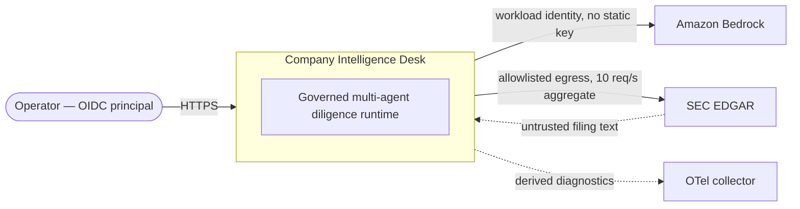
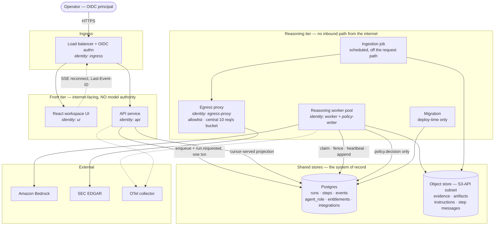
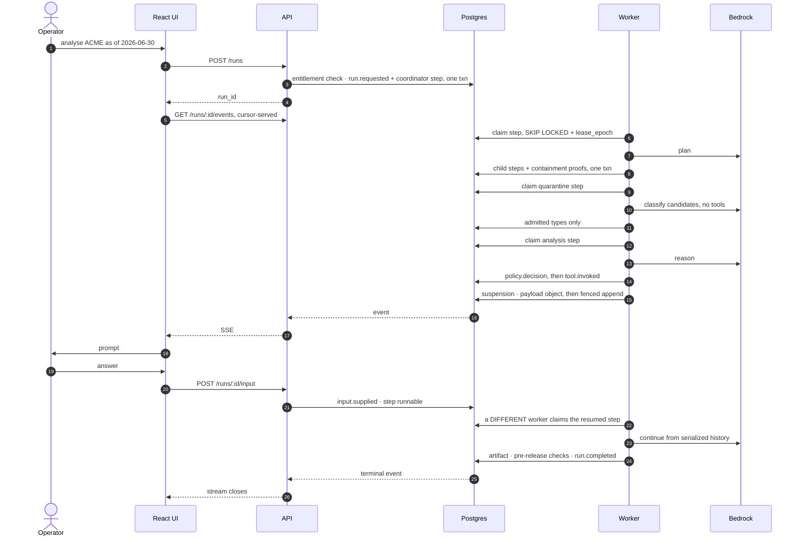
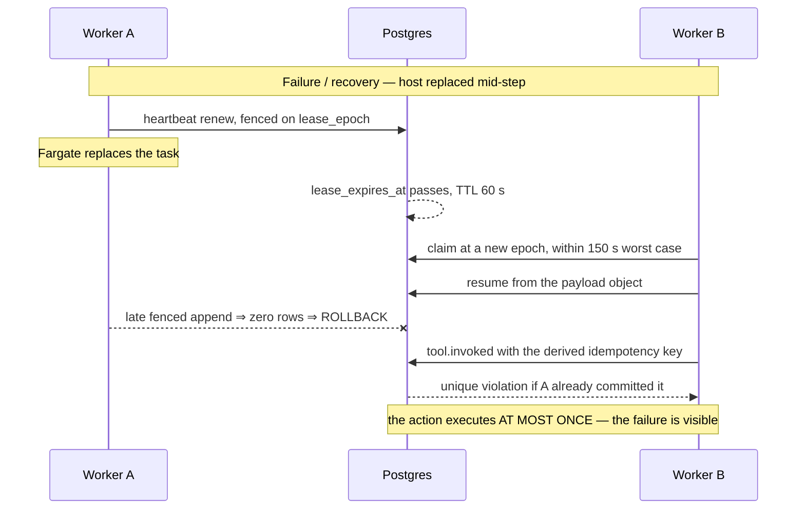

# Application/System Design — Company Intelligence Desk runtime

**STATUS: PARTIALLY BUILT.** The event log, the privilege split, the HTTP
surface, the worker pool and the agent layer ship; the authorization boundary
and the provider call do not. [`../README.md`](../README.md) § What is built is
the current map.

**Decision sought:** accept the ownership split, the structural injection
defence that follows from it, and the identity model that bounds agent
authority.

**Author:** eugenelim
**Status:** Accepted — ratified 2026-09-18 by the owner, **with the five
accepted limits in § 9 open**. Signing off did not close them.
**Last updated:** 2026-09-20

**Reviewers:** eugenelim (owner). A single-operator project: the independent
pass came from forked-context reviewer agents, not a second person.

**Revision:** r8. This is the consistency pass r7 left outstanding: it folds in
the framework decision, the amended charter, and the thirteen amendments the
worker runtime required. Documents citing **r7** cite the revision this one
supersedes, at commit `f728bd3`, recoverable through git history.

**Subsystem designs bound by this document:**
[`worker-runtime.md`](../pydantic-ai-worker-runtime/worker-runtime.md) — the
inside of a leased step and the pool that leases them.
**Companions:** [`observability-and-evaluation.md`](observability-and-evaluation.md),
[`experience-and-presentation.md`](experience-and-presentation.md).

**Governing decisions:** [ADR-0001](../../adr/0001-pydantic-ai-as-the-agent-framework.md)
(framework), [ADR-0002](../../adr/0002-pydantic-ai-version-pin.md) (version
pin), [ADR-0003](../../adr/0003-repository-layout.md) (layout),
[ADR-0004](../../adr/0004-fence-function-owner.md) and
[ADR-0005](../../adr/0005-the-fence-proves-lease-possession.md) (the fence).

**Evidence:** [`spikes/README.md`](../../../spikes/README.md) and
[`prompt-injection-defence-survey.md`](../../product/research/prompt-injection-defence-survey.md).
Evidence is cited where it is relied on, never accumulated here.

---

## 1. Scope and Context

What does this system own, what does it explicitly not own, and which
stakeholders' concerns does that boundary answer?

| In scope | Out of scope | Why the boundary falls here |
| --- | --- | --- |
| Run state, the durable event log, checkpoints, authorization decisions | The agent framework being the system of record for any of them | Inspectability is the product, and it is not retrofittable onto a vendor's session store |
| The event envelope and the stream contract | Payload inlining and redaction policy | The stream is this document's own interface; the telemetry boundary belongs to [`observability-and-evaluation.md`](observability-and-evaluation.md) |
| The quarantine boundary's guarantee and the minting pipeline behind it | How a step enforces it internally | The guarantee is system-level; enforcement is [`worker-runtime.md`](../pydantic-ai-worker-runtime/worker-runtime.md) § 4 |
| Identity, entitlements, and the containment gates | Which library authorizes a call | [ADR-0001](../../adr/0001-pydantic-ai-as-the-agent-framework.md) picks the library; the gates outlive it |
| Evidence acquisition policy and the as-of dating rule | Multi-company or portfolio analysis | [`evidence-backed-company-diligence`](../../product/intents/evidence-backed-company-diligence.md) § Excluded bars it outright |
| The human approval gate and the run states that carry it | The approval UI surface | Deferred to [`experience-and-presentation.md`](experience-and-presentation.md) |
| Typed artifacts as the presentation contract | Workspace information architecture, Storybook's role | Same companion |
| Evaluation seams — the fixture corpus and the producer tuple | Evaluation architecture and release gates | [`observability-and-evaluation.md`](observability-and-evaluation.md) |

### Stakeholder concerns

- **An engineer evaluating how to build a governed multi-agent system** — can I
  read this and see *why* each control is where it is, and check it against a
  running system?
- **The operator running a diligence run** — can I see what the system did, and
  intervene when it needs me?
- **A reader of a published report** — can every claim be traced to evidence?
- **Whoever is paged at 3am** — will a stuck run surface, and will recovery
  happen without me?

### Goals

Each is testable from outside the system.

- **Reconstructable runs.** A reconstruction script rebuilds the published
  report from the event log alone, with no model calls, byte-matching on the
  claim set and the evidence-locator set. "Event log" means the `events` table
  plus the immutable payload objects its references address.
- **Claim provenance.** 100% of published claims resolve to an evidence item
  with a content-addressed locator, or to a deterministic calculation with
  recorded inputs. Zero unresolved claims is the release gate.
- **Host-loss survival.** A run whose worker is killed reacquires its lease
  within 2 × lease TTL + poll interval, so **≤ 150 s**, with no operator action.
- **Stream continuity.** Across 100 forced disconnects — including tab reload
  and simulated sleep, with concurrent writers active — zero missed and zero
  re-applied events, by sequence-completeness assertion at the sink.
- **Replayable context.** The context package each step received is re-readable
  from the event log without re-running any model, modulo excluded reasoning
  parts.
- **Provider portability.** Swapping the model provider changes one adapter
  behind the `Model` seam and zero files under the domain package.
- **Cloud portability.** No AWS SDK import exists outside `adapters/`, proven by
  a dependency-direction test. Each managed dependency carries a written
  substitution note naming its GCP and Azure equivalent.
- **Bounded agent authority.** No tool invocation succeeds whose arguments fall
  outside the acting role's ceiling, **or** outside the initiating user's
  entitlements, **or** whose role ceiling is not contained by its parent's, **or**
  whose role was authored beyond its author's own entitlement.
- **Attributable action.** 100% of tool invocations record run, step, acting
  role and initiating principal, with a policy decision event. Absence of a
  decision event fails the run.

### Non-goals

- **A general-purpose agent platform in the sense the charter once excluded.**
  The project *is* an executable substrate, with diligence as its proving use
  case ([`CHARTER.md`](../../CHARTER.md) § Amendments, 2026-09-18). What survives
  and still binds: **one execution plane**, and the substrate is
  **single-author in operation** until the three governance gaps in § 9 are
  built.
- **Exactly-once tool execution.** Resumption is at-least-once; idempotency
  keys dedup instead, and § 4 names the storage that makes that true.
- **Multi-tenant isolation.** Single-principal, single-operator. A workspace is
  a **UI view** and never a security boundary. This is load-bearing: it is also
  why authorization is coarse and self-approval is the default.
- **Agent-authored UI.** Typed domain artifacts only.
- **Detection-based injection defence.** Excluded on evidence, not on taste.
  Cheap local checks are a layer, never the boundary.
- **Prompt and context caching.** Deliberately unused, because it makes stating
  what context a step received harder. It costs concurrency headroom as well as
  money, since caching reduces the input term deducted from the token bucket at
  request start.
- **Simultaneous multi-cloud.** Portability means deployable elsewhere with
  bounded, known work. No cross-cloud replication and no split-brain.



### Why the boundary sits here

**The application owns the run; the agent framework is invoked inside a step
and is never the system of record for anything a user inspects.** That split is
the whole design. Inspectability ranks first among the quality attributes, and a
framework's session store is the wrong place to keep something the product
exists to show.

Four ranked quality attributes decide every trade below, ordered by
business-importance × architectural-risk. **Legibility as a reference
implementation gates them rather than competing with them** — a design that is
correct but unteachable does not satisfy the project's purpose, so it is never
traded away.

1. **Inspectability and auditability** — it *is* the product, and not
   retrofittable.
2. **Security of the untrusted-content and agent-authority boundaries** — no
   managed control covers this workload class, and detection will not either.
3. **Run durability** — tens of minutes, multi-agent, no-notice host
   replacement, at-least-once tool semantics.
4. **Portability through explicit contracts** — ratified, and cheap at a seam.

### Four grounded facts the design rests on

**Detection-based injection defence does not survive adaptive attack.** Eight
defences on AgentDojo were bypassed above 50% attack success (arXiv:2503.00061),
in-band detection collapsed from near-zero to above 90% success
(arXiv:2606.26479), and six production guardrails including two major vendors'
were evaded at up to 100% (arXiv:2504.11168). Rated `[high]` across four
independent author groups.

**Structural defences held, at `[moderate]`.** Progent fell to 2.6% attack
success under adaptive attack, ScopeGate allowed 0 of 29 unauthorized calls
under a 40-iteration budget, and CaMeL practically solves AgentDojo security at
a 7-point capability cost. **Every one is evaluated by its own authors, and no
disinterested party has re-run any of them.** The downgrade factor is
self-evaluation, and this design claims no more than that.

**The managed guardrail does not cover this workload class.** AWS states
verbatim that guardrails do not evaluate tool-use fields — tool results, tool
specifications and the model's generated tool input — for every filter type, and
publishes no accuracy figures for prompt-attack detection.

**The chosen framework reaches the provider directly.**
[ADR-0001](../../adr/0001-pydantic-ai-as-the-agent-framework.md) records why:
the incumbent had no native Bedrock path, forcing a third-party package into the
model hot path, and its session seam was a four-method ABC never presented as a
public extension point.

---

## 2. Structural Model

What are the people, systems and containers, and at what zoom are we looking?

**Zoom: container.** This stops at the container boundary. What happens inside
the worker is [`worker-runtime.md`](../pydantic-ai-worker-runtime/worker-runtime.md)
§ 2.

| Element | Type | Responsibility |
| --- | --- | --- |
| Operator | Person | Starts runs, answers clarifications, approves flagged output |
| Amazon Bedrock | System | Model inference, reached by workload identity |
| SEC EDGAR | System | The evidence source, and the untrusted-content origin |
| React workspace UI | Container | Renders runs and artifacts. Holds no credentials |
| API service | Container | `POST /runs`, `GET /runs/{id}/snapshot`, `GET /runs/{id}/events`. **Holds no model authority** |
| Reasoning worker pool | Container | Leases steps and executes them. The only container with model authority |
| Egress proxy | Container | Hostname allowlist and the central 10 req/s token bucket |
| Ingestion job | Container | Scheduled evidence acquisition, off the request path |
| Migration | Container | Deploy-time expand-then-contract DDL |
| Postgres | Container (store) | Runs, steps, events, agent roles, entitlements, the integration registry |
| Object store | Container (store) | Evidence, artifacts, instruction text, step message histories |

| From | To | Nature | Protocol |
| --- | --- | --- | --- |
| Operator | Ingress | uses | HTTPS + OIDC |
| UI | API | calls | REST + SSE, cursor-served |
| API | Postgres | enqueues a step and appends `run.requested` in one transaction | SQL, `api` identity |
| Worker | Postgres | claims, fences, appends | SQL, `worker` identity |
| Worker | Postgres | appends the authorization decision | SQL, `policy-writer` identity |
| Worker | Object store | reads evidence, writes artifacts and message histories | S3-API subset |
| Worker | Bedrock | model calls | HTTPS, ambient workload identity |
| Ingestion job | Egress proxy → SEC | scheduled fetch | HTTPS |
| Worker, API | OTel collector | emits derived diagnostics | OTLP |



### Why this grain

**Three placements carry the design and each is visible in the diagram.** The
API holds no model authority, so compromising the internet-facing container
yields no model access. The worker authenticates as two database roles, which is
what lets an authorization decision be recorded through a path the worker's
general write grant cannot reach. And ingestion sits off the request path, so no
run's latency or availability depends on a third party that rate-limits.

**The stores are drawn as containers because authority over data is the thing
this zoom must show.** Postgres is the system of record for run state and the
event log; the object store holds everything content-addressed. Neither is a
detail of a service.

**This diagram does not descend into the worker.** The quarantined agent, the
deterministic parser, the toolset stack and the decision point are real and they
are one zoom level down. Drawing them here would put the same elements in two
documents, and the copy in the parent would drift the first time either changed.

---

## 3. Runtime Model

How does an end-to-end journey move through the system, normally and when
something goes wrong?

| Journey | Trigger | Path |
| --- | --- | --- |
| Analyse one company as of a date | Operator posts a run | normal |
| Mid-run clarification | An agent needs an ambiguity resolved | normal, suspending |
| Flagged output held for approval | A pre-release check fails | normal, suspending |
| Client rejoins after being away | Page load or reconnect | normal |
| Worker host replaced mid-run | Fargate replaces the task | failure / recovery |
| Run cancelled while a step is running | Operator cancels | failure / recovery |



### The run state machine

| From | To | Trigger | Event |
| --- | --- | --- | --- |
| — | `requested` | user starts a run | `run.requested` |
| `requested` | `claimed` | first step leased | `run.claimed` |
| `claimed` | `running` | first step begins | `step.started` |
| `running` | `awaiting_input` | an agent asks the operator a question | `input.requested` |
| `awaiting_input` | `running` | operator answers | `input.supplied` |
| `running` | `awaiting_approval` | a pre-release check fails | `approval.requested` |
| `awaiting_approval` | `running` | approver returns for revision | `approval.rejected` |
| `awaiting_approval` | `completed` | approver publishes | `approval.granted` |
| `awaiting_approval` | `expired` | `approval_timeout` elapsed | `approval.expired` |
| `expired` | `awaiting_approval` | approver reopens | `approval.reopened` |
| `running` | `completed` | all checks pass | `run.completed` |
| any non-terminal | `failed` | unrecoverable error | `run.failed` |
| any non-terminal | `cancelled` | user cancels | `run.cancelled` |

Terminal states are `completed`, `failed` and `cancelled`. **`awaiting_input`,
`awaiting_approval` and `expired` are all non-terminal and all release their
leases**, because a suspended step must not hold one while a human takes an
unbounded amount of time. `approval_timeout` defaults to none, which is exactly
why a stuck payload reference would be a permanently stuck run rather than a
delayed one.

**The run state is a projection over concurrent steps, not a step scheduler.** A
run may have several steps in flight, and ordering comes from the per-run
sequence rather than from the pool.

### What the normal path establishes

**Every human interaction has one shape.** A content-addressed payload object is
written first, the fenced append commits second carrying its hash, the lease
releases, and a *different* worker resumes from bytes. That uniformity is why
there is one suspension mechanism rather than two, and it is what survives the
host being replaced mid-wait.

**The stream reads the log, not the worker.** Server-sent events are a
cursor-served projection over committed events, so run duration and stream
session duration are independent and no ingress limit constrains run length. A
client that has been away calls `GET /runs/{id}/snapshot`, discards local state,
renders the snapshot and resumes at `as_of_seq` — the ordinary page-load path,
not only a recovery mechanism.

**The operator's answer is a direct-injection surface and is treated as one.**
It is trusted *as instruction* and bounded by what the acting role may do, never
screened. Two constraints keep that honest: the answer is admitted at the role's
existing ceiling and cannot widen it, and the request and answer are both
recorded as events so the analysis can be reconstructed knowing a human steered
it.

**The approval gate is conditional, and the condition is computed outside the
model.** The deterministic pre-release checks run before the agent, and their
result commits as an event; the approval-gated tool exists in the compiled
toolset only when a check failed. A run passing every check publishes
automatically, which is what
[`CHARTER.md`](../../CHARTER.md) principle 3 was amended to permit.
`require_distinct_approver` defaults to false for the single operator, and both
the flag state and the approver principal are recorded.



### Why recovery looks like this

**Row locking and lease expiry are different mechanisms, and conflating them
breaks the database.** A row lock held across a multi-minute step would pin an
idle-in-transaction connection, hold the transaction horizon back, and block
vacuum on the event-log tables. So a claim commits immediately and the step
executes outside any transaction.

**Cancellation and fence loss collapse into one signal**, which is correct —
both mean *stop, you no longer own this*. The heartbeat reads the run state in
the same statement that renews the lease, so worst-case cancellation latency is
one heartbeat interval and no new polling exists. A worker mid-step would
otherwise discover a cancellation only at step end, after minutes of model spend.

**A fenced worker aborts without *additional* side effects.** It may already
have invoked a tool; attribution is at the logical-invocation level, and the
derived idempotency key in § 4 is what makes re-execution safe rather than
merely recorded. On `SIGTERM` the worker sets its lease to expire immediately
and exits, so planned replacement recovers in one poll interval.

---

## 4. Contracts and Invariants

What must always hold across every boundary, and how would a violation be
caught?

| Contract | Parties | Invariant | Failure semantics | Enforcement | Verification |
| --- | --- | --- | --- | --- | --- |
| **Per-run sequence** | any appender ↔ `events` | Each event's `seq` comes from a per-run counter updated in the same transaction, never a `bigserial` | A rolled-back append leaves no hole | Row `UPDATE` on `runs.next_seq` inside the append transaction | **Built.** Lock-ordering spike: 200 events, dense from 1, no duplicates |
| **Two append paths, and only two** | `api`, `worker`, `policy-writer` ↔ `events` | `next_seq` is never bumped outside them. The worker path is fenced; the run-lifecycle path is unfenced and guarded on non-terminal state | A late cancel after a terminal event is a no-op, not a reconstruction divergence | Three `SECURITY DEFINER` functions with disjoint grants | **Built** |
| **Lock ordering** | any appender ↔ `steps`, `runs` | `steps` is locked before `runs`, on every path | Deadlock (40P01) is retried with backoff | Convention enforced in the definer functions | **Built.** Zero deadlocks under the designed order across 8 writers; 12 under mixed orders |
| **No role holds an unqualified events insert** | every identity ↔ `events` | `api` is limited to run-lifecycle types, `worker` to step-scoped types, `policy-writer` to `policy.decision` | Database refusal, not application refusal | Disjoint `EXECUTE` grants; `events.type` carries a CHECK requiring a dotted run of lowercase ASCII alphanumerics | **Built.** Privilege-split spike, 7/7 |
| **The fence proves possession** | any fenced writer ↔ `steps` | A never-claimed, released, drained or expired step is unappendable at any epoch | Append refused | `fence_step`, owned by a `NOLOGIN` role so the role the split distrusts cannot drop it — [ADR-0004](../../adr/0004-fence-function-owner.md), [ADR-0005](../../adr/0005-the-fence-proves-lease-possession.md) | **Built** |
| **The decision commits before the action** | decision point ↔ `events` | A `policy.decision` commits, under a live fence, before the authorized invocation is issued | A failed append is a **denial, never a retry** | Second database identity, fenced transaction | Owed: force the append to fail, assert the tool body does not run |
| **At most once per logical invocation** | recording layer ↔ `events` | A `(run_id, idempotency_key)` pair appends at most once for `tool.invoked` | Unique violation ⇒ duplicate-detected step failure, visible rather than silent | Partial unique expression index over `tool.invoked` events | Fault-injection suite |
| **Bounded agent authority** | decision point ↔ every tool call | `may_exist`, `may_run` and `may_act` all hold — see below | Domain exception propagating out of the agent run | Argument-**value** checks outside any model's context | Authorization suite, release gate |
| **Quarantine** | untrusted evidence ↔ planning agents | A planning agent receives **no attacker-authored free text** | Non-conforming output fails the step | A deterministic fail-closed parser, and a minting pipeline that runs before any model | Quarantine suite |
| **References are minted, not emitted** | pipeline ↔ quarantined agent | The model selects among candidates that already resolve; it cannot emit an identifier the pipeline did not mint | A reference the runtime did not mint fails the step | Deterministic semantic pipeline | Quarantine suite |
| **Event envelope** | appenders ↔ stream consumers | `{schema_version, run_id, seq, occurred_at, type, step_id?, agent_role?, principal, payload_ref}` | Additive fields only | Schema | Contract test |
| **Stream cursor** | server ↔ client | The server prefers `Last-Event-ID` over `after=`; the sink is idempotent on `(run_id, seq)` | A stale query parameter cannot cause a replay | Server-side preference | **Built.** Zero duplicates across 9 forced disconnects with a deliberately stale `after=0` |
| **Object store portability** | system ↔ any S3-API store | Only `PUT`, `GET`, `HEAD`, `DELETE`, `LIST` with prefix, plus encryption at rest | No S3-specific feature may become load-bearing | Adapter boundary | Runs against MinIO locally |
| **Scope-qualified keys** | any writer ↔ object store | `key = <owner_scope>/<content_hash>`, with `public` as an explicit named scope | — | Key construction | Reconstruction byte-match |
| **Model seam** | system ↔ provider | Swapping providers changes one `Model` subclass and nothing else | — | No framework import outside `agents/` and `adapters/` | **Built** — `tests/architecture/dependency_direction.py` |
| **Aggregate egress limit** | system ↔ SEC | 10 requests per second in total, regardless of worker count | A failed fetch is a failed run with a recorded cause, never partial evidence | One central token bucket in the egress path | Proxy metric |
| **As-of dating** | ingestion ↔ evidence | Evidence is dated by **filing date**, never acceptance or retrieval timestamp | — | Ingestion rule | Ingestion test |
| **Evidence snapshot immutability** | run ↔ evidence corpus | `snapshot_id = hash(sorted set of evidence content hashes)`, recorded at run start. An amendment creates a *new* snapshot historical runs never see | — | Content addressing | Reconstruction byte-match |
| **No reasoning is stored** | system ↔ both stores | Chain-of-thought is never written to the event log or the evidence store, so no servable location holds it | Compilation fails if a role enables it | A storage property, not a filter on read | Round-trip test |

### The three containment gates

Authorization is three checks at three times against three authorities. Stating
them as one biconditional conflates them and hides which one is missing.

```
may_exist(role)    ⟺ role.ceiling ⊆ author.authoring_entitlement
                      — at AUTHORING time, recorded on the role version
may_run(role, run) ⟺ role.ceiling ⊆ parent_role.ceiling
                    ∧ role.ceiling ⊆ initiating_user.entitlements
                      — at SPAWN, recorded as an event
may_act(call)      ⟺ args ∈ role.ceiling
                    ∧ args ∈ initiating_user.entitlements
                      — at CALL, recorded as the policy.decision
```

**Authoring bounds what may exist; execution bounds what may run.** They are
independent and both must hold. `may_exist` exists because the moment a second
principal authors a role, authoring becomes a privilege-escalation primitive —
write a role with a wide ceiling, get it spawned, act beyond your own rights. It
closes with the no-amplification rule the charter already ratifies: an author
may only grant what they hold.

**The base case is out of band.** `policy-author` is human-operated with no
runtime identity holding it, so it is the root of the authoring tree and its
entitlement is set by database grant, never authored inside the system. The root
coordinator's ceiling is bounded by the initiating user's entitlements at run
start.

**Narrowing an author's entitlement does not retroactively invalidate roles.**
The proof is recorded at authoring time against the entitlement then in force,
and role versions are immutable. That is safe because the other two gates still
check the *current* initiating user, so a role that should no longer be
reachable becomes unreachable at execution — without a cascading revalidation
pass over a corpus of role versions. A role version in use by an in-flight run
is immutable, so a recorded containment proof cannot go stale mid-run.

### Decidability, and the one unsafe constructor

Value constraints are restricted to a decidable fragment — closed enumerations,
prefixes, numeric ranges and set membership — combined as a **conjunction of
independent per-argument predicates**. No disjunction and no cross-argument
relation is expressible, and that closure is what makes per-attribute structural
containment decidable and set-theoretically sound.

**Set-level soundness is not semantic safety, and the gap is the prefix
constructor.** Containment proves a value lies inside the declared ceiling. It
does not prove the value *means* what the ceiling's author intended, because a
prefix over an argument the callee **parses** admits an attacker-chosen suffix:
`https://www.sec.gov` matches `https://www.sec.gov.attacker.example/`, and a
path prefix matches a traversal beyond its root. Both pass and both report
sound.

The fragment therefore does three things, and the third is the one most designs
omit.

1. **Prefix is expressible only on arguments declared not to be parsed by their
   consumer.**
2. **Interpreted arguments carry a domain type** whose predicates range over
   parsed components.
3. **The canonical form is what the callee receives**, so validator and callee
   cannot hold different opinions about the same string.

The mechanism and the canonicalization rules are
[`worker-runtime.md`](../pydantic-ai-worker-runtime/worker-runtime.md) § 4.

**Compositional authorization across turns remains unsolved.** Each call is
authorized independently, and a sequence of individually-authorized calls can
achieve an effect no single call would be permitted. Named, not solved.

### Identity — two layers

**Layer 1 — workload identity.** Roles are the model; the AWS column is the
current binding.

| Component | Model provider | Postgres | Object store | SEC egress | Secrets |
| --- | --- | --- | --- | --- | --- |
| `api` | **none** | read all; write `runs` including `next_seq`, `steps` enqueue, run-lifecycle `events`; publish one metric namespace when autoscaling lands | read artifacts | none | own DB credential path |
| `worker` | invoke and invoke-stream on named models | read/write runs, steps, context, evidence; `events` **except** `policy.decision` | read/write evidence, artifacts, message histories | via proxy only | own DB credential path |
| `policy-writer` | none | `runs.next_seq` bump and insert `policy.decision` only, via a fence function that grants **no table access** | none | none | own DB credential path |
| `egress-proxy` | none | none | none | allowlisted hostnames | own TLS material |
| `ui` | none | none | none | none | none |
| `ingress` | none | none | none | none | OIDC client secret |
| `migration` | none | DDL and DML on tables under active migration | none | none | own DB credential path |
| `policy-author` | none | write agent-role, entitlement and integration-registry tables | write instruction and schema objects | none | human-operated |
| *per integration* | none | as the integration's `credential_scope` declares | as declared | as declared | resolved per step, not per worker |

**The `policy.decision` split is a database-role property.** The invariant is
that the database role writing a `policy.decision` is not the role performing
the worker's general writes, **and no database role holds both**. The worker
process authenticates as two roles, because a worker task must obtain both
credentials at boot and no delivery scheme makes them separable while one
process needs both. The split's strength is therefore the grant, which the
privilege-split spike proved directly, not credential separation.

**What the split does and does not buy.** It separates **recording** authority,
never **decision** authority: the worker still makes the call. It defends
against a bug or partial compromise in any single write path forging a decision.
It does **not** defend against full compromise of the worker process, which
legitimately holds the credential that reaches the decision point.

**Credentials are ambient at both boundaries, and the seam sits in different
places.** At the model boundary the provider layer resolves the ambient chain
itself — every provider checked does, including Application Default Credentials
on GCP — so a separate indirection the framework never calls would be a seam in
name only. Swapping clouds swaps a provider class, which is the portability goal.

At the **integration** boundary the seam is real and needed, because the worker
process holds several distinct authorities at once; that is where per-integration
credential scopes live. The `ingress` OIDC client secret is outside both seams —
a static credential with its own rotation owner.

**Least privilege on Bedrock has a non-obvious shape.** A cross-region inference
profile evaluates authorization for the underlying foundation model in the
region Bedrock **routes to**, not the one called. So the policy may pin the
inference-profile ARN to the calling region, but the foundation-model ARN must
stay region-wildcarded, and a requested-region equality condition **denies the
call outright**. Both tightenings look correct and both break invocation.

Denying a model requires denying both the invoke and invoke-stream actions, and
long-term bearer API keys create a static IAM user credential and are denied.

**Layer 2 — principal identity.** An **agent role** is a first-class security
object: a named, versioned record declaring a tool allowlist with per-argument
value constraints, stored outside any model's context and assigned by the
orchestrator, never by a model. Its ceiling is expressed in the same decidable
fragment as the initiating user's entitlements, which the base case requires
since it is itself a containment check.

### Trust boundaries

Seven boundaries are crossed.

| Boundary | Control |
| --- | --- |
| **User → application** | OIDC at the ingress. The prompt is trusted *as instruction* and bounded by entitlements, not screened. This is where direct injection enters |
| **Untrusted evidence → quarantined agent** | Filing text enters an agent that holds no tools and cannot plan |
| **Quarantined agent → planning agents** | Only validated references and closed-vocabulary labels cross, via a deterministic fail-closed parser over a minted candidate set |
| **Agent → tool authority** | Argument-value authorization at the decision point, which is a framework object standing on a security boundary — see § 9 Risks |
| **Worker → model provider** | Workload identity only, with no third-party package in the hot path |
| **Worker → SEC EDGAR** | Egress proxy, hostname allowlist, compliant user agent, central rate limit, bounded retry |
| **Run → published output** | Automatic on a clean run; held for approval when flagged |

**Two threat classes take different controls, and that is the whole injection
strategy.** Retrieved filing content is *indirect* injection, written by the
entity under analysis, and the control is the quarantine boundary — untrusted
text never reaches an agent that can act and never crosses as prose. The user
prompt is *direct* injection, where the text legitimately **is** the
instruction, so "treat as data" is unavailable and the control is authorization
bounds instead.

**The model never produces a reference, and that is the difference between
detecting forgery and making it unrepresentable.** A deterministic semantic
pipeline runs *before* the quarantined agent and produces the candidate set:
XBRL facts, parsed table cells with their coordinates, and section boundaries.
The agent's job shrinks to selecting and labelling among candidates that already
resolve.

**This was established by falsification, not assumption.** Phase 0 tested the
weaker construction, where the agent emitted anchors and a parser rejected
those that failed to resolve, and 1 in 8 were fabricated **with no adversary
present**. The same run found that a verbatim-substring anchor cannot resolve a
fact assembled from table cells, so a prose-quote reference type systematically
drops precisely the figures this product exists to analyse. Quantitative claims
therefore cross as XBRL fact references; prose quotes remain right for narrative
claims.

**What a planning agent may receive is three things and nothing else:**
references, closed-vocabulary labels, and **typed scalars** — decimals, dates,
enumerated units, content-addressed locators. The scalar channel is load-bearing
rather than a concession, because without it the deterministic financial
calculation has no data path. So the precise guarantee is *"a planning agent
receives no attacker-authored **free text**"*, **not** *"no attacker-influenced
signal"*.

**Filing-language change analysis survives this.** The diff between two filing
sections is computed deterministically, stored as its own evidence item with a
content-addressed locator, and the quarantined agent returns a reference to that
diff plus a label from a closed vocabulary. A fixed enumeration is not
attacker-controlled text; free prose would be.

**Cheap local checks are a layer, not the boundary.** Tool-result protocol
validation, structural anomaly detection on retrieved chunks, and code-injection
patterns are implemented directly. They are free and model-free, and they are
not described as closing anything.

### Evidence acquisition

**Discovery is batch, not crawling, and the right batch is small.** SEC
publishes bulk archives precisely so consumers do not crawl, but the published
artifacts span four orders of magnitude.

| Tier | Artifact | Size | Used for |
| --- | --- | --- | --- |
| 1 | `company_tickers.json` | 0.2 MB | ticker → CIK, cached, refreshed rarely |
| 2 | `daily-index/…/master.<date>.idx` | 0.1 MB | what was filed that day |
| 3 | `data.sec.gov/submissions/CIK….json` | small | one filer's history |
| 4 | the filing document itself | ~1 MB | the analysis |
| — | `submissions.zip` + `companyfacts.zip` | **~3 GB nightly** | **not used** |

**The whole-market archives are out of scope by construction.** This system
analyses one company at a time, and ingesting every filer nightly — roughly
1.1 TB/year of transfer — would buy whole-market coverage the charter refuses.
Tiers 1 to 4 total well under 2 MB for a typical run.

**Freshness comes from per-company polling, not a market-wide feed.** There is
no push or streaming for a non-PDS consumer, and the paid dissemination service
is not the answer, because filings reach the website *before* PDS. The
per-company submissions endpoint is documented as sub-second, carries no window,
and is not on a robots-disallowed path — unlike the latest-filings feed, which
is, and which is bounded at 100 entries covering only **1.7 hours** at peak
filing rates.

**Ingestion is scheduled and a run reads the store.** Four reasons, and the
first decides it.

1. **An as-of analysis cannot be built from a live pull.** The evidence snapshot
   pins the universe of retrievable evidence at a moment, and re-resolving it at
   query time is exactly the falsification condition
   [`scoped-context-and-evidence`](../../product/intents/scoped-context-and-evidence.md)
   names.
2. **The data is daily.** Filings are discrete events on a business calendar, so
   there is nothing for an intra-request fetch to gain.
3. **It would couple user-facing latency and availability to a third party**
   that rate-limits and blocks.
4. **The rate limit is aggregate.** Concurrent runs would contend for one budget
   that scheduled ingestion spends once, off the request path.

**A compliant user agent is necessary and not sufficient.** Phase 0 saw EDGAR
return 403 to correctly-formed user agents while the address was rate-blocked,
including on static pages, clearing on its own after the documented cooldown.
The declared contact is supplied at runtime and is never a maintainer's personal
identity.

---

## 5. Data and State

What data domains exist, who has authority over each, and what must stay
consistent?

| Data domain | Authority | Lifecycle | Consistency requirement |
| --- | --- | --- | --- |
| Run state | Application, in Postgres | Created by `run.requested`; projected from steps; terminal on completion, failure or cancellation | Strict. A terminal event closes the stream, so a later append would be a reconstruction divergence |
| Event log | Application, in Postgres | Append-only, per-run `seq` allocated in the append transaction | Strict. Dense from 1, no duplicates, no holes |
| Step leases | Pool, in Postgres | Claimed, renewed at TTL/3, released on completion, failure **or suspension** | At most one live owner. Every fenced write checks epoch and live possession |
| Evidence corpus | Ingestion, in the object store | Written by scheduled ingestion; content-addressed; never mutated | Immutable. An amendment is a new object |
| Evidence snapshots | Application, recorded on the run | `snapshot_id` fixed at run start | Immutable. A historical run must never see its snapshot change |
| Payload objects — messages, artifacts | Worker, in the object store | Written before the event referencing them; retained for the life of the report | Strict ordering across two stores |
| Instruction and schema text | `policy-author`, in the object store | Content-addressed, never rewritten | Immutable by construction |
| Agent roles and the integration registry | `policy-author`, in Postgres | New versions bind at the next spawn | A version in use by an in-flight run is immutable |
| Entitlements | `policy-author`, in Postgres | Set out of band by database grant at the root | Current at execution, not at authoring |
| Telemetry | OTel collector | Derived, expiring | None — spans are diagnostics, never the record |

### Why authority sits where it does

**The event log plus its payload objects is the system of record, and telemetry
is derived.** Reconstruction reads the log and never a trace. That is what makes
the reconstruction goal checkable rather than aspirational, and it is why the
telemetry boundary can be deferred to a companion without weakening anything
here.

**Retention has no expiry.** The reconstruction goal and cross-period comparison
both depend on the log, so no cursor is refused on age and nothing is deleted.

**Reproducibility means replay, not re-execution.** Step *N*'s context is
assembled from step *N−1*'s output, sampling is non-deterministic, and
specialists interleave — so the snapshot pins the *universe* of retrievable
evidence, not the *selection*. The run header records the producer tuple —
`{model_id, model_version, inference_profile, temperature, top_p, max_tokens,
prompt_template_version, tool_manifest_hash, agent_role_version,
context_assembler_version, app_image_digest, fetch_adapter, model_adapter,
framework_version}` — and a re-run whose tuple differs is labelled **divergent**.
The two adapter fields record whether each external boundary is live or
replaying, so a fixture run can never be mistaken for a live one.

### Two columns taken now because they cannot be taken later

A nullable `pool_class` on `steps`, and a nullable `owner_scope` on `runs`,
`steps`, `agent_role` and the integration registry. Both default to the single
MVP value and `owner_scope` is read by nothing.

**Adding a column to empty or small tables is trivial; backfilling onto a corpus
of executed runs is guesswork**, because there is no record of who owned a run
that never recorded an owner. The same asymmetry governs the object-key
derivation, which is baked into locators, `snapshot_id` and the reconstruction
goal's byte-matching — re-keying later invalidates recorded snapshot IDs that
historical runs must never see change.

`pool_class` buys the ability to run high-sensitivity integrations on a separate
worker service with a different task role, which is the only form of credential
isolation that actually holds, since a separate process cannot reach another
process's ambient chain.

---

## 6. Deployment and Operations

How is the system deployed, operated, and observed?

| Deployment unit | Runs as | Scaling | Observability |
| --- | --- | --- | --- |
| React UI | ECS service, 2 tasks × 0.25 vCPU | Fixed | Ingress metrics |
| API service | ECS service, 2 tasks × 0.5 vCPU | Fixed | Request rate, SSE connection count |
| Reasoning worker | ECS service, 2 tasks × 2 vCPU, one image for every pool class | Fixed count. The signal when autoscaling lands is **runnable steps not yet claimed**, published as a custom metric by a job on the `api` identity | Queue depth, claim latency, lease losses, step duration p99 |
| Egress proxy | ECS service, 2 tasks × 0.25 vCPU | Fixed | Token-bucket depth, upstream 403 rate |
| Ingestion job | Scheduled task | Per schedule | Fetch success, corpus growth |
| Migration | Deploy-time task, 0.5 vCPU transient | n/a | Migration success |
| Postgres, object store | Managed | Managed | Connection count, storage |

Steady state is **6.0 vCPU** and a rolling deploy peaks at **13.0**.

### What the deployment shape buys

**A long-running service with a desired count, never a task per run.**
Standalone tasks are never replaced, so a run losing its host would stop with no
recovery and no signal. A service maintains the count, and work finds workers by
being in the queue.

**The scaling signal is queue depth, not CPU.** A reasoning worker spends most of
a step blocked on a model call, so CPU stays near-flat whether the queue is empty
or fifty deep. Autoscaling is deliberately deferred because the aggregate egress
and provider-token budgets bind before worker count does — adding workers past
the point where the central bucket saturates buys queueing, not throughput.

**Readiness is not liveness, and the liveness probe definition is
load-bearing.** Readiness gates claiming, and a worker must verify both database
connections and the object store before it claims anything, because a worker
that claims a step it cannot finish manufactures a 150-second recovery for a
problem a readiness check catches in milliseconds. **Liveness must fail when no
heartbeat has been *attempted* within 2 × TTL**, not merely when the process
exists — a probe that only checks process existence cannot catch a starved event
loop, which is the exact failure mode where in-process timers stop too.

**The vCPU quota is a provisioning precondition.** The On-Demand Fargate default
is 6 per Region, so on a default account steady state sits exactly at the quota
with zero headroom and a rolling deploy cannot complete. The target account is
already at 4000, verified 2026-09-10, which is a property of that account rather
than of the design; a fresh account reinstates the default and a 16 vCPU
increase becomes a precondition again.

**Egress uses a task-assigned public IP, not a NAT gateway.** A NAT gateway
costs roughly 240× more at this duty cycle and buys a stable address no
publisher has asked for. Because the rate limit is aggregate rather than
per-host, address determinism does not satisfy it — the central token bucket
does. NAT plus a static address is the escalation if a correctly-behaved client
is ever blocked, and it must then be a *zonal* gateway, since the regional
gateway's automatic mode lets the platform manage addresses and would silently
break any allowlist.

**`max_tokens = 4096` is a concurrency decision, not a length preference.**
Input plus `max_tokens` is deducted from the token bucket at request start and
output burns at 5–15×, so an oversized value silently collapses concurrency.

### Observability

The framework ships OpenTelemetry instrumentation following the GenAI semantic
conventions, enabled with content and binary content excluded, so prompts,
completions, tool arguments and tool results do not enter telemetry. **That is
the fail-closed starting position, not a commitment**
[`observability-and-evaluation.md`](observability-and-evaluation.md) has to
honour — but the event log remains the system of record either way.

**Local development is recorded-fixture replay.** A `Model` adapter replays
recorded model responses and a fetch adapter replays recorded filings, both
keyed by content hash. Everything else runs for real: orchestration, leases, the
event log, the stream, the quarantine boundary, authorization, the UI. Only the
two external boundaries are replaced and both already sit behind adapters, so
this is wiring an existing seam.

Two properties make fixture mode more than a convenience. **It is the same
mechanism the production ingest path uses**, exercised with a different corpus,
because live fetch is already confined to jobs outside a run. And the fixture
corpus is the substrate the evaluation companion needs, so building it here means
not building it twice.

---

## 7. Quality Scenarios and Verification

For each quality attribute at this zoom, what scenario proves it, and how is it
verified?

| Source | Stimulus | Environment | Response | Measurable target | Business consequence | Mechanism | Verification |
| --- | --- | --- | --- | --- | --- | --- | --- |
| Auditor | Rebuild a published report from the log | Normal | Report reconstructed | Byte-match on the claim set and evidence-locator set, zero model calls | The product's central claim is unverifiable | Event log plus content-addressed payloads as the record | Reconstruction script, Phase 1 |
| Reader | Trace every published claim | Normal | Each resolves to evidence or a recorded calculation | 100%; zero unresolved claims | A report that cannot be trusted at the claim level | Content-addressed locators, minted references | Pre-release check, release gate |
| Infrastructure | Host replaced mid-run | Degraded | Another worker reacquires | ≤ 150 s, no operator action | A run stalls silently | Lease with epoch fencing, TTL 60 s / heartbeat 20 s / poll 30 s | Fault-injection suite, two workers, real timings |
| Client | 100 forced disconnects with concurrent writers | Degraded | Stream resumes exactly | Zero missed, zero re-applied | Inspection is unreliable precisely when a run is long | `Last-Event-ID` preference, idempotent sink on `(run_id, seq)` | **Built** — verified across 9 disconnects |
| Attacker via filing text | Attempt to reach a planning agent as prose | Normal | Blocked at the parser | No attacker-authored free text crosses | The system's central security claim fails | Minting pipeline plus fail-closed parser | Quarantine suite |
| Attacker via a tool argument | A well-typed unauthorized call | Normal | Tool body does not execute; step terminates | 100% refusal, with a denial that is never retryable advice | An unauthorized action attributed to a governed run | Argument-value checks outside the model context | Authorization suite, release gate, every build |
| Attacker via a parsed argument | A value passing a prefix but parsing outside the allowlist | Normal | Refused; the adapter receives the canonical value | Every unsafe-prefix case refused | SSRF or traversal through a control that reports sound | Domain-typed arguments, one parser | Containment property test with interpreted arguments |
| Concurrency | Two workers in the same step during the fence-detection window | Degraded | Duplicate decision rolls back; duplicate invocation refused | The action executes **at most once**, visibly | A report published twice | Fenced policy append plus derived idempotency key | Fault-injection suite |
| Provider | Model stream stalls | Degraded | Step fails, lease released | No step *reported* running past `step_deadline`; p99 < deadline < page threshold | A 3am page for a worker that is alive but stuck | In-loop deadline, hard task timeout, out-of-process liveness probe | Phase 1 measurement |
| Operator | A clean run | Normal | Publishes with no human in the path | Zero human interactions | A ratified charter amendment silently reversed | The gated tool is compiled in only when a check failed | Phase 1 |
| Reviewer | Flagged output accumulates | Normal | Escalation stays in a workable band | 5–15%, over a rolling 30-day window, minimum 50 runs | Approval fatigue defeats the gate | Conditional gate on deterministic checks | Measurement, **not** a release gate |

### Why these targets

**Escalation rate is a calibration target and deliberately not a release gate.**
Oversight has finite capacity, reviewer agreement on what is risky is moderate
(κ = 0.52), and safety follows an inverted-U against escalation rate that
adversarial flooding can exploit. The 5–15% band comes from an author-run study
of 125 hand-labelled actions — `[moderate]`, and too thin to gate a release on.

**Recovery is specified at 150 s because that is what the mechanism yields**, not
because 150 s is a requirement anyone stated: TTL 60 s plus heartbeat 20 s plus
poll 30 s gives 2 × TTL + poll as the worst case. Publishing the derivation
rather than the number is what lets an operator change one timing and recompute
the rest.

**The two security scenarios are separate because the controls are separate.**
One is bounded by what crosses the quarantine boundary and the other by what a
role may do. A single "the system is secure" scenario would let either control's
failure hide behind the other's success.

---

## 8. Implementation Mapping

Where does each element live, and who owns it?

| Element | Repository | Source | Deployable | Platform | State |
| --- | --- | --- | --- | --- | --- |
| Event log and its append paths | this | `src/ced/domain/events.py`, `src/ced/adapters/postgres/event_log.py`, `migrations/versions/0002_*` | both | Postgres | **Built** |
| The privilege split and the fence | this | `migrations/versions/0002_*` | both | Postgres | **Built** |
| HTTP surface | this | `src/ced/api/`, `contracts/openapi/runs.yaml` | `ced-api` | ECS | **Built** |
| Worker pool | this | `src/ced/worker/pool.py` | `ced-worker` | ECS | **Built** |
| Dependency-direction gate | this | `tests/architecture/dependency_direction.py` | n/a | CI-less; a repository check | **Built** |
| Local substrate | this | `deploy/` | n/a | docker-compose | **Built** |
| Agent layer and the quarantine boundary | this | `src/ced/agents/`, `src/ced/domain/quarantine/` | `ced-worker` | ECS | **Built** — the compiler is the only constructor of the agent; the stack is policy decision point → step events → trust class → function tools. The decision point holds no predicate and refuses every call, so no tool body runs |
| Authorization boundary — the ceiling predicate's encoding and its evaluation | this | n/a — no source yet | `ced-worker` | ECS | Designed — owned by [`walking-skeleton-authority-containment`](../../specs/walking-skeleton-authority-containment/spec.md) for the decidable fragment and by [`walking-skeleton-policy-decision-point`](../../specs/walking-skeleton-policy-decision-point/spec.md) for the `predicates` encoding and the decision point that installs it, the two having been separated by the cut of 2026-09-23. The decidable fragment itself ships: `ceiling` is that fragment and revision 0003 settles an entry's binding fields. **This row's status is not the current map** — `docs/architecture/README.md` § What is built is, and it is what the two specs above update as they land |
| Run state machine transitions | this | `src/ced/domain/` | both | ECS | Designed |
| Integration registry | this | `migrations/versions/0003_*`, `src/ced/adapters/postgres/roles.py` | both | Postgres | **Built** — revision 0003 closes `agent_role` and `integration_registry` to r5's record shapes, and `load_role` / `decode_role_record` read them |
| Ingestion | this | `src/ced/adapters/` | ingestion job | ECS scheduled | Designed |
| UI | this | separate container per the ratified constraint | `ced-ui` | ECS | Designed |

**One repository, one package, two entry points** — `ced-api` and `ced-worker`
— per [ADR-0003](../../adr/0003-repository-layout.md) D3. One team, which is one
person, so ownership columns would carry no information and are omitted rather
than filled with a placeholder.

**The mapping is not one-to-one in one place, deliberately.** The domain layer
builds into both deployables, because the run state machine and step planning
execute on the `api` identity's path as well as the worker's. That is the layout
the ADR chose, not drift.

This zoom stops here. How the worker keeps its core independent of its edges is
[`worker-runtime.md`](../pydantic-ai-worker-runtime/worker-runtime.md) § 8.

---

## 9. Decisions, Alternatives, and Risks

### Decisions

- **The application owns run state, the event log, checkpoints and
  authorization; the framework is invoked inside a step.** Every other decision
  follows from this one.
- **Injection defence is structural, not detection-based.** No impossibility
  result exists, so this is an empirical bet with a shelf life rather than a
  proof — and it is the bet the evidence supports.
- **References are minted by a deterministic pipeline before any model runs.**
  Forgery is unrepresentable rather than detected.
- **Postgres carries the work queue, not a message broker**, because the work
  item and its first event must commit atomically.
- **Authorization checks argument values, not schemas.** Checking tool names and
  argument *types* is the documented anti-pattern that several well-known
  toolkits implement, and a well-typed unauthorized call passes it.
- **Three containment gates, not one formula** — authoring, spawn, and call.
- **Pydantic AI as the step-level reasoning library**
  ([ADR-0001](../../adr/0001-pydantic-ai-as-the-agent-framework.md)), pinned
  ([ADR-0002](../../adr/0002-pydantic-ai-version-pin.md)). This retires a
  third-party package from the model hot path rather than mitigating it.
- **The charter permits an executable substrate.** Amended by the owner
  2026-09-18 under a shaping-phase exception. Charter principle 3 was narrowed
  to *approval of flagged output*, and principle 7 renamed; a run passing every
  check publishes automatically.

### Alternatives considered

**Framework-owned orchestration.** Uses the framework as intended and builds
substantially less.

**Rejected because** it binds the inspection surface — the first-ranked quality
attribute — to a session-service interface the vendor does not present as a
public extension point and has already broken across a major version.

**Step Functions as orchestrator.** Cloud-native durable execution with
documented persistence and exactly-once semantics.

**Rejected because** state payloads cap at 256 KiB and history at 25,000 events,
both unraisable, and agent transcripts cross both. Redrive requires history below
24,999, so an execution that failed *because of* the cap cannot be redriven. It
is also single-cloud, which portability independently forecloses.

**A managed agent runtime.** The shortest path to production on the target cloud.

**Rejected because** it has no documented checkpoint or replay, so durability
would rest on an undocumented property, and a managed agent platform makes core
behaviour inseparable from one cloud.

**Per-run tasks instead of a service.** One task per run, exiting when the run
ends.

**Rejected because** standalone tasks are never replaced and hosts are replaced
without notice, so a run losing its host stops with no recovery and no signal.

**A message broker between API and worker.** The conventional shape.

**Rejected because** the work item and its first event must commit atomically,
which Postgres gives in one transaction and a broker cannot without an outbox.
Accepted costs: the poll interval is a latency floor, and there is no
dead-letter primitive, so the lease-expiry counter plays that role.

**WebSocket instead of server-sent events.** A bidirectional transport.

**Rejected because** the transport is one-directional here, so it adds a
stateful connection without adding a capability, and the managed gateway's hard
29-second integration timeout would force backend pushes through a separate
callback API.

**Detection-based injection defence.** A guardrail component at the tool-result
boundary — what most comparable systems do, and the intuitive answer.

**Rejected because** every detection approach *evaluated* in the literature has
lost under adaptive attack, most of the open-source ecosystem is archived, two
of the best-known models contain no injection detection at all, and the managed
baseline publishes no figures while its only two evaluations were run by
competitors. Cheap local checks are retained as a layer.

### Accepted limits — open, and not a task list

These five were accepted open at ratification. Signing off did not close them.

1. **The quarantine guarantee is narrower than it first reads.** It is *"no
   attacker-authored free text reaches a planning agent"*, **not** *"no
   attacker-influenced signal"*. Four things still do not cross even with the
   minting pipeline: **causal attribution**, because a judgement is an argument
   rather than a category; **untagged narrative**, since risk factors, legal
   proceedings and much of the discussion section carry no XBRL tagging, so
   exactly the qualitative material falls back to the weaker prose-anchor path;
   **selection influence**, because whatever ranks or filters candidates carries
   attacker-influenceable signal whether it is a model or a heuristic; and
   **cross-fact inference**, where the finding is a relation between facts rather
   than any fact. Phase 0 observed the cost directly: a legal exposure and an
   explicit management warning both appeared in the baseline analysis and
   neither crossed, although both categories are in the admitted vocabulary.
   Selection, not vocabulary, was the limit.
2. **The `policy.decision` split separates recording, not decision.** It defends
   against a bug or partial compromise in any single write path. It does not
   defend against full compromise of the worker process.
3. **The event-append privilege model is proven; the containment algorithm is
   not.** The privilege split was demonstrated against real database roles. The
   fragment's soundness is argued, and the containment property test with
   interpreted arguments is owed.
4. **The security posture rests on `[moderate]`, self-evaluated evidence** with
   no disinterested replication, no unlimited-budget adaptive test, and no
   benchmark for long-document financial filings — this system's exact workload
   class.
5. **Three governance gaps keep the substrate single-author in operation.**
   Principal-scope isolation is designed and unbuilt; authoring-time containment
   is designed and unbuilt; and the trust class of instruction text authored by
   someone who is not the operator is still unsettled. Designing a gap closed is
   not closing it.

### Risks

- **The reference-selection channel.** A closed vocabulary bounds the
  *alphabet*, not the *channel*. Which references the quarantined agent returns,
  in what order, and which labels it attaches are all attacker-influenceable —
  several bits per step into a planning agent's context, and resolution detects
  forged references rather than steered-but-valid ones. *Unmitigated and
  unmeasured.*
- **A quarantined agent induced to forge references.** *Largely retired* by the
  minting pipeline, which leaves no free-text reference to invent. *Named* because
  the pipeline is designed and not yet built.
- **The decision point is a framework object on a security boundary.** A change
  to the wrapper's contract changes the authorization boundary and could land in
  a minor release without being classed as breaking. *Mitigated* by the
  authorization suite as a release gate, asserting refusal and exception type.
- **A major framework version is permissible at any time**, the vendor's floor
  after the current major having passed. *Mitigated* by exact pinning and
  contract tests at both seams.
- **Message-history schema drift.** The version policy permits adding optional
  fields in minors, and payloads are retained for the life of a report, so a
  *removal* breaks replay where an addition would not. *Partially mitigated* —
  the envelope carries a schema version and the producer tuple records the exact
  framework version. **The vendor makes no schema-versioning promise.**
- **Capability cost may not transfer.** The 7-point figure for structural
  defence is measured on 97 short-task scenarios under that paper's own policy
  complexity, not on long-document financial analysis. *Unmitigated.*
- **No structural defence has been tested under an unlimited adaptive budget**,
  and no benchmark exists for this workload class. *Unmitigated.*
- **At-least-once tool execution on resume.** *Mitigated* by derived idempotency
  keys with a unique index behind them.
- **Information-hazard aggregation.** Authorization bounds are necessary and not
  sufficient. *Unmitigated; latent under a single principal.*
- **Policy misconfiguration.** *Mitigated* by the authorization suite as a
  release gate.
- **Operational — 3am.** A worker alive but stuck on a hung model stream never
  expires a lease. **Primary page: time since last event append per active run >
  p99 step duration × 3**, with lease-expiry count secondary. The in-loop
  deadline and the liveness probe narrow this; the page stays as backstop, and
  the threshold is calibrated in Phase 1.
- **Token burndown collapsing concurrency.** *Mitigated* by the recorded
  `max_tokens` rationale.
- **Approval fatigue.** *Mitigated* by measuring escalation against the 5–15%
  band.
- **Credential scoping is blast radius, not isolation.** In one process with an
  ambient chain, one integration's adapter can reach another's credential.
  *Deferred* to a commissioned credential-broker design, with pool classes as
  the structural fallback.

---

## 10. Rollout, Migration, and Reversal

**Phased, and nothing user-facing exists until Phase 2** — which is what makes
structural change cheap now and expensive later.

**Phase 0 — complete.** Six spikes ran; five held and one was falsified, which
changed the design rather than the plan. Results and their limits are in
[`spikes/README.md`](../../../spikes/README.md). The falsified one produced four
design changes: XBRL fact references for quantitative claims, the deterministic
pipeline ahead of the quarantined agent, the ingestion tiering, and as-of dating
by filing date.

A later addendum re-established the provider and authorization claims against
the replacement framework. Total model spend was under $0.10.

**Phase 1 — walking skeleton.** *Entry precondition: satisfied in the target
account, where the vCPU quota is already 4000; on an account carrying the
6 vCPU default the increase comes first.* Start a run; execute one step against a
real provider via workload identity; append events; stream to a browser; kill
the worker mid-run and observe reacquisition within 150 s; attempt a well-typed
unauthorized tool call and observe refusal.

Exit criteria beyond those: calibrate the p99 page threshold and `step_deadline`;
record the account token-per-minute quota; prove the dependency-direction test;
measure cancellation latency on an in-flight stream; confirm a clean run
publishes with zero human interaction; assert commit-before-action under a
forced append failure; prove a byte-identical round trip over a realistic
message history; re-baseline analytical quality under the current stack; and run
the containment property test with interpreted arguments.

**Phase 2 — the MVP slice.**

### Schema changes, all expand-only

| Change | Shape | Status |
| --- | --- | --- |
| Two append paths and three definer functions | The privilege split | **Built** |
| `fence_step` owned by a `NOLOGIN` role | Possession-proving fence | **Built** |
| Partial unique index on `(run_id, idempotency_key)` over `tool.invoked` | Additive index over an existing payload field | Owed |
| Nullable `steps.pool_class`, plus one claim predicate | Narrows the candidate set, does not reorder locks | Owed |
| Nullable `owner_scope` on four tables | Inert, read by nothing | Owed |
| `awaiting_input` state with its two events | No stored state to migrate; states derive from events | Owed |

**No downgrade path is offered, by policy.** Migrations are expand-then-contract,
and the event log is append-only, so a rollback never loses inspection history.

**Rollback.** Until Phase 2 nothing user-facing is deployed, so the unit is a
revert. From Phase 2 it is the container image plus the migration.

**One asymmetry is worth naming.** Step message histories are written in the
current framework's format, so a rollback to a different framework after runs
have executed strands their replay. That argues for structural change before
Phase 2, not that rollback is free.

**On the hook:** `eugenelim`, who is both owner and sole operator.

---

## 11. Open Questions

- **Does an SEC-declared client remain unblocked under sustained,
  rate-respecting load?** Phase 0 only observed a block triggered by bursty
  probing, which cleared on its own. *Falsified if* a compliant client at a
  steady rate is blocked. Owner: `eugenelim`.
- **Does a load balancer truncate an in-flight SSE response at client-keepalive
  expiry?** Answerable by test. Changes operational tuning, not architecture.
- **What is p99 step duration?** Unmeasurable until Phase 1 runs real steps, and
  both `step_deadline` and the page threshold depend on it. Owner: `eugenelim`,
  at Phase 1 exit.
- **Does the cancellation token abort an in-flight provider stream promptly?**
  Answerable by measurement at Phase 1. If it only lands at the next await
  point, the hard task timeout is what bounds the step.
- **What triggers admitting a second principal, and what lands when it does?**
  The target is structural isolation in one database — row-level security with
  `FORCE ROW LEVEL SECURITY`, an owner-scope column, scope-qualified keys, and
  per-principal quotas inside the shared buckets. **`FORCE` is named for a
  reason:** row-level security does not apply to a table's owner without it, and
  the decision split runs through owner-owned definer functions, so adopting it
  without `FORCE` would produce a policy that silently does nothing on exactly
  the append paths that matter most. The rate limit is an aggregate obligation
  that does not divide, so what tenancy can buy is per-principal quotas *inside*
  a shared bucket. It also carries a product tension: inspectability is the
  product, so whatever lands must keep a deliberate **public scope** or the
  reference implementation stops referencing anything. Owner: `eugenelim`.
- **What is the trust class of instruction text authored by a non-operator?**
  Bounding what an agent may *do* rather than screening what it is told is still
  the right control, but it was reasoned about for a single operator. **This is
  the remaining blocker for a multi-author surface.**
- **Rotation of the ingress OIDC client secret.** Owner: `eugenelim`; the
  procedure is defined at Phase 2, when a real deployment first holds it.
