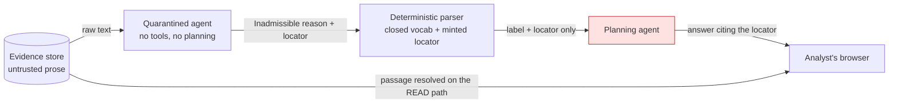

# Legible refusal and continuous readiness

**STATUS: PLANNED** — designed but unbuilt. Governing intent:
[`assistant-mediated-operation`](../../product/intents/assistant-mediated-operation.md)
(Draft). Bound by
[`runtime-architecture.md`](../inspectable-multi-agent-diligence/runtime-architecture.md)
and [`worker-runtime.md`](../pydantic-ai-worker-runtime/worker-runtime.md),
both ratified 2026-09-18.

**Author(s):** eugenelim
**Status:** Draft — revision r1
**Last updated:** 2026-09-18
**Reviewers:** eugenelim (owner); single-operator project, so the independent
pass comes from a forked-context reviewer rather than a second person.
**Evidence:** [`agentic-assistant`](../../ux/blueprints/agentic-assistant.md)
§ Column gaps, G3 and G6.

> **Scope:** the two gaps the service blueprint marked structural. Everything
> else it named — capability introspection, the provenance read path, the
> scenario engine, consequence preview, the completion notifier — is ordinary
> construction against seams that already exist, and is out of scope here.

## TL;DR

Two things the runtime knows but cannot say: *why it is refusing*, and *how
close the work is to publishable*. Both are fixed by making an existing
mechanism carry one more case — inadmissibility becomes an **admitted type**
rather than a parse failure, and readiness becomes a **projection over the
event log** rather than a batch check. The reader is asked to accept that a
refusal may cross the quarantine boundary as a labelled fact, and that a
continuously-displayed readiness signal is not the thing that authorises
publication.

## Context

The blueprint found nine gaps between the agentic-assistant journey and the
ratified runtime. Seven are missing endpoints. Two are missing *concepts*, and
they are the two that produce the journey's worst moments.

**G3.** Trust-class enforcement fails the step when integration output is not
admissible. That is correct for an attack and wrong for the journey's most
common case — an analyst asked *why*, the answer lives in untagged narrative,
and the system must say so. Phase 0 already measured this: causal attribution
and untagged narrative do not cross, and spike 4 recorded a real legal
exposure and an explicit management warning both failing to reach the
analysis. The runtime has one outcome where the experience needs two.

**G6.** Pre-release checks run in the step executor before the agent run,
once. The analyst wants to watch publishability approach while composing, and
learns instead at the moment they expected to be finished. Late failure is the
expensive kind.

### Constraints

- **The quarantine guarantee does not move.** A planning agent receives
  symbolic references, closed-vocabulary labels and typed scalars, and no
  attacker-authored free text. Any refusal mechanism must cross *as one of
  those three*, not as an exception to them.
- **The release gate's authority does not move.** r7 makes 100% claim
  resolution the gate; a display cannot become the thing that authorises.
- **Non-obvious:** the natural fix for G3 — let the quarantined agent explain
  itself in prose — is precisely the thing the boundary exists to prevent. The
  explanation has to be a *label*, or it is a hole.
- **Also non-obvious:** not every release check can be evaluated
  incrementally. A check that folds over per-claim facts can; one that needs
  the whole set at once cannot. Promising a green light that only some checks
  back is worse than promising nothing.

## Goals and Non-goals

### Goals

- **A refusal names its reason and points at the material.** For every case
  where content cannot cross, the analyst receives a closed-vocabulary reason
  and a locator that resolves to the passage — never a generic error, never
  silence. Verified by an assertion suite over each reason in the vocabulary.
- **The prose reaches the analyst without reaching a planning agent.** The
  passage is rendered from the evidence store on the read path. Verified by a
  dependency assertion: no planning agent's context package contains the
  resolved text of an inadmissible item.
- **Malformed and inadmissible remain distinguishable, deterministically.**
  Classification is structural, never a model's or an integration's
  self-report. A parse failure still fails the step.
- **Readiness is visible while work forms.** The analyst can see, at any
  point, which claims resolve and which do not, without asking.
- **The displayed signal never authorises publication.** The gate recomputes
  from scratch; agreement is expected and disagreement is an event.

### Non-goals

- **Widening what crosses the boundary.** This design adds a *label class*,
  not a content class. It does not make causal attribution crossable — it
  makes its absence legible, which is the opposite move.
- **Making the quarantined agent explain itself.** No free-text rationale, no
  matter how useful it would be. That is the hole the boundary exists to
  close.
- **Evaluating whether a refusal was correct.** A quarantined agent that
  refuses reducible material is a quality problem, caught by evaluation, not a
  safety problem caught by the boundary. Owned by
  [`governed-observable-and-evaluable-operation`](../../product/intents/governed-observable-and-evaluable-operation.md).
- **Replacing the terminal release gate.** The projection is a display.

## Proposal

### G3 — inadmissibility is an admitted type

The insight is that the two causes of a rejected result are distinguishable
**structurally**, before any judgement:

| Cause | When it is known | Outcome |
| --- | --- | --- |
| A `free-text` integration bound to a planning role | **Compile time** — R2 already refuses this | The step never runs |
| Output declared `admitted-types` that does not parse | Runtime, deterministically | **Step fails.** Malformed or hostile; unchanged |
| The quarantined agent has material it cannot reduce | Runtime, and it is the *expected* case | **Step succeeds** with an inadmissibility result — new |

The third row is the whole design. It is reached only from the quarantined
agent, because that is the only place where well-formed untrusted prose meets
a requirement to emit admitted types.

**The quarantined agent's output contract becomes a sum type.**

```
QAOutput = Admitted(observations: [AdmittedItem])
         | Inadmissible(reason: Reason, locator: EvidenceLocator)

Reason = untagged-narrative | causal-attribution | cross-fact-inference
       | not-present-in-evidence        # a CLOSED vocabulary
```

`Inadmissible` crosses the boundary legitimately because its two fields are
exactly two of the three admitted classes: a **closed-vocabulary label** and a
**minted reference**. A fixed enumeration is not attacker-authored text, and
the locator is validated against the runtime-minted set the same way every
other reference is. **Nothing about the guarantee is relaxed** — the refusal
is admitted under the existing rules rather than exempted from them.

The four reasons are not invented: they are the four things Phase 0 and r7
§ Known at ship record as not crossing.

**The routing is what makes the analyst whole.**



The planning agent learns *that* there is material at a locator and *what
class* it is. It never sees the prose. The analyst sees the prose, resolved
straight from the evidence store on the read path — the same path that already
serves provenance. **The red box is the one that must stay starved**, and the
diagram is drawn to make a violation obvious.

So the analyst receives: *"There's causal reasoning in the MD&A I can't carry
across — here is the passage, you judge it."* Which is a better answer than
the system currently gives, and a better answer than a system without a
boundary would give, because it is honest about what it did not read.

**What this costs, stated plainly.** The planning agent gains a few bits per
step: which locator, and which of four labels. That is the
**reference-selection channel** r7 already records as *unmitigated and
unmeasured* — this design widens it by one small label class and does not
create it. Recording the widening is the honest move; pretending a refusal
carries no signal would not be.

**And it creates a suppression channel.** A quarantined agent that is steered
— or simply wrong — can return `Inadmissible` for material it could have
reduced, silently removing a finding. This is a *denial* channel, not a
disclosure one, and it is newly reachable. The mitigation is measurement
rather than prevention: refusal rate per reason, per role, against a baseline.
That is exactly the open question
[`assistant-mediated-operation`](../../product/intents/assistant-mediated-operation.md)
already carries — *"what is an acceptable refusal rate, and how would we know
it had been exceeded?"* — and this design is the reason it must be answered.

### G6 — readiness is a projection, not a job

Readiness is a fold over the claim set, and the claim set grows by events.
The system already has a projection engine for exactly this shape: the event
log and its cursor-served stream.

**Claims become events carrying their own resolution.** When a claim is
asserted, resolution is checked deterministically at that moment — does the
locator resolve, does the calculation have recorded inputs — and the answer is
part of the event:

```
claim.asserted { claim_id, locator | calculation_ref, resolved: bool, reason? }
```

Readiness is then `fold(claims) → all resolved`, maintained by the same client
that already consumes the stream, and exposed in the snapshot for a client
that has been away. **No new evaluation engine, no polling, no second
source of truth** — the analyst watches a number that is derived from the same
committed events everything else is derived from.

**Not every check folds, and the split must be visible.**

| Class | Example | Evaluable |
| --- | --- | --- |
| Per-claim | does every claim resolve to evidence or a recorded calculation | **Incrementally** — a fold |
| Whole-set | do any two claims contradict; is the claim set complete for the declared scope | **Only at the gate** — needs the whole set |

The analyst sees the incremental class continuously and is told, explicitly,
that some checks run at publication. A readiness indicator that implies more
coverage than it has would recreate the late-failure problem it exists to
solve, one level up.

**The gate recomputes; the display projects.** At publication the release gate
evaluates every check from scratch against committed state, and its verdict is
authoritative. The projection is a display and is never consulted for the
decision. If the two disagree, the gate wins **and the disagreement is
appended as an event** — because a projection that has drifted from the log is
a bug, and the only thing worse than finding it is not recording that it
happened.

This keeps A2's authority exactly where r7 put it. What changes is that the
pre-release check becomes a *re-verification* of something the analyst has
been watching, rather than the first time anyone looked.

## Alternatives Considered

### Let the quarantined agent explain the refusal in prose

The most useful answer for the analyst by a wide margin: a sentence saying
what the material is and why it could not be reduced.

**Rejected because** it is the hole the boundary exists to close. A free-text
rationale from an agent that has just read attacker-authored prose is
attacker-authored prose with an extra step, and it would reach a planning
agent. The closed vocabulary gives up nuance to keep the guarantee, and the
locator gives the nuance back to the *human* through a path the planning agent
is not on.

### Classify malformed-versus-inadmissible with a second model

A judge model reads the rejected output and decides whether it was an attack
or an honest limit.

**Rejected because** it makes a security boundary depend on a model's
judgement, which is the position this project rejects everywhere else and has
evidence against — every detection approach evaluated in the literature has
lost under adaptive attack. The structural split costs nothing and cannot be
argued with.

### Keep failing the step and explain it in the UI

Let the step fail as it does now, and have the interface render a friendly
message for the failure.

**Rejected because** the UI cannot distinguish the cases either — it would be
guessing from an error, which is the same detection problem moved to a worse
location. It also loses the locator, which is the part the analyst actually
needs. A failed step has no admitted output to carry one.

### Recompute readiness on demand

Re-run the release checks whenever the client asks.

**Rejected because** it is a batch job with a shorter period, so it inherits
the cost and adds polling — and it would run the whole-set checks repeatedly
over an incomplete set, producing red lights that mean nothing. The fold is
cheaper and, more importantly, honest about which checks it covers.

### Make readiness the authority and skip the terminal gate

If the projection is continuously correct, the gate is redundant.

**Rejected because** a projection is a cache and the release gate is the
product's central promise. Caches drift; this one is maintained partly
client-side. The gate is cheap and runs once.

## Risks

- **The suppression channel is new and unmeasured.** A steered or mistaken
  quarantined agent can hide a finding behind `Inadmissible`. *Unmitigated by
  construction* — the mechanism is measurement, and no baseline exists.
  This is the most important thing in this document.
- **The closed vocabulary will be wrong at first.** Four reasons derived from
  one spike on one filing. A reason that does not fit gets forced into the
  nearest label, which is how a vocabulary silently stops meaning anything.
  *Mitigated* by treating the distribution across reasons as a signal and
  revisiting after Phase 1.
- **A refusal is a better attack surface than a failure.** A failed step ends
  the interaction; an admitted refusal continues it, carrying a
  label and locator of the agent's choosing into a planning context.
  *Partially mitigated* — the locator is validated against the minted set and
  the label against the enumeration, so the choice is bounded to a few bits.
  *Named* because "bounded" is not "none".
- **Operational — 3am.** The readiness projection diverging from the gate is
  the failure that looks like nothing. An analyst sees green, publishes, and
  the gate refuses; or worse, the projection shows red forever and nobody
  notices it is stale. *Mitigated* by appending the disagreement as an event
  and alerting on any occurrence — this should be zero, so any non-zero rate
  is a bug and not a threshold to tune.
- **Rendering the passage is an output-handling surface.** The inadmissible
  passage is untrusted prose displayed to a human. *Mitigated* by the
  plain-text rendering rule already specified in `worker-runtime.md`
  § End to end, GAP 4 — no markdown, no HTML, no autolinking. Worth repeating
  because this design *increases* how often untrusted prose is shown.
- **Claim resolution at assertion time may be wrong later.** A calculation's
  inputs are recorded, and evidence snapshots are immutable, so resolution
  should be stable. *Accepted* on that reasoning, and the terminal
  recomputation is what catches it if the reasoning is wrong.

## Rollout

**Phased, and both parts are additive.** Neither changes an existing
contract — G3 adds a variant to an output type that has no production
instances yet, and G6 adds an event type and a projection.

**Phase A — G3 ahead of G6.** G3 is on the critical path for the assistant's
worst moment and is testable without a UI: assert that each reason in the
vocabulary crosses the parser, that the locator resolves, and that no planning
agent context package contains the resolved text. G6 needs a client to be
useful.

**Phase B — G6 with the first conversational surface**, since a readiness
display with nothing to display is untestable.

**Rollback.** Both are additive and neither has a migration. Removing G3
returns the boundary to failing the step — a worse experience, not a broken
one. Removing G6 returns readiness to the terminal gate, which retains full
authority throughout and so loses nothing but the display.

**On the hook:** `eugenelim`, owner and sole operator.

## Open Questions

- **What is the baseline refusal rate, and per reason?** Unanswerable before
  Phase 1 runs real material. It gates the suppression-channel mitigation,
  which is this design's largest unmitigated risk. Owner: `eugenelim`,
  measured over the fixture corpus first because it is the only corpus where
  the correct answer is known.
- **Does `not-present-in-evidence` belong in the same vocabulary as the other
  three?** The other three are *"this exists and cannot cross"*; this one is
  *"this does not exist"*. Conflating a boundary with an absence may teach the
  analyst the wrong thing about both. Answerable by putting both phrasings in
  front of one analyst.
### Settled

- **Should the planning agent see the reason, or only that something was
  withheld? — SETTLED 2026-09-18: the reason.** Owner decision. Withholding
  the label would narrow the selection channel further, at the cost of the
  planning agent being unable to compose a sentence the analyst can act on —
  and an answer the analyst cannot act on is close to the silence this design
  exists to remove. The cost is accepted and is the channel widening recorded
  under § Risks: a few bits per step, bounded by a four-value enumeration.
