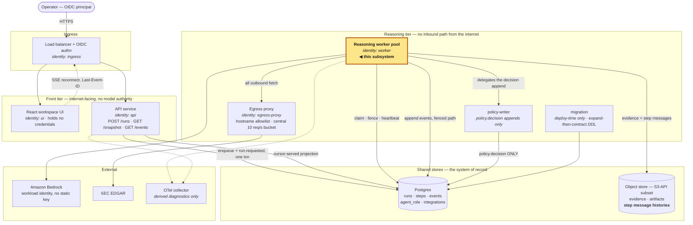
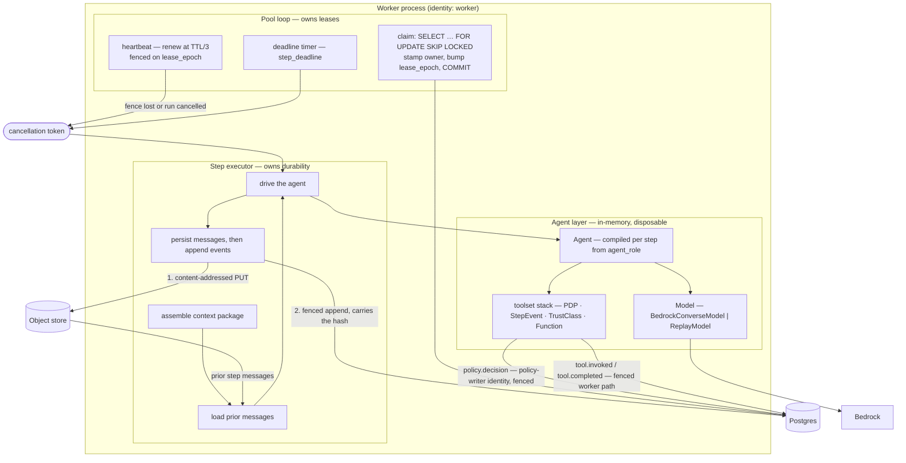
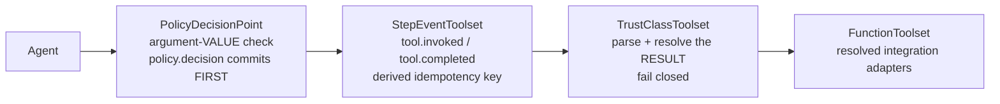
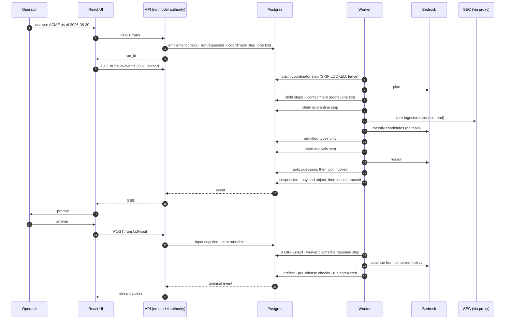
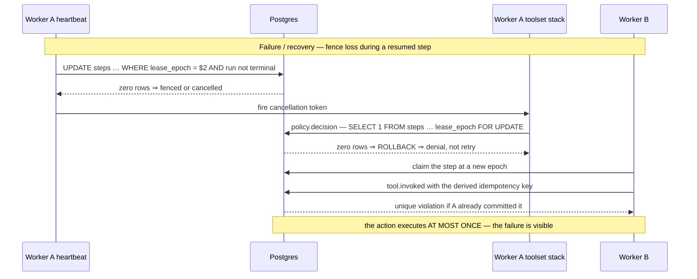

# Subsystem Design — the reasoning worker and its pool

**STATUS: PLANNED** — the pool, the lease protocol and the privilege split are
built; the agent layer, the authorization boundary and the provider call are
not. [`../README.md`](../README.md) § What is built is the current map.

**Decision sought:** accept this as the specification of the inside of a leased
step and the pool that leases them, binding on
[`walking-skeleton-role-compilation`](../../specs/walking-skeleton-role-compilation/spec.md),
[`walking-skeleton-authority-containment`](../../specs/walking-skeleton-authority-containment/spec.md)
and [`walking-skeleton-step-lifecycle`](../../specs/walking-skeleton-step-lifecycle/spec.md).

**Author:** eugenelim
**Status:** Accepted — 2026-09-18, alongside the runtime architecture
**Last updated:** 2026-09-20
**Reviewers:** eugenelim (owner). A single-operator project: the independent
pass came from a forked-context reviewer agent, not a second person.

**Revision:** r5. Documents citing **r4** cite the revision this one supersedes,
at commit `1003fb0ba90e7dbc36c33afd79baef3c9189ba40`, recoverable through git
history. This revision reorganizes that content and changes no accepted
decision; the amendments r4 asked of its parent now live in the parent.

**Errata:** 2026-09-20 — § 1's inherited-constraints line named `pydantic-ai`
2.44.0 while [ADR-0002](../../adr/0002-pydantic-ai-version-pin.md), which it
cites as the owner of the pin, pins 2.45.0. Corrected in the projection, not the
ADR. No accepted decision changed, and the revision stays r5; recorded because
specs citing r5 carry amendment triggers keyed to its content.

**Governing decisions:**
[ADR-0001](../../adr/0001-pydantic-ai-as-the-agent-framework.md) (framework),
[ADR-0002](../../adr/0002-pydantic-ai-version-pin.md) (version pin),
[ADR-0003](../../adr/0003-repository-layout.md) (layout),
[ADR-0004](../../adr/0004-fence-function-owner.md) (fence function owner),
[ADR-0005](../../adr/0005-the-fence-proves-lease-possession.md) (the fence
proves possession).

**Constraint authority:**
[`portable-identity-first-runtime`](../../product/intents/portable-identity-first-runtime.md)
§ Constraint amendments, owner-amended 2026-09-17.
**Evidence:** [`spikes/README.md`](../../../spikes/README.md) — the framework
spike, the privilege-split spike, the lock-ordering spike, and the resumption
spike. Each claim below cites the spike that carries it; no evidence is
reproduced here.

**Decomposition:** § 9 walks the `architect-design` decomposition rubric
(criteria `D1`–`D6`). No *child* of this subsystem earns its own document, and
the amendments this design needed from its parent were folded into the parent
rather than carried here.

---

## 1. Scope and Context

What does this subsystem own, what does it explicitly not own, and why does
the boundary sit there rather than somewhere else?

| In scope | Out of scope | Why the boundary falls here |
| --- | --- | --- |
| Claiming a step under a lease, and holding that lease | The run state machine and what a run *means* | The application owns run state; the pool owns the right to execute one step of it |
| Compiling an agent role into a runnable agent at step start | Authoring roles, ceilings and integrations | Authoring is `policy-author`, human-operated, with no runtime identity holding it |
| Authorizing every tool call on argument value, and recording the decision | Deciding *which* step runs next | Planning is an agent role's output, materialized by the application layer |
| Persisting the step's message history and appending its events | The event log's schema, the envelope, the append paths | Ratified in the [runtime architecture](../inspectable-multi-agent-diligence/runtime-architecture.md); this design is bound by it |
| Mediating every model call, and bounding spend and wall-clock per step | The telemetry boundary and redaction policy | Deferred to [`observability-and-evaluation.md`](../inspectable-multi-agent-diligence/observability-and-evaluation.md) |
| Enforcing the quarantine boundary's *input* and *output* trust classes | The quarantine boundary's *guarantee* | The guarantee is the deterministic minting pipeline, ratified upstream |
| Rendering agent-authored text as a boundary requirement | How the browser renders it | [`experience-and-presentation.md`](../inspectable-multi-agent-diligence/experience-and-presentation.md) implements it |

### Goals

Each is testable from outside the subsystem.

- **Nothing agent-specific is compiled into the worker.** Adding an agent role,
  or an integration of an already-registered `kind`, is a data write against an
  unchanged image. A new `kind` is a code change by construction.
- **No single credential spans two integrations' backends.** Each integration
  resolves its own credential scope, so the worker's task role is not the union
  of every integration's authority. This buys blast radius, not isolation —
  see § 9 Risks.
- **The framework is containable.** No `pydantic_ai` import exists outside
  `agents/` and `adapters/`, and zero exist under the domain package.
- **A step's model conversation is replayable modulo excluded reasoning
  parts.** The persisted bytes deserialize to a message list a *fresh* agent
  resumes from, with no model call and no shared in-memory state. Reasoning
  parts are excluded before persisting, because never writing chain-of-thought
  is a storage property the runtime architecture guarantees.
- **Authorization is fail-closed inside the framework.** For every well-typed
  unauthorized call, the tool body does not execute and the step terminates. A
  denial is never delivered to the model as retryable advice.
- **The approval gate crosses a process boundary.** A suspended step's state is
  a JSON payload object, and the decision is applied by a different worker
  process holding a fresh lease.
- **No step is *reported* running past `step_deadline`.** At the deadline the
  step fails and its lease releases, whether or not the provider call has
  terminated. This is deliberately weaker than "the model call is cancelled";
  § 3 says why.
- **Provider portability costs one class.** Swapping the model provider changes
  one `Model` subclass under `adapters/` and zero files elsewhere.
- **Token spend per step is bounded before the call**, not observed after it.

### Non-goals

- **Executing agent-supplied or registry-supplied code.** Integrations are data
  *selecting* a first-party adapter from a closed set of kinds. A registry that
  could introduce new executable behaviour by data write is a different system
  with a different threat model.
- **Enabling MCP.** The registry shape admits `kind: mcp`; the provenance story
  does not exist. An externally-sourced MCP server supplies tool descriptions
  and schemas into the model's context, which is an untrusted instruction
  surface rather than a dependency.
- **Adopting a durable-execution engine.** The framework ships integrations for
  Temporal, DBOS, Prefect, Restate and Lambda durable functions, and this design
  uses none of them. § 9 says what the Postgres-backed one costs.
- **Letting typed output become the quarantine boundary.** Structured output is
  a layer, not the security control.
- **Concurrent steps inside one worker.** One step in flight per worker stays;
  § 6 says why that leaves no throughput on the table.
- **Changing the event log, the envelope, the lease protocol, or the run state
  machine.** § 10 lists the additive changes this design does ask for, and none
  is a reversal.
- **Adopting the hosted observability product.** This design takes the
  OpenTelemetry instrumentation, which works with any OTel backend.



### Why the boundary sits here

The ownership split is ratified upstream and is not renegotiated: the
application owns run state, the durable event log, checkpoints and
authorization decisions, and the framework is invoked *inside* a step and is
never the system of record for anything a user inspects. This subsystem
specifies what that ratification deliberately left as "a framework is invoked
inside a step". Any shape that makes the framework the system of record for run
state loses against inspectability and is out of scope by construction.

The diagram is a different cut from the runtime architecture's structure
diagram, which traces the *data path* through the quarantine boundary. This one
traces *deployables and the identities they hold*, because that is what decides
which box a credential compromise reaches. Only the highlighted box is this
subsystem.

Two placements in it are load-bearing. `policy-writer` is a separate arrow
rather than a library call, which is what lets a decision point live inside a
framework object without handing that object the worker's general write grant.
The object store gains one payload class — step message histories — and no new
contract, because it uses the same `PUT`/`GET`/`HEAD`/`DELETE`/`LIST` subset
already pinned for portability.

### Constraints inherited

The pinned framework version is `pydantic-ai` 2.45.0
([ADR-0002](../../adr/0002-pydantic-ai-version-pin.md)), and the version
argument below holds only while that pin is what ships. The seam set named by
the [portable identity
constraint](../../product/intents/portable-identity-first-runtime.md) is the
model-provider adapter plus one adapter per registered integration `kind`;
closure is preserved by making a new kind an intent change rather than an
implementation detail. The `sql-read` and `object-store-read` kinds this design
introduces are therefore intent-level additions, recorded as such.

Two vendor facts bound the version risk and neither is obvious. The V2 line
went stable on 2026-06-23 against a published floor of three months before a
next major, and **that window closed in September 2026** — a major release is
permissible at any time. The same policy permits adding optional fields and
message parts to existing types in a *minor* release, so a message history
retained for the life of a published report relies on additive-only drift that
the vendor has not promised as a schema guarantee.

---

## 2. Structural Model

What are this subsystem's internal elements, how do they relate, and at what
zoom level are we looking?

**Zoom: component, inside one worker process.** The application layer and the
registry appear because this subsystem calls them, not because it owns them.

| Element | Type | Responsibility | Owns durable state |
| --- | --- | --- | --- |
| Pool loop | in-process task | Claims steps, holds and renews the lease, owns the cancellation token and the deadline | No — the lease row is in Postgres |
| Step executor | component | Assembles input, drives one step, persists the result, appends events | No — it writes, it does not hold |
| Agent compiler | component | Turns an `agent_role` version into a constructed agent, and asserts the structural invariants | No |
| Compiled agent | in-memory object | Holds one step's conversation; disposable by construction | No — this is the point |
| Toolset stack | in-memory object | Authorizes, records and parses every tool call, innermost to outermost | No |
| `Model` adapter | in-memory object | The provider seam — `BedrockConverseModel` live, `ReplayModel` for fixtures | No |
| Integration registry | Postgres table | Integrations as data: kind, adapter, connection, credential scope, argument schema, trust class | Yes — written only by `policy-author` |
| `agent_role` records | Postgres table | Instructions ref, output-schema ref, tool bindings, model settings, the ceiling | Yes — written only by `policy-author` |
| Application layer | linked library | Run state machine, pre-release checks, publication, context-assembly rules, step planning | Yes — run state |

| From | To | Nature | Protocol |
| --- | --- | --- | --- |
| Pool loop | Postgres `steps` | claims, fences, renews | SQL, `FOR UPDATE SKIP LOCKED` |
| Pool loop | Step executor | hands over a claimed step; receives one of three outcomes | in-process call |
| Step executor | Agent compiler | requests a compiled agent for a role version | in-process call |
| Agent compiler | Integration registry, `agent_role` | reads, cacheable indefinitely | SQL, `worker` identity |
| Step executor | Object store | content-addressed payload write, then read on resume | S3-API subset |
| Step executor | Postgres `events` | fenced append, after the payload write | SQL, `worker` identity |
| Toolset stack | Postgres `events` | `policy.decision` first, then `tool.invoked` | SQL, `policy-writer` then `worker` |
| `Model` adapter | Bedrock | model call | HTTPS, ambient workload identity |
| Step executor | Application layer | pre-step hooks, outcome disposition | in-process call |



### Why this grain, and where the line falls

The line that decides the zoom runs between the step executor and the agent
layer: **everything durable happens in the step executor, and the agent layer is
an in-memory conversation that can be thrown away and rebuilt from bytes.** A
finer grain would model the framework's internals, which are vendor detail. A
coarser one would hide that line, which is the property the whole design rests
on.

Exactly two kinds of write originate inside the agent layer — the authorization
decision and the tool-invocation record — and both travel the same fenced and
policy paths the step executor uses, under the same database identities, with no
new grant. Neither is *state*: both are attribution records that must commit
*before* the action they describe, so they cannot be deferred to step end
without defeating their purpose. The split being protected is over run state —
what the run is, what it decided, what it published — and none of that is
written from inside the agent.

### The toolset stack, innermost to outermost

Order is a security property, not a style choice.



`PolicyDecisionPoint` is outermost so nothing below it ever observes an
unauthorized call. That is necessary and not sufficient — sufficiency comes from
the compiler invariant below, which is what guarantees no sibling toolset sits
beside the stack.

`TrustClassToolset` is innermost so it parses an integration's result *before*
any layer above observes the return value. A free-text result therefore cannot
reach the attribution record or the agent, and `tool.completed` records the
parse outcome, so a rejected result is attributable rather than merely absent.

### An agent role compiles to an agent

An agent role is a named, versioned security object declaring a tool allowlist
with per-argument value constraints, stored outside any model's context. At step
start it compiles:

```
agent_role(version) ⟶ ( instructions, toolset stack, ceiling, model settings )
```

**The compiler is the only constructor of an agent, and that is a structural
invariant rather than a convention.** Nesting order governs only tools reached
*through* the wrapped stack: a tool registered by decorator, or added as a second
entry in `toolsets=[…]`, is a sibling the decision point never sees. The
behavioural authorization suite cannot catch that — an unwrapped tool has no
ceiling entry to violate, so there is no unauthorized call to fail — which is
why a tool reachable outside the wrapped stack is a **build failure, not a
denial**.

Agents are constructed per step and never cached across steps, because a role
version in use by an in-flight run is immutable and new versions bind only at
the next spawn. A cached agent object is a cached role version, which is exactly
the staleness the recorded containment proof rules out.

`instructions` rather than `system_prompt` is deliberate, and the property reads
backwards if compressed. **Instructions carried inside a replayed message
history are excluded, and the instructions supplied to the current run always
apply**; system prompts are retained across runs and would accumulate from
history. A resumed step is therefore prompted by the *current* role compilation
and never by a stale copy replayed from a payload written days earlier.

### Responsibility catalogue — the pool

The pool owns the right to execute. It never reads an agent definition.

| # | Responsibility | Why here |
| --- | --- | --- |
| P1 | Capacity and process lifecycle — maintain N workers, health, `SIGTERM` drain | Fleet-level; a step cannot see the fleet |
| P2 | Work acquisition — poll, `SKIP LOCKED` claim filtered on `pool_class`, stamp owner, bump `lease_epoch`, commit immediately | Must complete before any definition is read, or a fetch failure strands a claimed step |
| P3 | Lease custody — acquire, renew at TTL/3 fenced on `lease_epoch`, release on completion, failure *or suspension*, detect fence loss | The only component that knows the lease exists; an awaiting-approval step must not hold one |
| P4 | Admission control and backpressure — one step in flight, back off on a signalled condition | Consumes a signal (proxy bucket depth, provider throttling counter); enforcement of the aggregate rate limit is the egress proxy's |
| P5 | Deadline and cancellation ownership — the timer, the token, the transport timeout | Must outlive and out-scope what it bounds; a runtime cannot reliably cancel itself |
| P6 | Step-attempt disposition — transient vs terminal, attempt counting, lease-expiry count as the DLQ substitute | There is no DLQ primitive upstream; this answers that gap. Distinct from R14, which caps retries *inside* one attempt |
| P7 | Drain and rolling replacement — stop claiming, release or finish in flight | Deploy-time; invisible to a step |
| P8 | Workload credential acquisition — the task role and both database roles | Process-scoped, not step-scoped |
| P9 | Fairness across queued runs — no run starves while another fans out | Requires seeing the queue |
| P10 | Pool telemetry — claims, lease losses, queue depth, claim latency | Fleet signals, not analysis signals |

### Responsibility catalogue — the runtime

The runtime turns *a row naming an agent* into *a completed, attributable,
durable step*. It never claims work and knows nothing about the domain.

| # | Responsibility | Note |
| --- | --- | --- |
| R1 | Resolve the agent definition from the role version | Cacheable indefinitely; tool bindings name `(integration_id, integration_version)` |
| R2 | Resolve integrations to concrete adapters, refusing a `free-text` integration bound to a non-quarantined role | **Fail closed.** An unresolvable integration is a step failure, never a silently smaller toolset |
| R3 | Resolve the model *id and settings* from role data | The `Model` *implementation* is injected by the pool — deploy-time wiring, not role data |
| R4 | Resolve per-integration credentials and scopes | Per-integration, not per-worker. This is what stops the fleet identity becoming the union of every agent's authority |
| R5 | Compile the agent and assert the structural invariants | Exactly one toolset and it is the decision point; no decorator tools; ceiling ⊆ parent; effective limits = `min(pool default, role value)`; role model id within the pool's allowed set; `thinking` disabled. A violation is a build failure |
| R6 | Assemble the context package under the admitted-type rules | References, closed-vocabulary labels, typed scalars — or raw untrusted text, quarantined roles only |
| R7 | Load prior state on resume — message history, deferred tool results | From the content-addressed payload store |
| R8 | Enforce the declared input trust class | The quarantine boundary, enforced by the substrate rather than by the agent's good behaviour |
| R8b | Invoke the application layer's pre-step hooks and commit their result before the agent runs | The runtime owns the call site and the ordering; the application owns the rule |
| R9 | Drive the agent run and own its event loop | |
| R10 | Mediate every tool call — authorize on argument value, append the decision first, derive the idempotency key, append attribution | Every call, every integration, no bypass path |
| R10b | Enforce the output trust class with the runtime's own deterministic parser | The boundary is the parser, never the integration's declaration |
| R11 | Mediate every model call — usage accounting, streaming, retry policy | |
| R12 | Enforce the pool's cancellation and deadline | The runtime observes the token; the pool owns it |
| R13 | Handle suspension — produce a resumable state when a call needs approval or external resolution | |
| R14 | Bound the loop — request, token and cost ceilings, and the retry cap | |
| R15 | Validate output against the role's declared schema | A layer; the security boundary is still a deterministic parser outside the agent |
| R16 | Persist — content-addressed payload first, fenced append second, reasoning parts stripped | The ordering *is* the atomicity story across two stores |
| R17 | Emit the semantic event stream | Events, never token deltas |
| R18 | Record the producer tuple — model, settings, prompt hash, role version, adapters, framework version | What makes a replay labellable as divergent |
| R19 | Account usage and cost per step, and emit OTel spans with content excluded | |
| R20 | Contain the step — no state survives it except what R16 persisted | The disposable agent is the isolation mechanism |
| R21 | Return the step outcome — completed, failed or suspended — to the pool | The pool cannot release a lease correctly without knowing which |

### Responsibility catalogue — the application layer

Domain knowledge, deliberately not generic. It is code linked into both the
`api` and `worker` deployables, not a fourth process.

| # | Responsibility | Runs in |
| --- | --- | --- |
| A1 | Run state machine and its projections — R21 returns an outcome, this decides what the run becomes | `api` + `worker` |
| A2 | Pre-release checks — 100% claim provenance and the rest of the release gate. Their result is what makes the approval gate conditional | `worker` |
| A3 | Publication — the transition, and the typed artifact published | `api` + `worker` |
| A4 | Context-package assembly rules — which admitted types, from which evidence, for which role class. R6 executes an assembly; this decides what a correct one is | `worker` |
| A5 | Role-class semantics — that a quarantined role resolves no integrations and carries a stricter input class | `worker` |
| A6 | Step planning — validating a coordinator's plan and materializing child step rows with their containment proofs | `api` (first step) + `worker` (the rest) |
| A7 | Ceiling and registry authoring, via `policy-author` | Neither — human-operated |

**So the genericity goal is narrower than "nothing is hardcoded".** The accurate
statement is that the pool and the runtime hardcode nothing about any agent, and
the application layer above them is domain-specific by design. A second use case
brings a second application layer and reuses the pool and runtime unchanged,
which is the claim worth testing.

The three-way split is exhaustive on *what*, not on *where*. The runtime spans
the step-executor and agent layers, because R10 and R11 are discharged *by* the
toolset stack and the `Model` rather than beside them.

---

## 3. Runtime Model

How does this subsystem behave at runtime, on the normal path and when
something goes wrong?

| Scenario | Trigger | Path |
| --- | --- | --- |
| One run, click to published report | Operator posts a run | normal |
| Mid-run clarification | Agent calls `request_user_input` | normal, suspending |
| Flagged output needs approval | A pre-release check failed | normal, suspending |
| Fence loss or run cancellation mid-step | Lease reclaimed, or the run reaches a terminal state | failure / recovery |
| Step exceeds `step_deadline` | Wall clock | failure |
| Duplicate execution across a resume | Two workers resume the same saved history | failure, contained |



### What the normal path establishes

Every human interaction has the same shape: payload object written first, fenced
append second, lease released, a *different* worker resuming from bytes. That
uniformity is why there is one suspension mechanism and not two, and it is what
survives the host being replaced between suspension and resume.

The API never holds model authority and never talks to a worker. The stream is a
cursor-served projection over committed events throughout, so run duration and
connection duration stay independent. A client that has been away rejoins
through `GET /runs/:id/snapshot` — discard local state, render the snapshot,
resume the cursor at `as_of_seq` — which is the ordinary page-load path and not
only a recovery mechanism.

Two mechanisms in that path exist because tracing a whole run exposed them as
missing. **Step rows are materialized by the step executor, not by the agent**:
the coordinator is an agent role like any other, its output is a typed plan, and
the executor validates each child's ceiling against its parent's, records the
containment proof as an event, and inserts the rows in the same transaction as
the parent's completion. A plan naming a role whose ceiling is not contained
fails the step.

**Agents can ask the operator a question mid-run**, through a
`request_user_input` tool that suspends the step exactly as an approval does.
The run gains one non-terminal state:

| From | To | Trigger | Event |
| --- | --- | --- | --- |
| `running` | `awaiting_input` | agent calls `request_user_input` | `input.requested` |
| `awaiting_input` | `running` | operator answers | `input.supplied` |
| `awaiting_input` | `cancelled` / `failed` | the existing any-non-terminal transitions | — |

`awaiting_input` releases its lease, for the same reason `awaiting_approval`
does. **The operator's answer is a direct-injection surface and is treated as
one**: it is trusted *as instruction* and bounded by what the acting role may
do, never screened. Two constraints keep that honest — the answer is admitted at
the role's existing ceiling and cannot widen it, and the request/answer pair is
recorded as events so the analysis can be reconstructed knowing a human steered
it.

**Agent-authored text reaching a human is rendered as plain text, never as
markdown, HTML, or a link.** No raw-HTML injection, no link autolinking, no
image embedding: a model-authored `[click](javascript:…)` or an
attacker-influenced exfiltration URL must not become clickable. Typed domain
artifacts are rendered by the application's own components from structured
fields, which is a different path and stays rich.

### The approval gate

The gate is conditional, and the condition is computed outside the model. The
deterministic pre-release checks run in the step executor *before* the agent
run, and their result commits as an event; the approval-gated tool is present in
the compiled toolset **only when a check failed**. On a clean run there is no
gated tool and no human in the path.

The agent's only lever is a contentless `request_approval()` that suspends the
step. It cannot publish: publication is an application-layer transition (A3) and
the published artifact is the application's typed artifact assembled from
structured fields, never a tool argument.

The commit order spans two systems that cannot share a transaction, so the
ordering *is* the atomicity story:

1. The agent run returns deferred requests. Nothing has been published.
2. **The payload object is written first**, content-addressed. **The fenced
   append commits second**, carrying the object's hash.
3. The run transitions to `awaiting_approval` and the step's lease releases.
4. The approver acts. A grant appends `approval.granted`; a rejection appends
   `approval.rejected` carrying the reason, which returns as the deferred tool
   result so the agent revises. **Capped at three cycles per step**, after which
   the step fails with a recorded cause.
5. **A different worker** claims it, loads the messages, constructs a fresh
   agent from the same role version, and resumes.

A crash between steps 2 and 3 leaves an unreferenced object, which is garbage.
The reverse order would leave a dangling payload reference on an
`awaiting_approval` run that can never be resumed — and because approval has no
default timeout, that is a permanently stuck run rather than a delayed one. The
same ordering governs the ordinary non-approval persist path, which has the
identical hazard.

Rejection resuming the conversation is not the forbidden negotiation pattern,
because the model cannot publish at all; it can only ask again. The three-cycle
cap is arbitrary and recorded as such — it exists so the loop is bounded, and
Phase 1 replaces it with an observed number.



### Why the failure path looks like this

Fence loss and cancellation collapse into one signal, which is correct — both
mean *stop, you no longer own this*. The heartbeat already writes every 20
seconds, so it reads the run state in the same statement and a terminal state
fires the same cancellation token:

```sql
UPDATE steps SET lease_expires_at = now() + interval '60 seconds'
 WHERE step_id = $1 AND lease_epoch = $2 AND owner = $3
   AND (SELECT state FROM runs WHERE run_id = steps.run_id)
       NOT IN ('cancelled','failed')
RETURNING 1;
-- zero rows ⇒ fenced OR cancelled ⇒ fire the token
```

Worst-case cancellation latency is therefore one heartbeat interval, and no new
polling exists. The same 20 seconds is the fence-detection window, so two
workers can be inside the same step's toolset stack at once — a real window, not
a theoretical one, and what the approval resume changes is that the overlapping
action can be the *published* one rather than a read.

**Two controls make that overlap benign and neither is optional.** The
`policy.decision` append takes the fence *first*, so a fenced worker's
authorization decision rolls back rather than committing for a step whose new
owner is concurrently authorizing its own calls. And the idempotency key is
*derived*, so the second `tool.invoked` append raises a unique violation, the
recording layer does not delegate, and the step terminates as a
duplicate-detected failure rather than a silent no-op.

```
idempotency_key = hash(run_id, step_id, tool_call_id)
```

`tool_call_id` is assigned by the model turn and is stable across serialization,
so it survives the process boundary that a per-attempt key does not. **The claim
is narrower than it looks:** the key is stable across *resume from the same
history*, which is the approval and fence-loss case, and it is **not** stable
across a re-planned retry after a step failure, because a new model turn mints a
new id. Deduping that needs a semantic key derived from the tool's arguments,
which this design does not add.

### Deadline, cancellation, and the honest limit

`step_deadline` is a wall-clock ceiling fired by the pool. Three thresholds
derive from p99 step duration and their ordering is an invariant rather than a
coincidence: **p99 < `step_deadline` < page threshold (p99 × 3)**. The deadline
must fire before the primary page, or the page fires for a condition the worker
has already handled, which trains an operator to ignore it.

The token is disarmed the moment the agent run returns. Otherwise a deadline
firing between the run returning and the persist committing would discard a step
that actually succeeded. Persisting is never cancellable; the only thing that
may invalidate it is fence loss, which the fenced append handles by rolling back.

**This narrows the hung-stream operational risk and does not close it.** Both
new controls are in-process asyncio tasks sharing an event loop with the call
they bound, so the failure mode splits in two:

- **An awaited stream stalls while the loop stays responsive.** The deadline
  fires and the step ends. This is a real gain, and it is also the case where
  the heartbeat keeps renewing happily, so lease expiry would never have
  recovered it.
- **A blocking synchronous call starves the loop.** The deadline timer and the
  heartbeat both stop, the lease expires, and recovery is the path that already
  existed. No gain, no loss.

The out-of-loop observer that covers the second slice already exists and costs
nothing: the ECS **liveness probe** is out-of-process by construction, so a
starved loop cannot answer it and the task is replaced. The probe is therefore
specified to fail when **no heartbeat has been *attempted* within 2 × TTL**, not
merely when the process exists. The operational page stays as backstop.

**The transport-level fallback is specified, not deferred.** Because asyncio
cancellation cannot be trusted to stop a synchronous botocore request, the agent
run is additionally wrapped in a hard task-level timeout, and the Bedrock client
is constructed with bounded connect and read timeouts. The deadline then bounds
*the step* even where it does not bound *the call* — which is why § 1 states the
goal as "no step is reported running past the deadline" rather than "the model
call is cancelled". An abandoned request is still billed and still holds
token-bucket budget.

---

## 4. Contracts and Invariants

What must always hold across every boundary this subsystem exposes, and how
would a violation be caught?

| Contract | Parties | Invariant | Failure semantics | Enforcement | Verification |
| --- | --- | --- | --- | --- | --- |
| **Step lease** | pool ↔ `steps` | A step has at most one live owner; an owner acts only at its own `lease_epoch` | Fenced writes roll back; the step is re-claimable after TTL | `lease_epoch` + owner predicate on every write | Lock-ordering and resumption spikes; fault-injection suite |
| **Fence proves possession** | any fenced writer ↔ `steps` | A never-claimed, released, drained or expired step is unappendable at any epoch | Append refused | `fence_step`, owned by a `NOLOGIN` role so the distrusted role cannot drop it ([ADR-0004](../../adr/0004-fence-function-owner.md), [ADR-0005](../../adr/0005-the-fence-proves-lease-possession.md)) | Built and under test |
| **Worker append path** | `worker` ↔ `events` | The worker cannot append a reserved event type through its own path | Append refused by the database, not the application | `SECURITY DEFINER` function with a disjoint grant | Privilege-split spike, 7/7 |
| **Policy decision append** | `policy-writer` ↔ `events` | A `policy.decision` commits **before** the action it authorizes, and only under a live fence | Failed append is a **denial**, never a retry | Second database identity, fenced transaction | Phase 1 criterion: force the append to fail, assert the tool body does not run |
| **Tool authorization** | decision point ↔ every tool call | `args ∈ role.ceiling ∧ args ∈ initiating_user.entitlements` | Domain exception, propagating out of the agent run; **never** a retryable hint | `call_tool` override, outermost in the stack | Authorization suite asserts refusal *and* the exception type, on every build |
| **Agent compilation** | compiler ↔ agent | Exactly one toolset, and it is the decision point; no decorator-registered tools | **Build failure**, not a denial | Structural assertion at compile time | Authorization suite, structural case |
| **Spawn containment** | orchestrator ↔ child role | `role.ceiling ⊆ parent_role.ceiling ∧ role.ceiling ⊆ initiating_user.entitlements` | The plan fails the step | Checked at spawn, recorded as an event | Containment property test |
| **Authoring containment** | author ↔ role version | `role.ceiling ⊆ author.authoring_entitlement` — an author may only grant what they hold | The role version is not writable | Checked at authoring, recorded on the version | Containment property test |
| **Argument domain typing** | registry ↔ ceiling | A predicate ranges over the domain the *callee* interprets the argument in | Unregistrable integration, or refused predicate | `arg_schema` domain types; prefix expressible only on `opaque-string` | Phase 1 criterion 8 |
| **Canonical form is what is passed on** | runtime ↔ adapter | The adapter receives the canonicalized value and must not re-parse the original | Ambiguous parse is refused, never guessed | One parser, one representation | Phase 1 criterion 8 asserts the adapter observes the canonical value |
| **Idempotency** | recording layer ↔ `events` | A `(run_id, idempotency_key)` pair appends at most once for `tool.invoked` | Unique violation ⇒ duplicate-detected step failure, visible | Partial unique expression index | Fault-injection suite |
| **Input trust class** | executor ↔ agent | A planning role's context carries only references, closed-vocabulary labels and typed scalars | Step failure | Enforced by the substrate, not by the agent | Quarantine suite |
| **Output trust class** | `TrustClassToolset` ↔ integration | Admitted-type output is *parsed* by the runtime; a reference resolves against a set the runtime minted for this step | Step failure | Runtime's own deterministic parser | Quarantine suite |
| **Registry write authority** | `policy-author` ↔ registry | No runtime identity holds write on `agent_role` or the integration registry | Grant refusal | Database grant | Privilege-split spike |
| **Persist ordering** | executor ↔ two stores | Content-addressed payload commits **before** the event that references it | Crash between them leaks an unreferenced object, never a dangling reference | Ordering in R16 | Fault-injection suite |
| **No reasoning is written** | executor ↔ both stores | Chain-of-thought never reaches the event log or the object store | Compilation fails if a role enables thinking | `thinking=False` asserted at compile time, **and** reasoning parts stripped before serializing | Phase 1 criterion 6 |
| **Model seam** | runtime ↔ provider | Swapping providers changes one `Model` subclass and nothing else | — | No `pydantic_ai` import outside `agents/` and `adapters/` | `tests/architecture/dependency_direction.py` — built |
| **Spend ceiling** | runtime ↔ provider | Per-step cost is bounded **before** the request is sent | Run terminates at the ceiling | Cost limit with pre-request token counting; request and tool-call limits | Authorization suite |
| **Role may narrow, never widen** | role ↔ pool defaults | Effective limits = `min(pool default, role value)` | Compile failure | Asserted in R5 | Authorization suite |

### The three gates, and why one formula was not enough

Containment is often stated as a single biconditional. It conflates three checks
that happen at three different times against three different authorities, and
separating them is what makes the remaining gap addressable:

```
may_exist(role)    ⟺ role.ceiling ⊆ author.authoring_entitlement
                      — at AUTHORING time, recorded on the role version
may_run(role, run) ⟺ role.ceiling ⊆ parent_role.ceiling
                    ∧ role.ceiling ⊆ initiating_user.entitlements
                      — at SPAWN, recorded as an event
may_act(call)      ⟺ args ∈ role.ceiling
                    ∧ args ∈ initiating_user.entitlements
                      — at CALL, recorded as the policy.decision
```

**Authoring bounds what may exist; execution bounds what may run.** They are
independent and both must hold: a legitimately authored role still cannot run
beyond the initiating user, and a role within the current user's rights still
cannot run if it was never legitimately authored.

`may_exist` exists because the moment a second principal authors a role,
**authoring becomes a privilege-escalation primitive** — write a role with a
wide ceiling, get it spawned, act beyond your own rights. It closes with the
no-amplification rule the charter already ratifies: an author may only grant
what they hold. The base case matches the runtime one, since `policy-author` is
human-operated with no runtime identity holding it, so its entitlement is set
out of band by database grant and never authored inside the system.

**Narrowing an author's entitlement does not retroactively invalidate roles.**
The proof is recorded at authoring time against the entitlement then in force,
and role versions are immutable. That is safe because the other two gates still
check the *current* initiating user, so a role that should no longer be
reachable becomes unreachable at execution — without a cascading revalidation
pass over a corpus of role versions.

### Why a prefix predicate is not safe on an interpreted argument

The decidable fragment is closed enumerations, string prefixes, numeric ranges
and set membership, combined as a conjunction of independent per-argument
predicates. That closure is what makes per-attribute containment decidable, and
it is **set-sound and semantically unsafe in exactly one constructor**. A prefix
is a well-defined operation on strings, but the callee does not treat the
argument as a string — it *parses* it, and string prefix corresponds to no
containment relation in the parsed domain:

| Ceiling | Value that passes | What the callee sees |
| --- | --- | --- |
| `startswith("https://www.sec.gov")` | `https://www.sec.gov.attacker.example/` | host `www.sec.gov.attacker.example` |
| `startswith("/evidence/")` | `/evidence/../../etc/passwd` | a path outside the root |

Both report sound, and this bites directly because the egress allowlist is
hostname-based and tool arguments carry URLs and locators. **This is a studied
failure mode.** A survey of 16 URL parsing libraries across ten language
ecosystems found five categories of inconsistency, and the
validator-versus-fetcher differential is the documented mechanism behind SSRF
allowlist bypasses and behind CVE-2020-5902. Confidence `[high]`: multiple
independent author groups, reproduced across implementations.

**The resolution is to constrain the argument in the domain the callee
interprets it in.** Three rules, and the third is the one most designs miss.

1. **Arguments carry a domain type**, declared in the registry's `arg_schema`:
   `opaque-string`, `url`, `fs-path`, `content-locator`, `enum`, `number`,
   `date`. The domain type decides both which predicates are expressible and
   which canonicalizer runs.
2. **Prefix is expressible only on `opaque-string`**, and an argument may be
   `opaque-string` only where the registry declares the callee does not parse
   it. On interpreted types the predicates range over *parsed components*:

   | Type | Expressible predicates |
   | --- | --- |
   | `url` | `scheme_in{…}` · `host_eq(h)` · `host_in_domain(d)` · `path_within(p)` on the normalized path |
   | `fs-path` | `within(root)` after full normalization — never string prefix |
   | `content-locator` | membership in the **runtime-minted** set for this step |

3. **The canonical form is what gets passed on.** Canonicalizing for the check
   and handing the adapter the original string rebuilds the differential inside
   our own process. The runtime parses once, checks the parsed value, and passes
   the canonical value to an adapter that must not re-parse the original.

**`host_in_domain` absorbs a disjunction into a primitive, deliberately.** "`sec.gov`
or any subdomain of it" is a disjunction, and the fragment bans disjunction
because it would break structural containment. Making it one constructor keeps
the ban intact while expressing what allowlists actually need: containment holds
iff `a == b` or `a` is a subdomain of `b`, which is decidable. **The domain
argument may not be a public suffix** — `host_in_domain("gov")` is refused at
authoring time, or the constructor silently admits the internet.

**What the canonicalizer must do**, because each omission is a known bypass:
IDNA-normalize the host to punycode, lowercase the host and not the path,
percent-decode before dot-segment removal and refuse a value that still contains
an encoded separator afterwards, drop default ports, and reject an ambiguous
parse rather than guessing. For `fs-path`, normalization resolves symlinks,
because a name-only normalization admits a link pointing outside the root.

Containment stays decidable and gets easier. Predicates over parsed components
are exact match, set membership, decidable domain containment, or numeric range
over typed fields, and `⊆` is computed per field.

### The integration registry

The registry is what makes integrations data rather than code, in the same shape
instructions and ceilings already are:

```
integration_id · version
kind              → pure-function | object-store-read | sql-read | http-fetch | mcp
adapter_ref       → which first-party adapter implements this kind
connection_ref    → endpoint / bucket / dataset, never inline credentials
credential_scope  → what this integration may authenticate as
arg_schema        → typed parameters and their domain types
ceiling_fragment  → which per-argument predicates are expressible over them
trust_class       → does output cross as free text, or only as admitted types?
```

**`kind` is a closed enumeration, not a plugin interface.** Adding a kind is a
code change with a review; adding an integration is data. This keeps arbitrary
code out of the worker while letting the catalogue grow, and it is the line an
"integrations are data" design most often crosses by accident.

**Closing the kind set is not sufficient on its own**, because for `http-fetch`
and `sql-read` the behaviour is partly the data. A registry write introducing a
new `connection_ref` would otherwise hand an agent a new network destination or
a new dataset with no code review. Three rules close it:

- **`http-fetch` hosts must already be on the egress proxy's allowlist**, which
  is deploy-time and reviewed. A `connection_ref` naming a host the proxy does
  not allow fails at compile time, so the registry can select within egress and
  never widen it.
- **`sql-read` carries no query text.** The adapter owns a named, parameterized
  statement and `connection_ref` selects a pre-registered dataset.
- **Registry writes are `policy-author` only.** No runtime identity holds write;
  `worker` holds read.

**`credential_scope` is per-integration.** Without it the task role becomes the
union of every integration's authority, and the least-privilege posture
collapses the first time two agents need different backends.

**`trust_class` is a construction, not a declaration.** A registry label is
*trusted to be telling the truth*, which is precisely the class of control this
project rejects when it refuses to let typed output be the quarantine boundary.
The upstream guarantee holds for two reasons — references are minted by a
deterministic pipeline *before* the agent runs, **and** re-resolved by a
fail-closed parser — and a label carries neither.

**Shape is not provenance, and conflating them would reopen the boundary.** A
generic shape parser builds only the second half, so an arbitrary integration
could return an attacker-chosen value inside a well-formed *reference* and be
admitted to a planning agent. Of the three admitted types, only
closed-vocabulary labels are safe by shape alone. So the admitted set is split by
whether a minting authority exists:

| Declared | What the runtime does | Effect |
| --- | --- | --- |
| `admitted-types` | Parser admits **closed-vocabulary labels** (finite, fixed alphabet) and **typed scalars** (decimals, dates, enumerated units). Non-conforming output **fails the step** | Honoured for planning agents |
| `admitted-types` + reference output | Every reference must resolve against a reference set **the runtime minted for this step**. A reference the runtime did not mint fails the step | Honoured only where a minting pipeline exists — today, the SEC evidence pipeline |
| `free-text` | No parse; output is untrusted prose, **including reference-shaped output with no minting authority** | Quarantined roles only. A planning agent bound to such an integration is a **compile-time failure** |
| absent | — | Not registrable |

**Typed scalars are attacker-influenceable and that is already accepted.** The
ratified guarantee is "no attacker-authored *free text*", not "no
attacker-influenced signal", and the scalar channel is load-bearing rather than
a concession — without it the deterministic financial calculation has no data
path. This design inherits that position exactly and does not widen it.

Three consequences follow.

- **The parser is generic**, validating admitted-type shape rather than
  integration semantics, so it is one component and not one per integration.
  The *resolvability* check is the part needing a per-pipeline minting authority.
- **An integration that cannot express output in admitted types is not banned.**
  It is `free-text`, and therefore quarantine-only.
- **This costs capability.** Integrations useful to a planning agent get
  downgraded when their output does not fit.

**Integration versions are pinned into the role, or the immutability argument
collapses.** Role immutability-in-flight is what licenses indefinite caching,
but tool bindings point at a separately versioned object whose `arg_schema`
could otherwise change under a running role, silently invalidating a ceiling
proven against the old schema. So bindings name `(integration_id,
integration_version)`, a version in use is immutable, and R5 re-verifies the
ceiling predicates against that pinned schema.

**`ceiling_fragment` is what makes an integration governable.** An integration
whose arguments cannot be constrained in the decidable fragment cannot be given
a meaningful ceiling, so it cannot be authorized, so it cannot be registered.

### Where instructions live

**Instruction text is content-addressed in the object store and referenced by
hash from the role record**, not stored inline in Postgres. Three reasons, and
the first is not about size.

1. It makes "which exact prompt did this step receive" answerable from the event
   log alone, with no model call and no join against mutable state. The producer
   tuple already records a prompt-template version; a content hash upgrades that
   from a label to a verifiable identity.
2. It is the **same payload mechanism** as evidence, artifacts and message
   histories — one storage contract, no new portability surface.
3. Large prompt text out of transactional rows keeps the append path fast and
   the events table vacuumable.

```
claim step  →  step row carries (agent_role_id, agent_role_version)
            →  read agent_role record             [Postgres, worker identity]
            →  read instruction + schema by hash  [object store, cacheable forever]
            →  compile → (instructions, toolset stack, ceiling, model settings)
            →  append step.started carrying role version + instruction hash
```

**Caching is safe and unusually so.** Both lookups are immutable by construction
— a content hash cannot change meaning, and a role version in use cannot be
rewritten — so a worker caches both indefinitely with no invalidation protocol.
That is a dividend of making role versions immutable for a security reason; the
performance benefit is a side effect, not the justification.

### Inputs, outputs, and tool reach

**The agent never fetches its own input.** The step executor assembles the
context package and hands it over, plus the message history when resuming.
Making the executor the sole supplier is what stops the trust boundary being
re-widened by an agent that can go and read for itself.

**Outputs are typed and returned, never written.** The validated object goes
back to the step executor, which writes the typed artifact and appends the
events. **Token-level streaming is not in the event log**: appending token
deltas would multiply the log by three orders of magnitude and make the
byte-matching reconstruction goal meaningless, so live token streaming to the
browser is out of scope and the UI's liveness comes from step-level events.

**Tools are resolved from the registry, never registered by decorator.** An
integration that does not resolve is a **step failure**, never a silently
smaller toolset, because a degraded toolset lets an agent proceed with less
authority than its ceiling describes and quietly produce an analysis nobody
knows was partial. The quarantined role resolves **no integrations at all**,
which is a property of its compilation rather than a convention.

---

## 5. Data and State

Who owns each piece of state, how does it change, and what must stay
consistent?

| Element | State it owns | Lifecycle | Consistency requirement |
| --- | --- | --- | --- |
| Pool loop | stateless | n/a | n/a |
| Step executor | stateless | n/a | n/a |
| Agent compiler | an in-memory cache of immutable records | Populated on demand, discarded with the process | None — a content hash cannot change meaning, so a stale entry is impossible |
| Compiled agent | the step's message list, in memory | Created at step start, destroyed at step end | None — it is authoritative for nothing |
| `steps` row | owner, `lease_epoch`, `lease_expires_at`, `pool_class`, `owner_scope` | Claimed, renewed, released | At most one live owner; every fenced write checks epoch **and** live possession |
| `events` | the durable record — `policy.decision`, `tool.invoked`, `tool.completed`, lifecycle types | Append-only, per-run `seq` allocated inside the append transaction | Strict. A decision commits before its action; a duplicate invocation cannot commit |
| Object store — message histories | one content-addressed object per suspension or completion | Written before the event that references it; retained for the life of the report | Strict ordering across two stores. An unreferenced object is garbage; a dangling reference is a stuck run |
| Object store — instructions, schemas | content-addressed, immutable | Written by `policy-author`, never rewritten | Immutable by construction |
| `agent_role` | the role version — ceiling, refs, model settings, `owner_scope` | Written by `policy-author`; a version in use by an in-flight run is immutable | Strict immutability in flight |
| Integration registry | integration versions and their scopes | Written by `policy-author`; a version in use is immutable | Strict immutability in flight |

### What is durable and what is not

The agent's conversation is **never durable state**. It exists in memory for one
step, and what survives is a content-addressed byte string the next worker
deserializes. That is the isolation mechanism: containment of a step is achieved
by the agent being disposable, not by a cleanup routine.

Nothing this subsystem caches needs an invalidation protocol, because everything
it caches is immutable by construction. Caches are therefore cold at boot and
that is fine — a cold worker is slower on its first step per role and never
wrong. **No cache pre-population step exists**, because one would be a
correctness dependency on a warm-up that Fargate can interrupt.

### Object keys are scope-qualified from the first object written

Content addressing derives a key from the hash of the bytes. With one principal
that is correct and free; with two it becomes an **existence oracle**, where a
principal computes the hash of a candidate document and probes whether the key
exists, learning that someone else holds it without reading it. Public filings
make that meaningless, but the registry's `sql-read` and `http-fetch` kinds mean
the substrate can host sources where it is not.

It is a one-way door, because the derivation is baked into locators, into
snapshot identifiers and into the reconstruction goal's byte-matching, and
re-keying later invalidates recorded snapshot IDs that historical runs must
never see change. So:

```
key = <owner_scope>/<content_hash>    e.g.  public/sha256-…   ·   acme/sha256-…
```

`public` is an explicit named scope holding SEC material and anything else
deliberately shared, so cross-principal dedup is retained exactly where it is
wanted and nowhere else. Content addressing survives inside a scope — integrity
verification, immutability and the dedup that matters are unchanged. Today every
write goes to one scope and the prefix is a constant; the cost now is a string
concatenation, and after launch it is a corpus migration plus invalidated
snapshots.

A nullable `owner_scope` column on `runs`, `steps`, `agent_role` and the registry
is taken on the same reasoning and read by nothing. Adding a column to empty or
small tables is trivial, and backfilling ownership onto a corpus of executed runs
afterwards is guesswork — there is no record of who owned a run that never
recorded an owner.

Both are contracts this subsystem honours so that a wider isolation target stays
reachable. The target itself is a decision at system altitude, not this
subsystem's; § 11 records where it sits.

---

## 6. Deployment and Operations

How is this subsystem deployed, operated, and observed?

| Deployment unit | Runs as | Scaling | Observability |
| --- | --- | --- | --- |
| `ced-worker` service | Long-running ECS service, Fargate, one image for every pool class | Fixed count of 2 at MVP, no autoscaling policy. Signal when added: runnable steps not yet claimed | Queue depth, claim latency, lease losses, step duration p99, OTel spans with content excluded |
| `ced-api` service | Long-running ECS service | Independent of this subsystem | Publishes the queue-depth metric when autoscaling lands |
| Local substrate | `docker-compose`: Postgres 17 with `deadlock_timeout` at 200 ms, MinIO, two worker containers on their own pool class | n/a | `tests/fault_injection` kills and restarts them |

### Why a service and not a task per run

Standalone ECS tasks are never replaced, so a run losing its host stops with no
recovery and no signal. A service maintains the count, and work finds workers by
being in the queue rather than by a worker being created for it. **One image,
every worker, all pool classes** — adding an agent is a `policy-author` write,
not a deployable.

**The scaling signal is queue depth, not CPU.** A reasoning worker spends most of
a step blocked on a model call, so CPU is near-flat whether the queue is empty or
fifty deep, and target-tracking on CPU would never scale this service. The
signal lives in Postgres, so it has to be published as a custom metric by a small
job on the `api` identity before ECS can act on it.

**A fixed count of 2 is the concurrency ceiling, not a placeholder.** At one step
in flight per worker it allows two sequential runs, or one that fans out to two
specialists. Autoscaling is deliberately deferred because the aggregate egress
and provider-token budgets bind first — adding workers past the point where the
central token bucket saturates buys queueing, not throughput.

**Scale-to-zero is rejected.** Postgres polling has no wake mechanism, so scaling
to zero means either a cold start on the first run of the day or an API-triggered
scale-up that couples the request path to control-plane latency. At two tasks the
idle cost is small and the failure surface is smaller.

**One step in flight per worker stays**, for three reasons and the first decides
it. The rate limit is an *aggregate* obligation enforced by a central token
bucket and the provider's token budget is account-wide, so in-process concurrency
moves contention inside a process where it is harder to observe. A single
in-flight step also means a fenced worker has exactly one thing to abandon, and a
worker handling one step is one step lost when Fargate replaces the host.

### Boot sequence

A worker that claims a step before it can finish one manufactures a lease expiry
and a 150-second recovery for a problem a readiness check catches in
milliseconds. The order is fixed:

1. **Acquire workload credentials** — the ECS task role, ambient, no static key.
2. **Open and verify both database connections**, `worker` and `policy-writer`.
   A worker without the policy connection cannot authorize a tool call, so it
   must fail readiness rather than start and deny everything.
3. **Verify the object store** with a `HEAD` against a known prefix.
4. **Warm nothing, and depend on it** — see § 5.
5. **Report ready.** Only now does the poll loop start claiming.

**Readiness is not liveness.** Readiness gates claiming; liveness restarts a
worker whose poll loop has stopped attempting, which is why the liveness probe
checks heartbeat attempts rather than process existence.

### Pool classes

The pool is homogeneous **within a class**, and MVP has exactly one. The seam is
one column and one predicate:

```
steps.pool_class    → which class of worker may claim this step
worker POOL_CLASS   → environment, deploy-time
claim query         → … WHERE pool_class = $1 AND …
```

What it buys is the ability to run high-sensitivity integrations on a separate
ECS service with a different task role, which is the only form of credential
isolation that actually holds — a separate process cannot reach another
process's ambient chain. It is therefore the structural answer to the
blast-radius limit in § 9, and it is why accepting that limit is tolerable
rather than permanent. A role names its required class, and the compiler refuses
a role whose integrations are not all available to that class.

### Two kinds of configuration, deliberately not one

**Pool configuration is deployment-time and operator-owned**: task count, vCPU
and memory, poll interval, lease TTL, `step_deadline`, default usage limits, the
model region, and which `Model` implementation is wired. It lives in the
infrastructure definition and **changing it requires a deploy**, which is the
point — these are the values whose change alters failure behaviour.

**Agent configuration is runtime data**, in the `agent_role` record:

```
agent_role_id · version · display_name
instruction_ref       → content hash of the instruction text
output_schema_ref     → content hash of the output contract
tool_allowlist[]      → tool name + per-argument value predicates (the ceiling)
model_settings        → model id, temperature, max_tokens, usage limits
```

Conflating the two is how an agent platform ends up with prompts in environment
variables. It also means a worker's own identity cannot be scoped per agent: the
authority bounding is the role ceiling at the decision point, not the task role,
which is exactly why the ceiling has to be enforced rather than trusted.

### Provisioning the two database identities

A worker task authenticates as **two** Postgres roles, and whichever way the
credentials are delivered, **the task role must be able to obtain both**. A
compromise of the task role therefore obtains both. That does not defeat the
split — the *database* refuses `worker` the reserved event type regardless, which
the privilege-split spike proved directly — but it does mean the split's strength
rests on the database grant rather than on credential separation.

Moving the append out of process would buy defence only against a compromise
that already holds the worker's credential, which is not the threat the split
was built for.

**The vCPU quota is a provisioning precondition, not a runtime concern.** The
default of 6 per Region sits against a steady state of 6.0 and a rolling-deploy
peak of 13.0, so on a default account a deploy cannot complete. The target
account is at 4000, verified 2026-09-10, which is a property of the account
rather than of this design.

### The model seam and fixture mode

`Model` is the portability contract. Production is `BedrockConverseModel`,
constructed with a model id and **nothing else** — no provider argument, no
credentials, no client. The framework spike confirmed it resolves the ambient
chain under a least-privilege assumed role, with streaming and the tool loop
intact and an out-of-policy model refused.

Fixture mode is a `ReplayModel(Model)` under `adapters/`, keyed by content hash,
against a documented extension point. The run header's `model_adapter` field
records which is in play, so a fixture run cannot be mistaken for a live one.
The cross-region inference-profile finding carries over unchanged: pin the
inference-profile ARN to the calling region, leave the foundation-model ARN
region-wildcarded, and apply no requested-region condition.

### Observability

The framework ships OpenTelemetry instrumentation following the GenAI semantic
conventions v1.37.0, usable with any OTel backend. It is enabled with
`include_content=False` and `include_binary_content=False`, so prompts,
completions, tool arguments and tool results do not enter telemetry.

**That default is the fail-closed starting position, not a commitment the
companion has to honour.** The telemetry boundary and redaction policy belong to
[`observability-and-evaluation.md`](../inspectable-multi-agent-diligence/observability-and-evaluation.md),
which may widen it. What does not move: **the event log remains the system of
record and OTel spans are derived diagnostics**, reconstruction reads the event
log and never a trace, and private model reasoning is never written anywhere.

### Trust boundaries — what moved

Five of the seven ratified boundaries are untouched. **Agent → tool authority**
now has a framework object standing on it, because the decision point is a
`WrapperToolset` subclass and a library upgrade changing `call_tool`'s contract
would change the security boundary. That cost is paid by the release gate, which
runs well-typed unauthorized calls on every build so a contract change fails the
build rather than quietly widening the ceiling.

**Worker → model provider** narrowed, in the good direction: one fewer
third-party package between our credentials and the provider.

---

## 7. Quality Scenarios and Verification

For each quality attribute that matters here, what scenario proves it holds?

| Source | Stimulus | Environment | Artifact | Response | Measurable target | Consequence if missed | Mechanism | Verification |
| --- | --- | --- | --- | --- | --- | --- | --- | --- |
| Attacker-influenced model turn | A well-typed call outside the ceiling | Normal | Toolset stack | Tool body does not execute; step terminates | 100% refusal; the exception type is a domain denial, never a retry hint | An unauthorized action executes and is attributed to a governed run | Decision point outermost + compiler structural invariant | Authorization suite, release gate, every build |
| Attacker-influenced argument | A URL or path that passes a prefix but parses outside the allowlist | Normal | Ceiling evaluator | Refused; the adapter receives the canonical value | Every row of the unsafe-prefix table refused; public-suffix domain refused at authoring | SSRF or path traversal through a control that reports sound | Domain-typed arguments, one parser, canonical pass-through | Containment property test — Phase 1 criterion 8 |
| Infrastructure | Fargate replaces the host mid-step | Degraded | Pool + `steps` | Another worker reacquires and re-executes the step | Reacquisition within 150 s (TTL 60 s, heartbeat 20 s, poll 30 s) | A run stalls silently with no recovery and no signal | Lease with epoch fencing, `SKIP LOCKED` claim | Fault-injection suite, two workers, real lease timings |
| Concurrency | Two workers inside the same step during the 20 s fence-detection window | Degraded | Toolset stack + `events` | The duplicate's decision rolls back; the duplicate invocation raises a unique violation | The action executes **at most once**, and the failure is visible | A report published twice across the approval gate | Fenced policy append + derived idempotency key + partial unique index | Fault-injection suite |
| Provider | Model stream stalls while the event loop stays responsive | Degraded | Pool deadline timer | Step fails, lease released | No step *reported* running past `step_deadline`; p99 < deadline < p99 × 3 | An operator pages at 3am for a worker that is alive but stuck | In-loop deadline + hard task timeout + bounded transport timeouts | Phase 1 criteria 1 and 2 |
| Provider | A blocking call starves the event loop | Degraded | ECS liveness probe | Task replaced | Probe fails when no heartbeat has been *attempted* within 2 × TTL | Same as above, with no in-loop control able to fire | Out-of-process probe | Fault-injection suite |
| Operator | Approval granted minutes later, on a different host | Normal | Payload store + a fresh agent | Step resumes from bytes alone | A different agent object, built only from serialized bytes, completes the run | The gate works only while one process survives the wait | Deferred requests serialized to a content-addressed object | Framework spike, 2/2; Phase 1 criterion 6 at realistic shape |
| Operator | A clean run with every pre-release check passing | Normal | Step executor | Publishes with no human in the path | Zero human interactions | A ratified charter amendment is silently reversed | The gated tool is compiled in only when a check failed | Phase 1 criterion 4 |
| Author | Registers a new agent role and a new integration of an existing kind | Normal | Unchanged image | A step executes | Zero deploys | The runtime is a program, not a runtime | Everything agent-specific is data resolved at step start | Genericity test |
| Cost | A runaway loop | Normal | Usage limits | Run terminates at the ceiling | Per-step cost bounded **before** the request is sent | Denial of wallet | Cost limit with pre-request token counting, plus request and tool-call limits | Authorization suite |
| Inspection | Replay a completed step | Normal | Payload object | A fresh agent resumes with no model call | Byte-identical round trip over a realistic history — tool calls, returns, a retry part, a pending approval | The inspection record is not actually an inspection record | Content-addressed message history, reasoning stripped | Phase 1 criterion 6 |

### Why these targets

Three ceilings bound spend, at different altitudes, and only the innermost is
genuinely pre-call.

- **Per step** — a cost limit with pre-request token counting enforces before
  the request is sent, and tool-call limits are checked before tool execution.
- **Per run** — the step executor checks usage already accumulated in the event
  log before dispatching each step, and **it pages rather than aborting**. For a
  single operator, killing a legitimate long analysis is the worse error.
- **Per account** — a budget alarm outside the application entirely. That is the
  point: it is the control that still works when the application is the thing
  malfunctioning.

The quarantined role sets both tool and output retries to zero. A validation
failure then raises immediately rather than re-prompting the model over
attacker-authored filing text with a framework-authored error string, which would
be an in-framework negotiation loop at the boundary this project ranks second.
Planning roles keep the default of one, because their inputs are admitted types
rather than untrusted prose, so a retry there re-prompts over content we minted.

The quarantined role is constructed with an empty toolset and a
closed-vocabulary output type, so having no domain tools and no planning
authority is a construction rather than a convention. **"No tools" is true of
domain tools and false of the request shape**: on Bedrock Converse the output
type is implemented as an output tool, so the wire carries a tool definition even
though nothing the agent can call touches the world. Zero retries is what keeps
that harmless — § 9 says why typed output is a layer and never the boundary.

---

## 8. Implementation Mapping

Where does each element live in source, build, and deployment?

| Element | Source | Build unit | Deployable | State |
| --- | --- | --- | --- | --- |
| Pool loop | `src/ced/worker/pool.py` | `ced` | `ced-worker` | **Built** — claim, fence, heartbeat at TTL 60 s / 20 s / 30 s |
| Event log and its two append paths | `src/ced/domain/events.py`, `src/ced/adapters/postgres/event_log.py`, `migrations/versions/0002_*` | `ced` | both | **Built** — per-run `seq` inside the append transaction |
| The privilege split | `migrations/versions/0002_*` | `ced` | both | **Built** — three `SECURITY DEFINER` functions with disjoint grants, plus `fence_step` owned by a `NOLOGIN` role |
| HTTP surface | `src/ced/api/` | `ced` | `ced-api` | **Built** — `contracts/openapi/runs.yaml` |
| Model seam containment | `tests/architecture/dependency_direction.py` | `ced` | n/a | **Built** — AST walk refusing `pydantic_ai` outside `agents/` and `adapters/` |
| Local substrate | `deploy/compose.yaml`, `deploy/Dockerfile`, `deploy/postgres-init/` | n/a | n/a | **Built** — two worker containers on their own pool class |
| Step executor | `src/ced/worker/` | `ced` | `ced-worker` | Designed |
| Agent compiler, toolset stack, quarantined role | `src/ced/agents/` | `ced` | `ced-worker` | Designed — the package is empty |
| `Model` adapters | `src/ced/adapters/` | `ced` | `ced-worker` | Designed |
| Integration registry | `migrations/`, `src/ced/domain/` | `ced` | both | Designed |
| Application layer | `src/ced/domain/` | `ced` | both | Partly built — the run state machine's transitions are not |

The mapping is not one-to-one in one place, deliberately. **The application layer
is one source area linked into two deployables**, because A1, A3 and A6 execute
on the `api` identity's path as well as the step executor's. One package with two
entry points is the ratified layout
([ADR-0003](../../adr/0003-repository-layout.md) D3), so this is the shape the
layout already chose rather than drift.

---

## 9. Decisions, Alternatives, and Risks

### Decomposition — this stays one document

The rubric qualifies a child for its own document only on `D1` — a live
architectural decision of its own — **plus** at least one of `D2` (a different
trust, identity, data-ownership or deployment boundary), `D3` (an independent
release or failure unit), `D4` (a different system shape or workload class),
`D5` (different owners or reviewers), or `D6` (its own quality scenarios).
Walked against every candidate:

| Candidate | `D1` | Other criteria | Outcome |
| --- | --- | --- | --- |
| Authorization and containment model | No — the narrowing is decided; compositional authorization is named-unsolved and *accepted*, which is not a live decision | — | Stays. Gates 1 and 2 are not even this subsystem's |
| Integration registry | No — kind closure, trust class, credential scope and version pinning are all decided | — | Stays as an element plus its contracts |
| Pool vs runtime | No | `D3` **fails** — one image, one process, one release and failure unit | Refused |
| Approval and human-interaction gate | No | — | Stays |
| Principal-scope isolation | Yes — the target shape, the quota policy and the trigger for a second principal are open | `D2` — a different data-ownership boundary | **Not a child of this subsystem.** It is a whole-system concern; § 11 routes it upward |
| Credential broker | Yes — wholly undecided | `D2` — it exists to change a credential boundary | Already commissioned as a separate design. The split has happened outside this document |

**Size did not enter the decision, and the rubric forbids letting it.** This
document is several times the size bound the gate flags, and that is a trigger to
walk the rubric — which is what § 9 is — never an authority to carve a boundary.
No candidate meets `D1` plus one other *within this subsystem*, so the remedy for
length is tighter prose and linked evidence, not an invented child.

### Decisions taken

Each is incorporated above rather than argued here; the rationale sits with the
model it shapes.

- **The policy decision point lives inside a framework object**, reached through
  a second database identity and fenced. Accepted for its ergonomics, paid for
  by the release gate.
- **Publication is an application-layer transition, not a tool.** The agent can
  ask and cannot publish.
- **`CredentialProvider` is not a seam at the model boundary.** The provider
  layer resolves ambient credentials itself, in every provider checked, so an
  indirection the framework never calls would be a seam in name only. The
  concept relocates to per-integration credential scopes.
- **Both database roles in one process is a database-role property.** A worker
  task must obtain both credentials at boot, so no delivery scheme makes them
  separable; the split's strength is the grant, which the privilege-split spike
  proved.
- **`trust_class` is a construction, not a declaration.**
- **Chain-of-thought is excluded at two layers** — disabled at compile time, and
  stripped before serializing — rather than relaxing the storage guarantee.
- **The substrate is chartered general-purpose in shape.** The owner amended
  [`CHARTER.md`](../../CHARTER.md) on 2026-09-18 under a shaping-phase exception:
  the project is an executable substrate, diligence is the proving use case, and
  the replacement exclusions are *no genericizing ahead of a use case* and *no
  executing code that arrives as data*. **The amendment authorized the shape and
  closed none of the governance gaps the shape creates** — which is why § 11
  still carries them.

### Alternatives considered

**Adopt the framework's DBOS durability capability as the pool.** DBOS is a
library backed by the Postgres we already run, so this is not "add a workflow
engine," and a reasonable engineer would reach for it. It would replace the lease
table, epoch fencing, the heartbeat and the poll loop with workflow
checkpointing.

**Rejected because** it trades machinery already exercised for machinery that is
not, at a stage where nothing is deployed and the cost of being wrong is a
rewrite of the durability layer. The asymmetry that makes vendor-formatted
message history acceptable while vendor-formatted *control flow* is not has to be
stated rather than assumed: **reconstruction never reads the message history** —
the claim set, the evidence locators and the policy decisions it byte-matches on
are typed application events in our own schema. Under DBOS the control flow
itself would be vendor-formatted, and that is reconstruction-critical; if that
asymmetry stops holding, this rejection stops holding with it.

Three costs compound it: no per-tool configuration, so a policy decision point
cannot be opted out of step wrapping; no selective non-retryable exceptions, so
a misconfiguration burns the full retry budget instead of failing fast, directly
at odds with a fail-closed denial; and a wrapper already deprecated in favour of
a successor slated for removal in v3.

**Keep ADK and LiteLLM.** The incumbent, already spiked green, and the constraint
as ratified at inception. Doing nothing is free and the risks were *recorded*,
which is not the same as unmanaged.

**Rejected because** both recorded risks are structural. LiteLLM is not a package
we can harden — it is in the model hot path because ADK has no Bedrock model
class, so the only way out is a different framework or an application-owned
adapter we would then own forever. And the inspectability outcome would keep
routing *around* the session-service ABC, which was never presented as a public
extension point, so every future context-service change is made against the
framework.

**Let the framework own the loop — one agent per run, not per step.** Construct a
single agent at run start, let its tool loop drive the whole analysis, and
persist at the end. This is how the framework is meant to be used and it would
delete the step executor.

**Rejected because** the unit of durability would become the run, and a run is
tens of minutes on a host Fargate replaces without notice. It also collapses the
role boundary: one agent per run cannot hold the per-role ceilings that make
child-in-parent containment meaningful, because there is one role. The step
boundary is where the lease, the containment proof and the checkpoint all land.

**Use typed output as the quarantine boundary and delete the parser.** A
closed-vocabulary output model is validated by the same library that parses the
response, and it would delete a component.

**Rejected because** it makes the boundary depend on the framework's serializer
and the model's cooperation. The distinction this project keeps making is between
*a control that usually works* and *a control that cannot be bypassed*, and a
validator inside the process that could be the thing going wrong is the former.

**Publication as a model-invoked tool.** Let the agent call `publish_report(...)`
with the analysis as an argument, gated on approval. This is the framework's most
idiomatic use of the deferred mechanism and the shape the spike actually tested.

**Rejected because** it puts a non-deterministic agent on the trigger for a
governance action *and* makes it the source of the published content — the
spike's own signature had the model supplying published content as free text.
Making it safe needs two further controls that together amount to the
application-layer transition this design chose, reached by a longer route.

### Risks

- **A major framework version is permissible at any time.** The three-month floor
  after the V2 line went stable has passed. *Mitigated* by exact pinning and
  contract tests at both seams.
- **The decision point is a framework object on a security boundary.** A change
  to `WrapperToolset.call_tool`'s contract changes the authorization boundary and
  could land in a minor release without being classed as breaking. *Mitigated* by
  the authorization suite as a release gate, asserting refusal and exception type.
- **Message-history schema drift.** The version policy permits adding optional
  fields and message parts in minors, and payloads are retained for the life of a
  published report, so a *removal* breaks replay where an addition would not.
  *Partially mitigated* — the envelope carries a schema version and the producer
  tuple records the exact framework version, so a divergent replay is labelled
  rather than silently wrong. **The vendor makes no schema-versioning promise;
  this is accepted, not solved.**
- **Denial-as-retry is a one-line footgun.** The difference between a terminal
  denial and a retryable hint is which exception type a contributor raises inside
  `call_tool`, and the wrong one degrades the boundary into a negotiation with no
  visible failure. *Mitigated* by the suite asserting the type; *named* because
  it is the kind of regression reviews miss.
- **A deadline is a threshold, and the current value is a guess.** A wrong one
  either kills healthy long steps or fails to fire. *Mitigated* by Phase 1
  calibration against measured p99; the operational page stays as backstop.
- **Cancellation may not be prompt.** Whether the token aborts an in-flight
  provider stream promptly or only at the next await point is unverified, and if
  it is slow the deadline bounds the step less tightly than claimed.
  *Unmitigated pending measurement* — § 11.
- **Re-spike debt is real but bounded.** Streaming was demonstrated over a short
  response, which shows the channel is open and says nothing about behaviour over
  a multi-minute step. *Mitigated* by the Phase 1 walking skeleton.
- **Trust-class enforcement costs capability, by design.** Integrations whose
  output does not fit the admitted types are downgraded to quarantine-only, so
  some genuinely useful signal will not reach a planning agent. *Accepted* — the
  same trade made at the SEC boundary and measured there, taken deliberately.
  The cost is unmeasured for other integrations.
- **Credential scoping is blast radius, not isolation.** In one process with an
  ambient chain, integration A's adapter can obtain integration B's credential.
  Declared scopes make each credential narrow, not mutually unreachable.
  *Partially mitigated* by narrow scopes; *deferred* to the commissioned
  credential-broker design, with pool classes as the structural fallback.
  **Named, not solved.** The broker's brief: issue per-integration credentials
  at compile time, never return a scope the compiling role did not declare, hold
  no ambient credential reachable by adapter code, and expire issued credentials
  at or before `step_deadline`. Its honest limit is that an in-process broker
  defends against adapter bugs and confused deputies, not against code that can
  read the process's own memory.
- **Queue-depth autoscaling does not exist.** A burst queues rather than scaling.
  *Accepted* — the aggregate egress and token budgets bind before worker count.
- **Compositional authorization across turns is unsolved.** Each call is
  authorized independently, and a *sequence* of individually-authorized calls can
  achieve an effect no single call would be permitted. Unsolved in the literature
  and accepted upstream; nothing here changes that.
- **This section is design, not evidence.** The fragment's soundness is argued,
  not demonstrated, and the self-evaluated `[moderate]` findings about structural
  injection defence are carried unchanged. *Carried, not re-argued.*

---

## 10. Rollout, Migration, and Reversal

**Phased, code-only, behind no flag — because there is nothing user-facing to
flag until launch.** That timing is the main argument for doing the framework
swap in this order rather than later.

### What this design needs from its parent architecture

Everything this subsystem needs is now **in** the parent. The amendments it
required — a third containment gate, a new non-terminal run state, two nullable
columns, an index, per-integration credential scopes, a relocated credential
seam, a fenced policy append, and a model-provider seam naming the framework
actually in use — are folded into
[`runtime-architecture.md`](../inspectable-multi-agent-diligence/runtime-architecture.md)
and are no longer asked for from here.

Three of them are load-bearing for invariants in § 4 and worth following if you
are building against those: the fenced policy append, the narrowed decidable
fragment, and scope-qualified object keys. The parent's § 4 and § 10 carry their
enforcement and their schema shape.

### Phase 1 — walking skeleton

The ratified exit criteria stand with "one ADK step" replaced by "one Pydantic AI
step": start a run; execute one step against a real provider via workload
identity; append events; stream to a browser; kill the worker mid-run and observe
reacquisition within 150 s; attempt a well-typed unauthorized tool call and
observe refusal. **Eight criteria are added by this design:**

1. Calibrate `step_deadline` against measured p99 step duration, respecting
   p99 < deadline < page threshold.
2. Measure cancellation latency on an in-flight stream, and record whether the
   provider call terminates or is merely abandoned.
3. Prove the dependency-direction test forbids `pydantic_ai` outside `agents/`
   and `adapters/`. *(Built.)*
4. **A clean run publishes with zero human interaction** — the check that the
   approval gate has not been made unconditional.
5. **Commit-before-action under failure:** append the decision on a second
   connection inside `call_tool`, force the append to fail, and assert the tool
   body does not run.
6. **Byte-identical round trip over a realistic history** — one containing tool
   calls, tool returns, a retry part and a pending approval.
7. **Re-baseline analytical quality** — the A/B comparison re-run under the new
   stack, now also measuring what the narrowed admitted set costs.
8. **Containment property test with interpreted arguments** — each row of the
   unsafe-prefix table refused, the adapter observed receiving the *canonical*
   value, and a public-suffix domain argument refused at authoring time.

**Analytical parity is not claimed and is not established by this design.** The
swap changes prompt assembly, the structured-output mechanism and the retry
model, all of which move model output, so the existing quality baseline's numbers
do not transfer. Nothing is deployed, so quality is re-baselined at Phase 1
rather than defended now.

**An upgrade gate beyond the authorization suite lands at launch.** While nothing
is deployed, a framework upgrade that moves output quality costs a re-run; once
the product ships, it costs a regression in a published report. The fixture
corpus that makes this cheap is already being built for replay and for the
evaluation companion, so the gate is wiring rather than new machinery, with
launch as the trigger and `eugenelim` as the owner.

### Rollback

The framework swap touches **no schema and no stored data** — the events table,
the envelope, the lease columns and the payload store are byte-identical before
and after. Until launch the rollback unit is a revert plus re-pinning the old
packages; after launch it is the container image alone, with no migration to
reverse.

**One asymmetry is worth naming.** Payload objects written by a Pydantic AI step
are message-history JSON an ADK runtime cannot read, so a rollback after runs
have executed strands their replay. That is an argument for doing this before
launch, not an argument that rollback is free.

**On the hook:** `eugenelim`, who is both owner and sole operator.

---

## 11. Open Questions

- **Does the cancellation token abort an in-flight provider stream promptly?**
  Answerable by measurement at Phase 1: cancel mid-stream, record wall clock to
  termination. It changes how tightly the deadline bounds a step, not the
  architecture. If cancellation only lands at the next await point, the fallback
  is the hard task-level timeout already specified.
- **What is p99 step duration?** Unmeasurable until Phase 1 runs real steps, and
  both `step_deadline` and the page threshold depend on it. Owner: `eugenelim`,
  at Phase 1 exit.
- **Should the run header pin the framework's minor version as a replay
  compatibility boundary?** It already records the version; the question is
  whether a *minor* difference should label a replay divergent. Owner:
  `eugenelim`, decidable once the observability companion fixes what "divergent"
  triggers.
- **What lands for principal-scope isolation, and what triggers it?** The target
  is structural isolation in one database — row-level security with `FORCE ROW
  LEVEL SECURITY`, an owner-scope column, scope-qualified keys, and per-principal
  quotas inside the shared buckets — and the two irreversible pieces are taken in
  § 5. What is not decided is the policy itself and the trigger for admitting a
  second principal. **`FORCE` is named for a reason:** row-level security is not
  applied to a table's owner without it, and the decision split uses definer
  functions owned by a role that also owns the tables, so adopting it without
  `FORCE` would produce a policy that silently does nothing on exactly the append
  paths that matter most. **This is a decision at system altitude, not this
  subsystem's** — it spans the object store, the API read path and the shared
  egress bucket, and the rate limit is an aggregate obligation that does not
  divide, so what tenancy can buy is per-principal quotas *inside* a shared
  bucket rather than separate buckets. It also carries a product tension:
  inspectability is the product, so whatever lands must keep a deliberate public
  scope or the reference implementation stops referencing anything. Owner:
  `eugenelim`, at system altitude.
- **Is authoring-time containment enough to admit a second author?** `may_exist`
  is designed and not built, and designing a gap closed is not closing it.
- **What is the trust class of instruction text authored by someone who is not
  the operator?** A prompt written by a non-operator has a different trust
  profile from the operator's own. Bounding what the agent may *do* rather than
  screening what it is told is still the right control, but it was reasoned about
  for a single operator. **This is the remaining blocker for a multi-author
  surface.**
- **What does the credential broker look like?** Commissioned as a separate
  design; § 9 Risks carries its brief.
