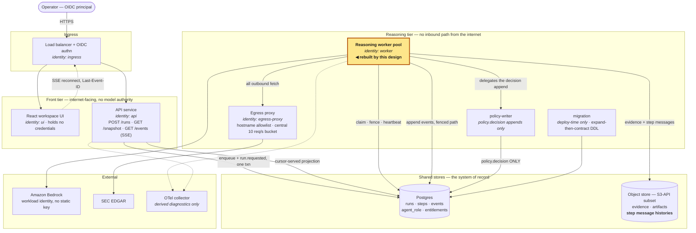
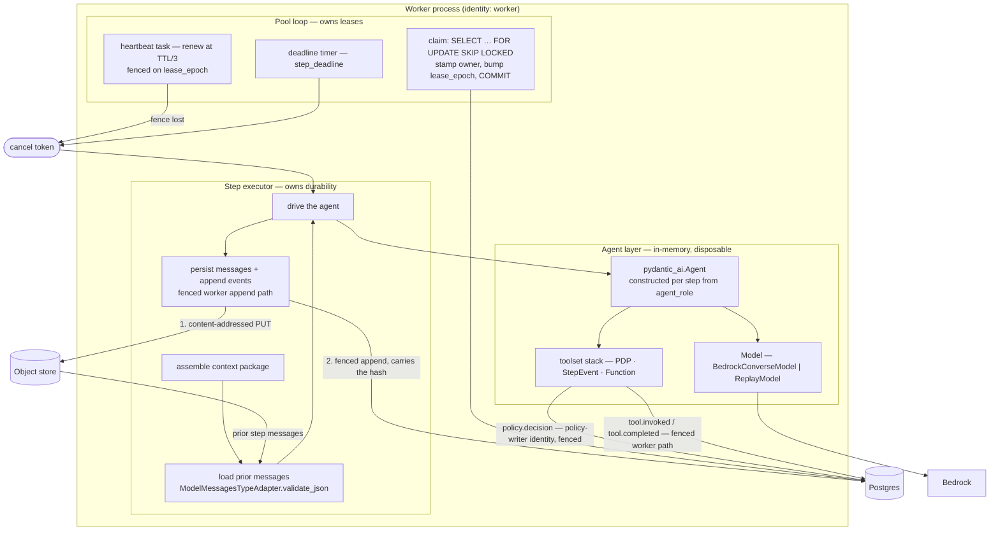
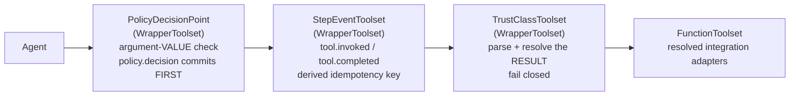
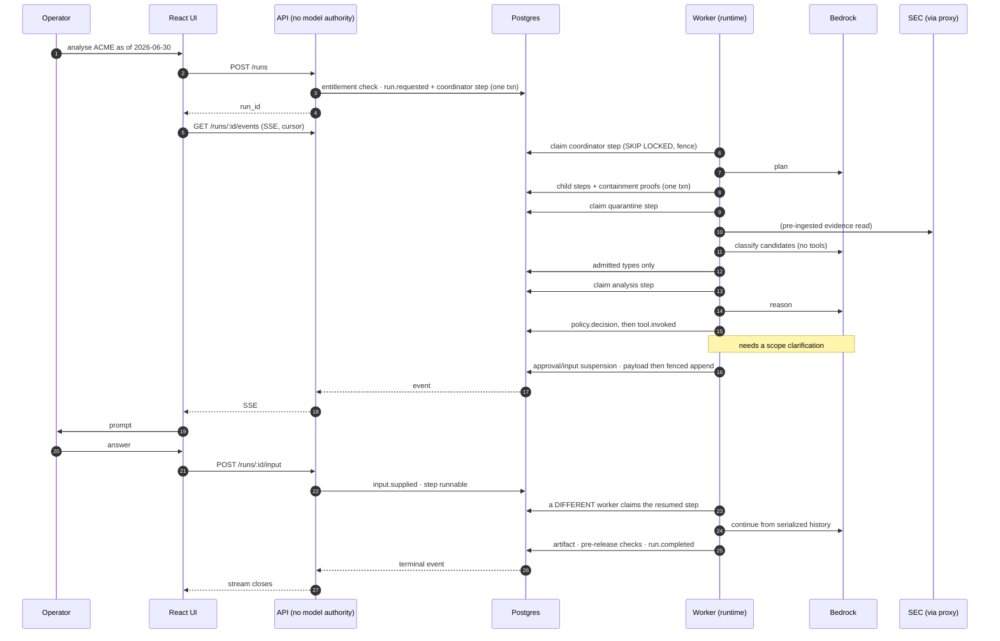

# The Pydantic AI worker and its pool

**STATUS: PLANNED** — designed but unbuilt. Governing decision:
[`ADR-0001`](../../adr/0001-pydantic-ai-as-the-agent-framework.md).
Constraint authority:
[`portable-identity-first-runtime`](../../product/intents/portable-identity-first-runtime.md)
§ Constraint amendments (owner-amended 2026-09-17).

**Author(s):** eugenelim
**Status:** Draft — revision r3, after two independent review passes
**Last updated:** 2026-09-18
**Reviewers:** eugenelim (owner). **This is a single-operator project and the
author is the reviewer** — the independent pass came from a forked-context
reviewer agent, not a second person. Labelled rather than presented as review.
**Evidence:** [`spikes/README.md`](../../../spikes/README.md) § Spike 7 —
**10/10 hypothesis checks** (H1 4/4, H2 2/2, H3 2/2, H4 2/2) under a
least-privilege role. The script prints 13 lines; three are setup and teardown
that cannot fail, and the repo's standard is that a check which cannot fail is
not evidence.

> **Scope:** the inside of a leased step, and the pool that leases them. This
> document does **not** re-open the event log, the lease protocol, the run state
> machine, the quarantine boundary's *guarantee*, or the identity model — those
> are ratified in
> [`runtime-architecture.md`](../inspectable-multi-agent-diligence/runtime-architecture.md)
> and this design is bound by them. It specifies what r7 deliberately left as
> "ADK is invoked inside a step".

## TL;DR

Replace ADK with Pydantic AI as a **step-level reasoning library** inside a
worker runtime that hardcodes nothing about any agent — instructions,
configuration and integrations all arrive as data the runtime resolves at step
start — while the application keeps owning run state. The reader is asked to
accept three things: that the policy decision point may live *inside* a
framework object, that the framework's serialized message history is good
enough to be the durable inspection record, and that the substrate is
**general-purpose in shape while remaining single-author in operation** until
three named governance gaps are closed.

## Context

[`runtime-architecture.md`](../inspectable-multi-agent-diligence/runtime-architecture.md)
r7 is ratified around an ownership split: the application owns the run state
machine, the durable event log, checkpoints, and authorization decisions, and
the agent framework is "invoked *inside* a step and is never the system of
record for anything a user inspects." That split is not in question here. What
is in question is which library sits inside the step, and what the worker
process actually looks like once one does.

Two of r7's own grounded facts forced the change, and both were about ADK
specifically. ADK has **no native Bedrock path**, so the only route to the
ratified model-access posture was `LiteLlm` — putting a package that shipped
unauthorized code in 1.82.7–8 into the model hot path, carried in r7 § Risks as
a supply-chain surface *accepted* for provider fan-out. And ADK's
`BaseSessionService` is **a four-method ABC not presented as a public extension
point**, which ADK 2.0 changed. The context service was already an application
capability rather than ADK's, precisely to avoid depending on it.

The owner amended the agent-runtime constraint on 2026-09-17. This document is
the design that amendment requires.

### Constraints

- **The ownership split is ratified and not renegotiated.** Any shape that makes
  the framework the system of record for run state loses against quality
  attribute 1 (inspectability) and is out of scope by construction.
- **The seam set is closed, but no longer at two.** Amended 2026-09-18 on the
  same owner authority as the charter's substrate amendment:
  `portable-identity-first-runtime` § Excluded now names the **model-provider
  adapter plus one adapter per registered integration `kind`**. Closure is
  preserved by a different mechanism — **adding a new kind is an intent
  change**, not an implementation detail. The `sql-read` and
  `object-store-read` kinds this design introduces are therefore intent-level
  additions and are recorded as such, not inferred.
- **The pinned version is `pydantic-ai` 2.44.0**, the version spike 7 ran
  against. Everything below about the version policy is an argument about the
  V2 line and holds only while that pin is what ships.
- **Non-obvious:** Pydantic AI **V2.0 went stable on 2026-06-23**, and its
  published policy is that a next major will not ship "sooner than 3 months
  after V2.0." **That window closed in September 2026** — before this design is
  built. The ADK breaking-change risk r7 carried is *reshaped and reduced*, not
  deleted, and the mitigation (exact pins plus contract tests at both seams)
  carries over unchanged.
- **Second non-obvious:** the version policy explicitly permits "adding new
  optional fields or message parts to existing types" in a *minor* release
  without that counting as breaking. For a message history retained for the life
  of a published report, additive-only drift is survivable — but it is a
  property we are relying on that the vendor has not promised as a schema
  guarantee.
- **Phase 0 evidence is partially invalidated.** Spikes 1 and 2 were passes
  *about ADK and LiteLLM*. Spike 7 re-establishes both against the replacement.
  Spikes 3, 4, P1 and P2 are framework-independent and stand.

## Goals and Non-goals

### Goals

- **Nothing agent-specific is compiled into the worker.** Adding an agent role
  or an integration requires a data write and no deployable, proven by a test
  that registers a new role and a new integration **of an already-registered
  `kind`** against an unchanged image and executes a step. A new *kind* is a
  code change by construction, which is the point of the kind set being
  closed. This is the property that makes it a runtime rather
  than a program.
- **No single credential spans two integrations' backends.** Each integration
  resolves its own credential scope, so the worker's task role is not the
  union of every integration's authority. This is a **blast-radius** property,
  not isolation: in one OS process with an ambient credential chain, nothing
  stops integration A's adapter code from obtaining integration B's
  credential. Whether to buy real isolation — per-integration `AssumeRole`
  behind an in-process broker that never returns a scope the compiling role
  did not declare — is D12.
- **The framework is containable.** No `pydantic_ai` import exists outside
  `agents/` and `adapters/`, proven by the same dependency-direction test that
  already guards `adapters/` for AWS SDK imports. Zero imports under the domain
  package.
- **A step's model conversation is replayable modulo excluded reasoning
  parts.** The bytes written to the payload store deserialize to a message list
  that a *fresh* `Agent` resumes from, with no model call and no shared
  in-memory state. **Not "verbatim":** r7 guarantees that chain-of-thought is
  never written to the event log or the evidence store, as a *storage*
  property, so reasoning parts are excluded before persisting and the replay
  is faithful to everything else. That weakening is deliberate — the r7
  guarantee is charter-adjacent and is not this document's to relax. See D8,
  which remains open only on *how* the exclusion is enforced, not whether.
  Spike 7 H3 demonstrated byte-identity on a stripped-equivalent history of
  two messages; the realistic-shape round trip is a Phase 1 criterion.
- **Authorization is fail-closed inside the framework.** For every well-typed
  unauthorised call in the authorization suite, the tool body does not execute
  and the step terminates. A denial is never delivered to the model as
  retryable advice. Release gate, extending the suite r7 already requires.
- **The approval gate crosses a process boundary.** A suspended step's state is
  a JSON payload object; the decision is applied by a different worker process
  holding a fresh lease. Demonstrated by spike 7 H4.
- **No step is *reported* running past `step_deadline`.** At the deadline the
  step is failed and its lease released, **regardless of whether the underlying
  provider call has terminated**. This is deliberately weaker than "the model
  call is cancelled": botocore is synchronous, so if the Bedrock request runs in
  a thread-pool worker, asyncio cancellation unwinds the coroutine while the
  thread and its socket continue — the call is *abandoned*, and an abandoned
  request is still billed and still holds token-bucket budget. The goal is
  stated at the level the mechanism can hold. It is still new: r7 records a
  worker "alive but stuck on a hung model stream" as an unmitigated 3am risk
  whose only answer was a page.
- **Provider portability costs one class.** Swapping the model provider changes
  one `Model` subclass under `adapters/` and zero files elsewhere.
- **Token spend per step is bounded by a ceiling the run cannot exceed by more
  than one request's output**, rather than observed after the fact. The
  request-count limit is pre-call; the token limit is evaluated as usage
  accrues, so the final request can overshoot by its own output before the
  limit trips. *There is no ceiling above the step — see § Decisions required,
  D6.*

### Non-goals

- **Executing agent-supplied or registry-supplied code.** Integrations are
  *data selecting* a first-party adapter from a closed set of `kind`s. Adding a
  new kind is a code change with a review. A registry that could introduce new
  executable behaviour by data write would put arbitrary code in the worker,
  which is a different system with a different threat model.
- **Enabling MCP in MVP.** The registry shape admits `kind: mcp`; the
  provenance story does not exist. An externally-sourced MCP server supplies
  tool descriptions and schemas into the model's context, which is an untrusted
  instruction surface rather than a dependency.
- **Adopting a durable-execution engine.** Pydantic AI ships integrations for
  Temporal, DBOS, Prefect, Restate and Lambda durable functions. We use none of
  them. A reasonable reader will assume the Postgres-backed one (DBOS) is free
  given we already run Postgres — it is not free, and the alternatives section
  says what it costs.
- **Letting typed output become the quarantine boundary.** Pydantic AI's
  structured output is genuinely good, and it is still not the security control.
  r7 rejected resting the boundary on a framework's structured-output mechanism
  and that reasoning does not change because the framework got better at it.
- **Concurrent steps inside one worker.** One step in flight per worker stays.
  This will look like leaving throughput on the table; § The pool says why it
  is not.
- **Changing the event log, the envelope, the lease protocol, or the run state
  machine.** No column changes and no data migration. **Three qualifications, all
  in § Changes this design asks of r7:** one additive expression index (which
  makes the idempotency key actually dedup), one additive nullable column
  (`steps.pool_class`), and grant changes on `policy-writer` and `api`. **And this is not the same as "no format
  change":** payload objects written by a Pydantic AI
  step are message-history JSON in a vendor format that an ADK runtime cannot
  read, so a rollback after runs have executed strands their replay. § Rollout
  states what that costs and why it argues for doing the swap before Phase 2.
- **Adopting Logfire the hosted product.** We take the OTel instrumentation,
  which the vendor documents as usable with any OpenTelemetry backend. The
  hosted-versus-self-hosted LLM-operations question stays open and stays with
  `governed-observable-and-evaluable-operation`.

## Proposal

### Where this sits in the application

Before the inside of the worker, the outside. This is the container view of the
whole application — every deployable unit, its workload identity, and the
stores and external services it reaches. It is a different cut from
`runtime-architecture.md`'s structure diagram, which traces the *data path*
through the quarantine boundary; this one traces *deployables and the identities
they hold*, because that is what a reader needs to see before being told which
box is being rebuilt.



Three things the picture is there to make hard to miss.

**Only one box changes.** The framework swap is confined to the highlighted
worker. The API holds no model authority and never did, so the
internet-facing component is unaffected by a change to how models are called —
which is the point of that split surviving this redesign untouched.

**`policy-writer` is a separate arrow, not a library call.** The worker reaches
the policy append path through a different database identity, which is why
§ The toolset stack can put a decision point inside a framework object without
handing that object the worker's general write grant. Spike P1 proved the
worker role is refused the reserved event type by its own append path.

**The object store gains one payload class and no new contract.** Step message
histories are content-addressed objects alongside evidence and artifacts, using
the same `PUT`/`GET`/`HEAD`/`DELETE`/`LIST` subset r7 pinned for portability.
Nothing here needs an S3-specific feature, so the store stays substitutable.

### Three layers, and a hard line between the middle two

The worker process is three layers. The line that matters is between the step
executor and the agent: **everything durable happens in the step executor;
the agent layer is an in-memory conversation that can be thrown away and
rebuilt from bytes.**



Read the diagram for one property, and read it in the corrected form the first
draft of this document got wrong. **The agent's *conversation* is never durable
state.** Exactly two kinds of write originate inside the agent layer — the
authorization decision and the tool-invocation record — and both go through the
same fenced and policy paths the step executor uses, under the same database
identities, with no new grant. Everything else the agent produces is returned to
the step executor, which decides what it means and what gets committed.

Those two exceptions do not reopen the ownership split, for a specific reason:
neither is *state*. A `policy.decision` and a `tool.invoked` are attribution
records that r7 requires to commit **before** the action they describe, so they
cannot be deferred to the end of the step without defeating their purpose. The
split r7 protects is over *run state* — what the run is, what it decided, what
it published — and none of that is written from inside the agent.

### An agent role compiles to an Agent

An **agent role** is already a first-class security object in r7: a named,
versioned record declaring a tool allowlist with per-argument value constraints,
stored outside any model's context and assigned by the orchestrator. Under this
design the role record *compiles* to three things at step start:

```
agent_role(version) ⟶ ( instructions, toolset stack, ceiling )
```

**The compiler is the only constructor of `Agent`, and that is a structural
invariant, not a convention.** It asserts that the agent holds exactly one
toolset and that it is a `PolicyDecisionPoint`, and that no function tool was
registered by decorator. This matters because nesting order only governs tools
reached *through* the wrapped stack: a tool registered with `@agent.tool` or
added as a second entry in `toolsets=[…]` is a sibling the PDP never sees, and
the behavioural release gate cannot catch it — an unwrapped tool has no ceiling
entry to violate, so there is no unauthorised call to fail. **A tool reachable
outside the wrapped stack is a build failure, not a denial.** The authorization
suite carries this as a structural assertion alongside its behavioural ones.

Agents are constructed **per step, never cached across steps**. This is not
defensive coding — r7 requires that "a role version in use by an in-flight run
is immutable" and that new versions "bind only at the next spawn." A cached
`Agent` object would be a cached role version, which is exactly the staleness
the recorded containment proof is supposed to rule out.

`instructions` rather than `system_prompt` is the deliberate choice, and the
property is worth stating precisely because it reads backwards if compressed.
**Instructions carried inside a replayed `message_history` are excluded; the
instructions supplied to the current run always apply.** System prompts, by
contrast, are retained across runs and so would accumulate from history. A
resumed step is therefore prompted by the *current* role compilation and never
by a stale copy replayed from a payload written days earlier — which is a
security property, not an ergonomic one, because the role compilation is where
the ceiling's sibling text lives. The authorization suite asserts it.

### The toolset stack, and why the PDP is outermost

Tools compose as nested toolsets. Order is a security property, not a style
choice:



**`TrustClassToolset` sits innermost, and the position is a security
property.** It must parse an integration's result *before* any layer above
observes the return value, so a free-text result cannot reach
`StepEventToolset`'s attribution record or the agent. `tool.completed` records
the parse outcome, so a rejected result is attributable rather than merely
absent. It is named in the compiler's structural invariant alongside the other
two — the agent still holds exactly one toolset, and the stack's composition
is asserted, not assumed.

**`PolicyDecisionPoint` is outermost so that nothing below it in the stack ever
observes an unauthorized call.** That is necessary and not sufficient — the
sufficiency comes from the compiler invariant in § An agent role compiles to an
Agent, which is what guarantees there is no sibling toolset beside the stack.

Its `call_tool` override evaluates the acting role's ceiling against **argument
values** — checking tool names and argument *types* is the documented
anti-pattern r7 names — appends the `policy.decision` event through the
`policy-writer` identity, and only then delegates to `super().call_tool()`. A
failed decision append is a denial, not a retry, exactly as r7 specifies. The
privilege split proven by spike P1 is untouched: the worker's own connection
still cannot write a `policy.decision`, and this wrapper reaching the policy
path is a second connection, not a second grant.

**The policy append must also be fenced, which r7's policy path does not
currently require.** r7 defines the run-lifecycle path as *unfenced* and the
`policy-writer` grant as "`runs.next_seq` bump + insert `policy.decision` events
only". That is correct for `api` appending `run.requested`, and wrong here:
between a worker losing its fence and cancellation landing, this wrapper could
commit an authorization decision for a step whose new owner is concurrently
authorizing its own calls — two committed decisions for one logical invocation,
and, because the fenced `tool.invoked` append rolls back, a `policy.decision`
with no matching invocation record. That would measure below 100% on r7's
*attributable action* goal for reasons that are **not** correct behaviour. So
the `policy-writer` transaction takes the same fence first:

```sql
SELECT 1 FROM steps WHERE step_id = $1 AND lease_epoch = $2 FOR UPDATE;
-- zero rows ⇒ fenced ⇒ ROLLBACK ⇒ denial, not retry
```

This is a **narrowing of r7's policy path** rather than an implementation
detail, and it is recorded as such in § Changes this design asks of r7.

**A denial raises a domain exception, never `ModelRetry`.** Spike 7 established
that an ordinary exception raised inside `call_tool` propagates out of the whole
agent run rather than being handed back to the model. That is the behaviour we
want and it is a choice the implementation must make on purpose — raising
`ModelRetry` would silently convert the authorization boundary into a
negotiation the model gets to keep attempting. The authorization suite asserts
the exception *type*, not only that the call was refused.

`StepEventToolset` sits inside the PDP and appends the invocation events on the
fenced worker path. It sees only authorized calls; the record of a refusal is
the `policy.decision` event, which is the only place it should be.

**The idempotency key is derived, never minted.** r7 excludes exactly-once and
relies on idempotency keys to dedup at-least-once re-execution — which a key
freshly generated per attempt cannot do, because every attempt gets a different
one. The key is

```
idempotency_key = hash(run_id, step_id, tool_call_id)
```

`tool_call_id` is assigned by the model turn, is stable across serialization,
and is what `DeferredToolResults` is keyed on — so it survives the process
boundary that a per-attempt key does not.

**A derived key dedups nothing unless a prior execution's key is durably
recorded**, so the storage has to be named: the key is written on the
`tool.invoked` event, and a **partial unique expression index** —
`(run_id, (payload->>'idempotency_key')) WHERE event_type = 'tool.invoked'` —
makes a duplicate append fail rather than succeed twice. The key lives in the
event payload, so this adds **no column**; it is an index, and it is listed
under § Changes this design asks of r7.

**And the claim is narrower than it looks.** The key is stable across *resume
from the same history* — which is the approval-gate case and the fence-loss
case. It is **not** stable across a re-planned retry after a step failure,
because a new model turn mints a new `tool_call_id`. Deduping that would need
a semantic key derived from the tool's arguments, which r7 does not have and
this design does not add. The concrete hazard this closes is a
double publication across the approval gate: worker A resumes with the
decision, executes the action, and loses its fence before the fenced append
commits; worker B resumes from the same persisted history and executes it
again. **What the duplicate actually does, precisely:** the second `tool.invoked`
append raises a unique violation, `StepEventToolset` therefore does not
delegate, and the step terminates as a *duplicate-detected failure*. It is not
a silent no-op — the action executes **at most once**, which is the property
the hazard needs, and the failure is visible rather than swallowed. The fenced
policy append above makes the duplicate's decision record a rollback. Both are needed — see
§ The pool on why a 20 s fence-detection window makes this a real window and
not a theoretical one.

### How workers are provisioned

**A long-running ECS service with a desired count, never a task per run.** r7
rejected per-run Fargate tasks because standalone tasks are never replaced by
ECS, so a run losing its host stops with no recovery and no signal. A service
maintains the count; work finds workers by being in the queue, not by a worker
being created for it.

**One image, every worker, all pool classes.** Nothing agent-specific is baked
in — that is the whole claim of § Responsibility decomposition — so there is no
per-agent deployable, no per-agent service, and no image rebuild when an agent
is added. Adding an agent is a `policy-author` write.

#### Boot sequence, and why a worker must not claim early

A worker that claims a step before it can finish one manufactures a lease
expiry and a 150-second recovery for a problem that a readiness check catches
in milliseconds. So the order is fixed:

1. **Acquire workload credentials.** The ECS task role, via the
   `CredentialProvider` reading (D3). Ambient — no static key, per the ratified
   constraint.
2. **Open and verify both database connections** — the `worker` role and the
   `policy-writer` role. *A worker without the policy connection cannot
   authorize a tool call, so it must fail readiness rather than start and deny
   everything.*
3. **Verify the object store** is reachable with a `HEAD` against a known
   prefix.
4. **Warm nothing, and depend on it.** Caches are cold at boot and that is
   fine: `agent_role` records and instruction text are immutable by
   construction, so a cold worker is slower on its first step per role and
   never wrong. **No cache pre-population step exists**, because one would be
   a correctness dependency on a warm-up that Fargate can interrupt.
5. **Report ready.** Only now does the poll loop start claiming.

**Readiness is not liveness.** Readiness gates claiming; liveness restarts a
worker whose poll loop has stopped attempting. The distinction matters because
of the failure mode in § The pool: a starved event loop stops heartbeating, and
a liveness probe that only checks process existence will not catch it.

#### Capacity and what actually scales it

**The scaling signal is queue depth, not CPU.** A reasoning worker spends most
of a step blocked on a model call, so CPU utilisation is near-flat whether the
queue is empty or fifty deep — target-tracking on CPU would never scale this
service. The signal is **runnable steps not yet claimed**, which lives in
Postgres, so it has to be published as a custom metric before ECS can act on
it. That publisher is a small job on the `api` identity (which already reads
`steps`), not a new component.

**MVP runs a fixed count of 2 and no autoscaling policy.** Two is r7's capacity
table, and at one step in flight per worker it is also the concurrency ceiling
r7 states: two sequential runs, or one that fans out to two specialists.
Autoscaling is deliberately deferred — the aggregate SEC and TPM budgets are
what bind first, so adding workers past the point where the central token
bucket saturates buys queueing, not throughput.

**Scale-to-zero is rejected for MVP.** Postgres polling has no wake mechanism,
so scaling to zero means either a cold-start penalty on the first run of the
day or an API-triggered scale-up that couples the request path to ECS control
plane latency. At two tasks the idle cost is small and the failure surface is
smaller.

**The Fargate vCPU quota is a provisioning precondition, not a runtime
concern.** r7 records the default as 6 vCPU per Region against a steady-state
6.0 and a rolling-deploy peak of 13.0 — so on a default account a deploy
cannot even complete. The target account is already at 4000, verified
2026-09-10, but that is a property of the account rather than the design.

#### Pool classes — the seam that makes isolation possible later

The pool is homogeneous **within a class**, and MVP has exactly one class. The
seam is small and worth building now because retrofitting it is not:

```
steps.pool_class    → which class of worker may claim this step
worker POOL_CLASS   → environment, deploy-time
claim query         → … WHERE pool_class = $1 AND …
```

That is one column and one predicate. What it buys is the ability to run
high-sensitivity integrations on a **separate ECS service with a different
task role**, which is the only form of credential isolation that actually
holds — a separate process cannot reach another process's ambient chain. It is
therefore the structural answer to the limit recorded in D12, and it is why
accepting blast-radius-only scoping in the worker is tolerable rather than
permanent.

An agent role names its required `pool_class`; the compiler refuses a role
whose integrations are not all available to that class. MVP sets every role to
the single class, so the check is a no-op until the day it is not.

#### Provisioning the two database identities — an unresolved wrinkle

A worker task must authenticate as **two** Postgres roles. Whichever way the
credentials are delivered — two Secrets Manager paths, or two IAM-auth tokens —
**the task role must be able to obtain both**, which means a compromise of the
task role obtains both. That does not defeat the split (P1 proves the
*database* refuses `worker` the reserved event type regardless), but it does
mean the split's strength rests on the database grant rather than on
credential separation. This is the provisioning-level form of D2, and it is the
concrete reason D2 is a real question rather than a wording choice.

### End to end: one run, from click to published report

Tracing a whole run is what exposed the gaps below. Five of them were real —
each is marked **GAP** and resolved in place, and three are changes to r7 that
§ Changes this design asks of r7 now carries.



**GAP 1 — nobody was materialising steps.** r7 says the run state is "a
projection over concurrent steps" and names a "root coordinator", but no
component owned *creating* step rows. Resolved: the **coordinator is an agent
role like any other**, and its step's output is a typed plan — child steps with
their `agent_role`, `pool_class` and inputs. The **step executor materialises
them**, not the agent: the plan is returned as data, the executor validates
each child's ceiling against `agent_role.ceiling ⊆ parent_role.ceiling`,
records the containment proof as an event, and inserts the rows **in the same
transaction as the parent's completion**. A plan naming a role whose ceiling is
not contained fails the step. This is A6 in the decomposition and it was
previously unassigned.

**GAP 2 — agents could not talk to the user.** The design had exactly one human
interaction, the approval gate, which is a *terminal* check. An agent that
needs a clarification mid-run — an ambiguous ticker, a scope question, a
missing parameter — had nowhere to go, and the honest alternatives were both
bad: guess, or fail the run.

Resolved with the mechanism already proven by spike 7 H4, using its other half.
`DeferredToolRequests` carries **`calls`** as well as `approvals` — external
execution, not just approval — so a `request_user_input` tool suspends the step
exactly as an approval does. The run gains a state:

| From | To | Trigger | Event |
| --- | --- | --- | --- |
| `running` | `awaiting_input` | agent calls `request_user_input` | `input.requested` |
| `awaiting_input` | `running` | operator answers | `input.supplied` |
| `awaiting_input` | `cancelled` / `failed` | the existing any-non-terminal rows | — |

`awaiting_input` is **non-terminal** and releases its lease, for the same
reason `awaiting_approval` does. Adding a run state is a change to r7.

**The operator's answer is a direct-injection surface, and is treated as one.**
It is the user's text arriving mid-run, so r7's direct-injection control
applies unchanged: it is trusted *as instruction* and bounded by what the
acting agent role may do, never screened. Two constraints keep that honest —
the answer is admitted at the **role's existing ceiling** and cannot widen it,
and the request/answer pair is recorded as events so the analysis can be
reconstructed knowing the human steered it.

**GAP 3 — cancellation could not reach a running step.** `POST /runs/:id/cancel`
appends `run.cancelled` through the unfenced API path, but a worker
mid-step polls nothing and would have discovered it only at step end, after
minutes of model spend. Resolved at zero cost: the **heartbeat already writes
every 20 s**, so it also reads the run state in the same statement, and a
terminal state fires the cancellation token the pool already owns.

```sql
UPDATE steps SET lease_expires_at = now() + interval '60 seconds'
 WHERE step_id = $1 AND lease_epoch = $2 AND owner = $3
   AND (SELECT state FROM runs WHERE run_id = steps.run_id)
       NOT IN ('cancelled','failed')
RETURNING 1;
-- zero rows ⇒ fenced OR cancelled ⇒ fire the token
```

Worst-case cancellation latency is therefore one heartbeat interval, 20 s, and
no new polling exists. It collapses fence-loss and cancellation into one
signal, which is correct — both mean *stop, you no longer own this*.

**GAP 4 — agent free text reaches a human, and nothing said how.** Progress
events and the clarification prompt in GAP 2 are model-authored text rendered
in a browser. That is OWASP LLM05 output handling and the design was silent.
Resolved: **agent-authored text is rendered as plain text, never as markdown,
HTML, or a link.** No `dangerouslySetInnerHTML`, no link autolinking, no image
embedding — a model-authored `[click](javascript:…)` or an
attacker-influenced exfiltration URL must not become clickable. Typed domain
artifacts are rendered by the application's own components from structured
fields, which is a different path and stays rich. This belongs to the
experience companion to implement; it is recorded here because it is a
*boundary*, and boundaries are this document's.

**GAP 5 — the UI's read path was only the stream.** A client that has been away
cannot replay from the log alone at reasonable cost. r7 already provides
`GET /runs/:id/snapshot → {state, as_of_seq}`; the walkthrough shows it is also
the **join** path — discard local state, render the snapshot, resume the
cursor at `as_of_seq`. Nothing new is needed, but the doc previously described
it only as a recovery mechanism, and it is the ordinary page-load path.

**What the trace confirmed rather than changed.** The API never holds model
authority and never talks to a worker. Every human interaction is a step
suspension with the same shape — payload object written first, fenced append
second, lease released, a *different* worker resuming from bytes. And the
stream is a projection over committed events throughout, so run duration and
connection duration stay independent.

### Configuration: two kinds, deliberately not one

Two things get called "configuration" here and conflating them is how an agent
platform ends up with prompts in environment variables.

**Pool configuration is deployment-time and operator-owned.** Task count,
vCPU and memory, poll interval, lease TTL, `step_deadline`, default
`usage_limits`, the model region, and which `Model` implementation is wired
(live or replay). It lives in the infrastructure definition and the container
environment, versioned with the image, and **changing it requires a deploy**.
That is the point: these are the values whose change alters failure behaviour,
and an operator should not be able to move `step_deadline` without a reviewable
artifact.

**Agent configuration is runtime data.** The `agent_role` record in Postgres —
already a first-class security object in r7 — carries:

```
agent_role_id · version · display_name
instruction_ref       → content hash of the instruction text
output_schema_ref     → content hash of the output contract
tool_allowlist[]      → tool name + per-argument value predicates (the ceiling)
model_settings        → model id, temperature, max_tokens, usage_limits
```

Written **only** by `policy-author`, which r7 makes human-operated with no
runtime identity holding it. A version in use by an in-flight run is immutable.

**The pool is homogeneous within a pool class, and MVP has exactly one class**
— see § Pool classes. Within a class this is the load-bearing consequence:
workers are *not* typed by agent. There is no "quarantine worker pool" and no
"planner pool" — any worker can execute any step, because the step row names
the `agent_role` and the worker compiles it on arrival. Pool capacity is
therefore a single number to reason about, and adding a new agent role adds no
deployable. It also means a worker's own identity cannot be scoped per agent;
the authority bounding is the `agent_role` ceiling at the PDP, not the task
role, which is exactly why the ceiling has to be enforced rather than trusted.

### Where instructions live, and how a worker gets them

**Instruction text is content-addressed in the object store, referenced by hash
from the `agent_role` record — not stored inline in Postgres.** Three reasons,
and the first is not about size:

1. **It makes "which exact prompt did this step receive" answerable from the
   event log alone**, with no model call and no join against mutable state.
   r7's producer tuple already records `prompt_template_version`; a content
   hash upgrades that from a label to a verifiable identity, which is what the
   *replayable context* goal actually needs.
2. It is the **same payload mechanism** as evidence, artifacts and step message
   histories — one storage contract, the `PUT`/`GET`/`HEAD`/`DELETE`/`LIST`
   subset r7 pinned, no new portability surface.
3. Large prompt text out of transactional rows keeps the append path fast and
   the `events` tables vacuumable.

Retrieval on each step, in order:

```
claim step  →  step row carries (agent_role_id, agent_role_version)
            →  read agent_role record            [Postgres, worker identity]
            →  read instruction + schema by hash  [object store, cacheable forever]
            →  compile → (instructions, toolset stack, ceiling, model settings)
            →  append step.started carrying role version + instruction hash
```

**Caching is safe and unusually so.** Both lookups are immutable by
construction — a content hash cannot change meaning, and a role version in use
cannot be rewritten — so a worker may cache both indefinitely with no
invalidation protocol. That is a direct dividend of making role versions
immutable for a security reason; the performance benefit is a side effect, not
the justification.

The `step.started` append is what makes the compilation reconstructable: role
version plus instruction hash plus the producer tuple means a reader can
rebuild the exact agent that ran without trusting any current state.

### Inputs, outputs, and how tools are reached

**Inputs — the agent never fetches its own input.** The step executor assembles
everything and hands it over: the context package from the context assembler,
plus `message_history` when resuming a suspended or multi-turn step. What may
be in that package is r7's ratified boundary and is unchanged — a planning
agent receives symbolic references, closed-vocabulary labels and typed scalars
and nothing else; only the quarantined agent's package may carry raw untrusted
filing text. Making the executor the sole supplier is what stops the boundary
being re-widened by an agent that can go and read for itself.

**Outputs are typed and returned, never written.** The agent's `output_type` is
the Pydantic model named by `output_schema_ref`; the validated object is
returned to the step executor, which writes the typed artifact and appends the
events. § Three layers shows the only two exceptions, both attribution records.

**Token-level streaming is not in the event log.** The log records semantic
events, and the SSE stream is a cursor-served projection over it — appending
token deltas would multiply the log by three orders of magnitude and make the
reconstruction goal's byte-matching meaningless. Live token streaming to the
browser is therefore **out of MVP scope**; the UI's liveness comes from
step-level events. If it is ever wanted, it is a second transport beside the
log, not a change to the log.

**Tools are resolved from the integration registry, never registered by
decorator.** The compiler reads the role's tool bindings, resolves each one to
a concrete adapter (R2), attaches its per-integration credential scope (R4),
builds a `FunctionToolset` over the resolved set, wraps it in
`StepEventToolset` and then `PolicyDecisionPoint`, and asserts that this is the
agent's only toolset. An integration that does not resolve is a **step
failure**, never a silently smaller toolset — a degraded toolset would let an
agent proceed with less authority than its ceiling describes and quietly
produce an analysis nobody knows was partial.

Every call, whatever its `kind`, passes PDP → `StepEventToolset` → adapter. The
quarantined agent resolves **no integrations at all**, which is now a property
of its compilation rather than a convention.

§ Responsibility decomposition specifies the registry, including why `kind` is
a closed enumeration rather than a plugin interface, and why an integration
whose arguments fall outside the decidable fragment cannot be registered.

### Responsibility decomposition — the pool and the runtime

Nothing about an agent is hardcoded: not its instructions, not its
configuration, not its integrations. The worker is a **generic execution
substrate** and everything agent-specific arrives as data it resolves at step
start. That is the reason there is a *pool* and a *runtime* at all rather than
a program that analyses filings.

**Three** components, and the split between the first two is the one that keeps
recurring: **the pool owns the right to execute; the runtime owns the
execution; the application layer owns what the execution *means*.** The pool
never reads an agent definition. The runtime never claims work. Neither knows
what a filing is.

*How this maps onto § Three layers.* That section cuts the same process by
durability (pool loop / step executor / disposable agent); this one cuts it by
responsibility. The **runtime spans the step-executor and agent layers** —
R10 and R11 are discharged *by* the toolset stack and the `Model`, not beside
them — and the **application layer is domain-specific code linked into both the `api`
and `worker` deployables** — A1, A3 and A6 execute on the `api` identity's
path as well as the step executor's — not a fourth process. The three-way
split is MECE on *what*, not on *where*.

#### Worker pool — agent-agnostic, fleet-scoped

| # | Responsibility | Why here, and the failure if it moves |
| --- | --- | --- |
| P1 | **Capacity and process lifecycle** — maintain N workers, health, `SIGTERM` drain | Fleet-level; the runtime is per-step and cannot see the fleet |
| P2 | **Work acquisition** — poll, `SKIP LOCKED` claim **filtered on `pool_class`**, stamp owner, bump `lease_epoch`, commit immediately | Must complete *before* any agent definition is read, or a definition fetch failure would strand a claimed step |
| P3 | **Lease custody** — acquire, renew at TTL/3 fenced on `lease_epoch`, **release on completion, failure or suspension**, and detect fence loss | The only component that knows the lease exists; the runtime is deliberately unaware of it. Release is here because an awaiting-approval step must not hold one |
| P4 | **Admission control and backpressure** — one step in flight; back off claiming on a signalled backpressure condition | **Enforcement** of the aggregate SEC limit belongs to the egress proxy's central bucket, not here — the pool has no way to observe it directly. The pool consumes a *signal*: proxy-exposed bucket depth and the provider's throttling counter. Naming the signal matters; a pool told to respect a budget it cannot see does nothing |
| P5 | **Deadline and cancellation ownership** — `step_deadline` timer, the cancellation token, the transport-level timeout | Must outlive and out-scope the thing it bounds. A runtime cannot reliably cancel itself |
| P6 | **Step-attempt disposition** — transient vs terminal, counting *step* attempts, what becomes a failed step vs a re-runnable one, lease-expiry count as the DLQ substitute | r7 has no DLQ primitive; this is where that gap is answered. Distinct from R14, which owns *in-run* model and tool retries — P6 counts how many times a step is tried, R14 caps what happens inside one try |
| P7 | **Drain and rolling replacement** — stop claiming, release or finish in flight | Deploy-time concern; invisible to a step |
| P8 | **Workload credential acquisition** — the task role, and both database roles | Process-scoped, not step-scoped. See D2 |
| P9 | **Fairness across queued runs** — no run starves while another fans out | Requires seeing the queue, which a step cannot |
| P10 | **Pool telemetry** — claims, lease losses, queue depth, claim latency | The operational signals that are about the fleet rather than about an analysis |

**Not the pool's job:** what the agent does, whether a tool call is allowed,
what an output means. The pool can run a step whose agent definition it could
not parse — it would hand it to the runtime and record the runtime's failure.

#### Worker runtime — agent-agnostic, step-scoped

The runtime is the substrate that turns *a row naming an agent* into *a
completed, attributable, durable step*. Six phases.

**Resolution and binding**

| # | Responsibility | Note |
| --- | --- | --- |
| R1 | **Resolve the agent definition** — `agent_role` version → instruction ref, output-schema ref, tool bindings, model settings | Cacheable indefinitely; all keys immutable by construction. **Tool bindings name `(integration_id, integration_version)`** — see below |
| R2 | **Resolve integrations** — bind each declared integration reference to a concrete adapter from the registry, and **refuse at compile time any `free-text` integration bound to a non-quarantined role** | **Fail closed.** An unresolvable or unknown integration is a step failure, never a silently smaller toolset |
| R3 | **Resolve the model *id and settings*** from role data | The `Model` **implementation** is injected by the pool (live or replay) — deploy-time wiring, not role data. R5 checks the id against the pool's allowed set so a role naming a model outside the worker's IAM grant fails at compile time rather than at call time |
| R4 | **Resolve per-integration credentials and scopes** | Per-integration, *not* per-worker. This is what stops the fleet identity becoming the union of every agent's authority |
| R5 | **Compile the agent** and assert the structural invariants — exactly one toolset and it is the PDP; no decorator-registered tools; ceiling ⊆ parent; **effective `usage_limits` = `min(pool default, role value)`**; the role's model id is in the pool's allowed set | A violation is a build/compile failure, not a denial. The `min` rule matters: without it a role write could raise a spend ceiling an operator set behind a reviewable deploy — **a role may narrow, never widen** |

**Input assembly**

| # | Responsibility | Note |
| --- | --- | --- |
| R6 | **Assemble the context package** under the admitted-type rules | References, closed-vocabulary labels, typed scalars — or raw untrusted text, for quarantined roles only |
| R7 | **Load prior state on resume** — message history, deferred tool results | From the content-addressed payload store |
| R8 | **Enforce the input trust class** declared by the role | The quarantine boundary, enforced by the substrate rather than by the agent's good behaviour |
| R8b | **Invoke the application layer's pre-step hooks** (A2, A4) and commit their result before the agent run | The runtime owns the call site and the ordering; the application owns the rule. Without this the runtime/application seam has no responsibility discharging it — which is the same gap A1–A7 was added to fix, one level down |

**Execution and mediation** — the core, and the reason a generic runtime is
worth having at all

| # | Responsibility | Note |
| --- | --- | --- |
| R9 | **Drive the agent run** and own its event loop | |
| R10 | **Mediate every tool call** — authorize on argument value, append the decision first, derive the idempotency key, append attribution | Every call, every integration, no exceptions and no bypass path |
| R10b | **Enforce `trust_class` on every integration result** — parse `admitted-types` output with the runtime's own deterministic parser; fail the step on non-conforming output | The boundary is the parser, never the integration's declaration. This is what makes `trust_class` a construction rather than a label |
| R11 | **Mediate every model call** — usage accounting, streaming, retry policy | |
| R12 | **Enforce the pool's cancellation and deadline** | The runtime observes the token; the pool owns it |
| R13 | **Handle suspension** — produce a resumable state when a call needs approval or external resolution | |
| R14 | **Bound the loop** — request and token ceilings, and the retry cap | |

**Output, durability, accounting, isolation**

| # | Responsibility | Note |
| --- | --- | --- |
| R15 | **Validate output** against the role's declared schema | Validation is a layer; a security boundary still gets a deterministic parser outside the agent |
| R16 | **Persist** — content-addressed payload first, fenced append second | The ordering *is* the atomicity story across two stores |
| R17 | **Emit the semantic event stream** | Events, never token deltas |
| R18 | **Record the producer tuple** — model, settings, prompt hash, role version, adapters, framework version | What makes a replay labellable as divergent |
| R19 | **Account usage and cost** per step, and emit OTel spans with content excluded | |
| R20 | **Contain the step** — no state survives it except what R16 persisted | The disposable agent is the isolation mechanism |
| R21 | **Return the step outcome** — completed, failed or suspended — to the pool | The pool cannot release a lease correctly without knowing which of the three happened, and the runtime is the only component that knows |

**Not the runtime's job:** owning the run state machine, authoring ceilings,
deciding *which* step runs next, or knowing anything about the domain.

#### Application layer — domain-specific, and deliberately so

The first draft of this decomposition had two components and was **not MECE**:
several things the rest of this document requires belonged to neither a
generic pool nor a generic runtime, and so were owned by nobody. They are
domain knowledge, and pretending otherwise is how a "generic" runtime
accumulates special cases until it is neither generic nor legible.

| # | Responsibility | Runs in | Note |
| --- | --- | --- | --- |
| A1 | **Run state machine and its projections** | `api` + `worker` | The runtime returns an outcome (R21); this decides what the run becomes |
| A2 | **Pre-release checks** — 100% claim provenance, and the rest of the release gate | `worker` | Domain rules. Their *result* is what makes the approval gate conditional. Invoked by R8b |
| A3 | **Publication** — the transition, and the typed artifact published | `api` + `worker` | See D1 for whether the agent triggers it |
| A4 | **Context-package assembly rules** — which admitted types, from which evidence, for which role class | `worker` | R6 *executes* an assembly; this decides what a correct one is. Invoked by R8b |
| A5 | **Role-class semantics** — that a quarantined role resolves no integrations and carries a stricter input class | `worker` | The runtime enforces the declaration; this authors it |
| A6 | **Step planning** — validating a coordinator's plan and materialising child step rows with their containment proofs | `api` (first step) + `worker` (all others) | See § End to end, GAP 1 |
| A7 | **Ceiling and registry authoring** — via `policy-author`; never a runtime identity | neither — human-operated | |

**So the genericity goal is narrower than "nothing is hardcoded".** The
accurate statement is: **the pool and the runtime hardcode nothing about any
agent; the application layer above them is domain-specific by design.** A
second use case brings a second application layer and reuses the pool and
runtime unchanged — which is the claim worth testing, and the one § Goals now
makes.

#### The integration registry — the piece this decomposition adds

R2 and R4 need something that does not exist in r7: integrations as **data**,
resolved at compile time, in the same shape that instructions and ceilings
already are.

```
integration_id · version
kind              → pure-function | object-store-read | sql-read | http-fetch | mcp
adapter_ref       → which first-party adapter implements this kind
connection_ref    → endpoint / bucket / dataset, never inline credentials
credential_scope  → what this integration may authenticate as
arg_schema        → typed parameters
ceiling_fragment  → which per-argument predicates are expressible over them
trust_class       → does output cross as free text, or only as admitted types?
```

**Written only by `policy-author`** — human-operated, with no runtime identity
holding it, the same treatment `agent_role` gets and for the same reason. The
`worker` identity holds read and nothing else. A registry an agent could write
would be an authority-granting primitive reachable from inside the boundary it
is supposed to bound.

Four properties are load-bearing, and three of them are security properties:

**`kind` is a closed enumeration, not a plugin interface.** Adding a new *kind*
is a code change with a review; adding a new *integration* is data. This keeps
arbitrary code out of the worker while letting the catalogue grow freely —
which is the whole point of a runtime, and the line an "integrations are data"
design most often crosses by accident.

**Closing the kind set is not sufficient on its own, and two kinds show why.**
For `http-fetch` and `sql-read` the *behaviour* is partly the data: a registry
write introducing a new `connection_ref` would otherwise hand an agent a new
network destination or a new dataset with no code review — new executable
behaviour by data write, which § Non-goals forbids. Three rules close it:

- **`http-fetch` hosts must already be on the egress proxy's allowlist**,
  which is deploy-time and reviewed. A `connection_ref` naming a host the proxy
  does not allow fails at compile time, not at call time — so the registry
  cannot widen egress, only select within it.
- **`sql-read` carries no query text.** The adapter owns a named, parameterized
  statement; `connection_ref` selects a pre-registered dataset. A registry
  write can point an agent at a different registered dataset, never author a
  query.
- **Registry writes are `policy-author` only**, exactly as `agent_role` writes
  are. No runtime identity holds write on the registry, and `worker` holds
  read.

**`credential_scope` is per-integration.** Without it, the pool's task role
becomes the union of every integration's authority and the least-privilege
posture collapses the first time two agents need different backends. This is
the single biggest change from the first draft of this document, which assumed
one worker identity because it assumed first-party tools.

**`trust_class` is a construction, not a declaration — settled 2026-09-18.**
The obvious design is a registry label: each integration declares whether its
output may reach a planning agent as free text. That was the first draft and it
is wrong, because a label is *trusted to be telling the truth* — which is
precisely the "control that usually works" this document rejects two sections
later when it refuses to let typed output be the quarantine boundary. r7's
boundary holds because references are minted by a deterministic pipeline
before the agent runs and re-resolved by a fail-closed parser; a label carries
none of that. Applying a weaker standard to arbitrary integrations than to the
one source r7 studied would be the design quietly relaxing as it generalises.

So `trust_class` is **enforced by the runtime, not reported by the
integration**:

**Shape is not provenance, and conflating them would have reopened the
boundary.** r7's guarantee holds for two reasons, not one: references are
**minted by a deterministic pipeline before the agent runs**, *and* re-resolved
by a fail-closed parser. A generic shape parser builds only the second half —
so an arbitrary integration could return an attacker-chosen value inside a
well-formed *reference* and be admitted to a planning agent. Of the three
admitted types, only closed-vocabulary labels are safe by shape alone.

So the admitted set is **split by whether a minting authority exists**:

| Declared | What the runtime does | Effect |
| --- | --- | --- |
| `admitted-types` | Parser admits **closed-vocabulary labels** (safe by shape — the alphabet is finite and fixed) and **typed scalars** (decimals, dates, enumerated units). Non-conforming output **fails the step** | Honoured for planning agents |
| `admitted-types` + reference output | Every reference must **resolve against a reference set minted by the runtime for this step**. A reference the runtime did not mint fails the step | Honoured only where a minting pipeline exists — today, the SEC evidence pipeline |
| `free-text` | No parse; output is untrusted prose — *and this includes reference-shaped output with no minting authority* | Quarantined roles only. A planning agent bound to such an integration is a **compile-time failure** |
| absent | — | Not registrable |

**Typed scalars are attacker-influenceable and that is already accepted.** r7
is explicit that the guarantee is *"no attacker-authored **free text**"*, not
*"no attacker-influenced signal"*, and that the scalar channel is load-bearing
rather than a concession — without it the deterministic financial calculation
has no data path. This design inherits that position exactly; it does not
widen it.

Three consequences. **The parser is generic** — it validates admitted-type
shape, not integration semantics, so it is one component rather than one per
integration; the *resolvability* check is the part that needs a per-pipeline
minting authority. **An integration that cannot express output in admitted
types is not banned**, it is `free-text` and therefore quarantine-only. And
**this costs capability**: integrations that would have been useful to a
planning agent get downgraded because their output does not fit. That is the
same trade r7 made and spike 4 measured at the SEC boundary, where the closed
vocabulary lost causal attribution — taken deliberately, not rediscovered.

**Integration versions are pinned into the role, or the immutability argument
collapses.** `agent_role` immutability-in-flight is what licenses the "caching
is safe and unusually so" claim — but tool bindings point at a separately
versioned object whose `arg_schema` could otherwise change under a running
role, silently invalidating a ceiling that was proven against the old schema.
So role tool bindings name `(integration_id, integration_version)`; a version
in use by an in-flight run is immutable; and R5's containment check re-verifies
the ceiling predicates against that **pinned** `arg_schema`.

**`ceiling_fragment` is what makes an integration governable.** An integration
whose arguments cannot be constrained in the decidable fragment — closed
enumerations, prefixes, numeric ranges, set membership, conjunction only —
cannot be given a meaningful ceiling, so it cannot be authorized, so it cannot
be registered. And r7's recorded unsoundness bites hardest here: a *prefix*
predicate over an argument the callee interprets admits an attacker-chosen
suffix, which is survivable when one engineer writes ceilings and a trap when
a registry offers "starts with" as an option.

**MCP is `kind: mcp` and is deliberately not enabled in MVP.** The registry
shape admits it; the provenance story does not exist yet. An externally-sourced
MCP server supplies tool descriptions and schemas that enter the model's
context, which is an untrusted instruction surface, not merely a dependency.
Enabling that kind is a separate decision with its own evidence.

#### This is a platform, and the charter now says so

The first version of this section recorded a conflict: a generic runtime with
data-driven agent and integration registries **is** a general-purpose agent
platform, and both r7's non-goals and `docs/CHARTER.md` forbade one. **The
owner resolved it on 2026-09-18 by amending the charter directly**, under a
shaping-phase exception to the RFC route that expires at Phase 2. The project
is chartered as an executable substrate; diligence is the proving use case, not
the boundary. The replacement exclusions are narrower and both bite on this
design: *no genericizing ahead of a use case*, and *no executing code that
arrives as data*. The seam-set constraint in `portable-identity-first-runtime`
was widened on the same authority, with closure preserved by making a new
integration `kind` an intent change.

r7's own non-goal — *"a general-purpose agent platform — one execution plane"* —
is now inconsistent with the charter above it and is superseded by it. Folding
that into r7 is part of the consistency pass this document triggers, not a
separate decision.

**What the amendment deliberately did not do.** It authorized the shape; it
closed none of the governance gaps the shape creates. Three remain open, and
the charter names them rather than letting ratification imply they are handled:

1. **Tenancy isolation does not exist.** r7 is explicit that a workspace is an
   organizational scope and not a security boundary. Many agents authored by
   many people needs it, and r7 already says adding it would be new work — so
   a *multi-author* substrate is not authorized by this amendment even though a
   *multi-agent* one is.
2. **Containment must move from spawn time to authoring time.** Today
   `agent_role.ceiling ⊆ parent_role.ceiling` is checked at spawn, and roles
   are authored by a trusted human. If a *user* authors a role, containment
   must also be enforced against that author's own entitlements at write time
   — otherwise authoring is a privilege-escalation primitive. This is the gap
   that turns a studio from a UI into a security problem.
3. **Authored instruction text is a new untrusted-input class.** A prompt
   written by someone who is not the system's author has a different trust
   profile from the operator's own prompt. r7's direct-injection control —
   bounding what the agent may *do* rather than screening what it is told — is
   still the right one, but it was reasoned about for a single operator.

Until all three are closed, the substrate is **general-purpose in shape and
single-author in operation**, and that distinction should be stated wherever
the platform capability is described.

### The approval gate: the state machine decides, the framework suspends

r7 puts the human gate on *flagged output* pre-release, in the run state
machine, and r7 § Charter amendments records principle 3 as **already amended**
so that a run passing every check publishes automatically. Any design in which
publication is statically approval-gated would silently reverse a ratified
charter amendment, so the conditionality is the first thing to specify, not an
implementation detail.

**The gate is conditional, and the condition is computed outside the model.**
The deterministic pre-release checks — 100% claim provenance being the release
gate — run in the **step executor, before the agent run**, and their result is
committed as an event. The approval-gated tool is present in the compiled
toolset **only when a check failed**. On a clean run there is no gated tool, no
`DeferredToolRequests`, and no human in the path. Phase 1 carries this as an
exit criterion: *a clean run publishes with zero human interaction.*

**Publication is an executor transition (A3), not a tool — D1, settled.** The
agent's only lever is a contentless `request_approval()` that suspends the
step; it cannot publish, and the published artifact is the application's typed
artifact rather than any tool argument. What follows is the flagged path.

The commit order is the load-bearing part, and it spans two systems that cannot
share a transaction:

1. The agent run returns `DeferredToolRequests`. Nothing has been published.
2. **The payload object is written first** — content-addressed, to the object
   store. **The fenced append commits second**, carrying the object's hash. A
   crash between them leaves an unreferenced object, which is garbage; the
   reverse order would leave a dangling `payload_ref` and an `awaiting_approval`
   run that can never be resumed — and because `approval_timeout` defaults to
   none, that is a permanently stuck run, not a delayed one. The object store is
   S3-API and the event log is Postgres, so this ordering *is* the atomicity
   story; there is no cross-system transaction to appeal to. **The same ordering
   governs the ordinary non-approval persist path, which has the identical
   hazard.**
3. The run transitions `running → awaiting_approval`. The step's lease is
   released — an awaiting-approval step must not hold a lease, for the same
   `approval_timeout` reason.
4. The approver acts. On **grant**, `approval.granted` is appended and the
   step becomes runnable again. On **rejection**, `approval.rejected` is
   appended carrying the approver's reason, and the step also becomes runnable
   — the reason is returned as the deferred tool result and the agent revises
   (D5). **Capped at three cycles per step**, after which the step fails with
   a recorded cause.
5. **A different worker** claims it, loads the messages from the payload store,
   constructs a fresh `Agent` from the same role version, and resumes with
   `message_history=` plus `deferred_tool_results=`.

Step 5 is the claim spike 7 H4 tested directly, and it tested it in the awkward
form: a different `Agent` object, built only from serialized bytes, with nothing
in-memory carried over. That is the only form that survives Fargate replacing
the host between step 2 and step 5.

Two properties follow. The framework's suspension is **not** a second source of
truth about run state — the run is `awaiting_approval` because the state machine
says so, and the `DeferredToolRequests` object is just the shape of the step's
saved work. And `require_distinct_approver` and the recorded approver principal
are unchanged, because they were never in the agent layer.

**What happens on rejection is an open decision — see § Decisions required,
D5.** Resuming the conversation with a denial delivered as a tool result lets
the model simply call the action again, which is the "authorization boundary
becomes a negotiation" pattern this design forbids two sections earlier. r7's
transition is `awaiting_approval → running` on "approver returns for revision",
which implies a rework cycle rather than an immediate re-attempt, and no bound
on approve/reject cycles is stated anywhere.

### The model seam and fixture mode

`Model` is the portability contract, replacing `BaseLlm`. Production is
`BedrockConverseModel`, constructed with a model id and **nothing else** — no
provider argument, no credentials, no boto3 client. Spike 7 H1 confirmed it
resolves the ambient chain under a least-privilege assumed role, with streaming
and the tool loop intact and an out-of-policy model refused with
`AccessDeniedException`.

**LiteLLM leaves the hot path.** This is the single largest dependency change in
the design and it retires a named risk rather than mitigating it.

Fixture mode is a `ReplayModel(Model)` under `adapters/`, implementing `request`
and `request_stream`, keyed by content hash — a 1:1 replacement for the
`BaseLlm` replay adapter r7 § Local development specifies, against a documented
extension point this time. `TestModel` and `FunctionModel` ship with the library
and cover unit tests where no recorded fixture is warranted. The run header's
`model_adapter` field already records which is in play, so a fixture run still
cannot be mistaken for a live one.

The cross-region inference-profile finding from spike 1 — pin the
inference-profile ARN to the calling region, leave the foundation-model ARN
region-wildcarded, and apply no `aws:RequestedRegion` condition — is an IAM
property rather than a framework one and carries over. Spike 7 inherited that
policy shape and it worked, but the three-variant experiment was not re-run.

### The quarantined agent

`QA` becomes a Pydantic AI `Agent` constructed with `toolsets=[]` and an
`output_type` of the closed-vocabulary model. It has **no domain tools and no
planning authority**, which is now a construction rather than a convention.

**"No tools" is true of domain tools and false of the request shape.** On
Bedrock Converse, `output_type` is implemented as an *output tool* in the
request, so the wire carries a tool definition even though nothing the agent
can call touches the world. That is harmless in itself. What is not
automatically harmless is the retry it enables: a validation failure triggers
the framework's automatic retry, which re-prompts the model over
attacker-authored filing text with a framework-authored error string — an
in-framework negotiation loop over untrusted content, at the boundary r7 ranks
second. See § Decisions required, D9.

**The deterministic fail-closed parser stays, outside the agent.** This will
read as duplication to the next engineer and it is not. Typed output is a
*layer* — it makes the common case well-formed and it is enforced by the same
process that could be the thing going wrong. The boundary is the parser, because
r7's argument is that a security control must not rest on the model's
cooperation or the framework's serializer, and nothing about Pydantic AI changes
that argument. The pipeline-first construction — references minted by
deterministic code before the quarantined agent ever runs, so forgery is
unrepresentable rather than detected — is unaffected by this design and is where
the real guarantee lives.

### The pool

The pool is **unchanged in protocol and changed in one behaviour**. Claim with
`FOR UPDATE SKIP LOCKED`, stamp owner, bump `lease_epoch`, commit immediately;
execute outside any transaction; heartbeat-renew at TTL/3, fenced on
`lease_epoch`; TTL 60 s, heartbeat 20 s, poll 30 s, worst-case reacquisition
150 s. On `SIGTERM`, set `lease_expires_at = now()` and exit. All of that is r7,
and it is proven by spikes 3, P1 and P2 **against a local Postgres container
with `deadlock_timeout` at 200 ms — not against RDS or Aurora.** That
qualification travels with every use of the word "proven" below, including the
DBOS rejection's appeal to machinery we have already proven.

**The fence-detection window is real, and two earlier mechanisms exist to close
it.** The heartbeat renews at TTL/3, so fence loss is detected up to 20 s after
the lease was reclaimed, and two workers can be inside the same step's toolset
stack at once. That was true under r7 too; what the approval resume changes is
that the overlapping action can now be the *published* one rather than a read.
The derived idempotency key and the fenced `policy.decision` append in § The
toolset stack are exactly what make that overlap benign — that window is what
they exist to close, and neither is optional.

**One step in flight per worker stays.** Three reasons, and the first is the one
that decides it. The SEC rate limit is an *aggregate* 10 req/s obligation
enforced by a central token bucket, and Bedrock's TPM budget is likewise
account-wide — so in-process concurrency does not buy throughput, it just moves
contention inside a process where it is harder to observe. Second, a single
in-flight step means a fenced worker has exactly one thing to abandon, which is
what makes "aborts without *additional* side effects" a simple statement rather
than a coordination problem. Third, blast radius: a worker handling one step is
one step lost when Fargate replaces the host with no notice.

**What is new: the step is cancellable, and cancellation is not advisory.**
`Agent.run` accepts a `cancellation_token`. The pool loop owns one per step and
fires it from two sources:

- **Fence loss.** The heartbeat task renews on `lease_epoch`; zero rows returned
  means fenced. Previously that meant "abort" with an in-flight model stream
  still running. Now it cancels the token, the agent run raises, and the step
  executor exits its `finally` without appending — the fenced append path would
  roll back anyway, and now we do not pay for the tokens first.
- **`step_deadline`.** A wall-clock ceiling on the step. Three thresholds now
  derive from p99 step duration, and their ordering is an invariant, not a
  coincidence: **`p99 < step_deadline < page threshold (p99 x 3)`**. The
  deadline must fire *before* the primary page, or the page fires for a
  condition the worker has already handled — which trains an operator to
  ignore it.

**The token is disarmed the moment the agent run returns.** Otherwise a
deadline firing between the run returning and `PERSIST` committing would
discard a step that actually succeeded. `PERSIST` is never cancellable; the
only thing that may invalidate it is fence loss, and the fenced append handles
that by rolling back.

**This narrows the gap r7 names as the 3am operational risk — it does not close
it, and the difference matters.** Both new controls are in-process asyncio
tasks sharing an event loop with the call they are supposed to bound. Split the
failure mode in two:

- **An awaited stream stalls while the loop stays responsive.** The deadline
  timer fires and the step ends. This is the case the new control genuinely
  fixes — and it is also the case where the heartbeat keeps renewing happily,
  so lease expiry would *never* have recovered it. Real gain.
- **A blocking synchronous call starves the loop.** The deadline timer and the
  heartbeat both stop. The heartbeat stopping means the lease expires, which is
  the recovery path r7 already had. No gain, no loss.

So the honest claim is that the worker now handles the slice lease expiry could
never reach, and falls back to lease expiry for the slice it cannot. **Whether
to add an out-of-loop watchdog — a separate thread, or a supervisor that
self-terminates the task when no heartbeat has been *attempted* within
2 x TTL — is an open decision, D4.** The r7 page stays as backstop either way.

**The transport-level fallback is specified now, not deferred.** Because
asyncio cancellation cannot be trusted to stop a synchronous botocore request,
the agent run is additionally wrapped in a hard `asyncio.timeout`, and the
Bedrock client is constructed with bounded connect and read timeouts so an
abandoned request cannot outlive the deadline indefinitely. The deadline then
bounds *the step* even in the case where it does not bound *the call*.

**Spend is bounded before the call.** Every run carries `usage_limits` capping
request count and total tokens. This is the loop cap for a non-deterministic
agent and the denial-of-wallet bound in one mechanism; `max_tokens = 4096` and
its concurrency rationale are unchanged from r7.

### Observability

Pydantic AI ships OpenTelemetry instrumentation following the **GenAI semantic
conventions v1.37.0**, usable with any OTel backend. We enable it with
`include_content=False` and `include_binary_content=False` by default, so
prompts, completions, tool arguments and tool results do not enter telemetry.

**This default is provisional and the companion may widen it.** r7 § Scope
defers the telemetry boundary and redaction policy to
`observability-and-evaluation.md`, so choosing `include_content=False` here is
a decision taken inside another document's scope. It is recorded as the
fail-closed starting position, not as a design commitment that document has to
honour.

This is a genuine simplification of work the observability companion was going
to have to do itself, and it must not be mistaken for a change of substrate.
**The event log remains the system of record; OTel spans are derived
diagnostics.** Reconstruction reads the event log, never a trace. Private model
reasoning is still never written anywhere, which stays a storage property rather
than a filter on read. What may be inlined and under what redaction remains
[`observability-and-evaluation.md`](../inspectable-multi-agent-diligence/observability-and-evaluation.md)'s
to decide; this design just stops it having to build the switch.

### Trust boundaries — what moved

Five of r7's seven boundaries are untouched. One moved and one narrowed.

**Agent → tool authority** now has a framework object standing on it. The
`PolicyDecisionPoint` is a `WrapperToolset` subclass, so a library upgrade that
changed `call_tool`'s contract would change the security boundary. This is the
cost of the ergonomics and it is paid by the release gate: the authorization
suite runs well-typed unauthorised calls on every build, so a contract change
fails the build rather than quietly widening the ceiling. Named in § Risks.

**Worker → model provider** narrowed, and in the good direction: one fewer
third-party package between our credentials and the provider.

### Changes this design asks of r7

**Eight.** Each is a narrowing or an addition, none is a reversal, and they are
collected here so that ratifying this document is not a way of editing r7 by
implication.

1. **The `policy.decision` append becomes fenced** — and **this widens
   `policy-writer`**, which the first draft of this list hid. r7 grants that
   role "`runs.next_seq` bump + insert `policy.decision` events **only**", but
   `SELECT … FOR UPDATE` on `steps` needs SELECT and row-lock on `steps`,
   materially widening the most deliberately narrow role in the system. Two
   ways to take it, and the design must pick one:
   - grant `policy-writer` **SELECT and row-lock on `steps`, nothing more**; or
   - expose a `SECURITY DEFINER` fence function owned by `worker` returning
     boolean, so `policy-writer` gains no table access at all.

   The second preserves r7's narrowness and is preferred, at the cost of one
   more definer function — and P1's finding that `current_user` misattributes
   inside a definer function applies to it. **Lock ordering:** this second
   locker on `steps` takes the row lock *before* any `runs` lock, the same
   order as the worker path, so spike P2's proven ordering is preserved rather
   than extended. P2 was run without a second locker, so this ordering is
   argued, not demonstrated.
2. **A partial unique index on `(run_id, idempotency_key)`** over the
   `tool.invoked` events, without which a derived idempotency key dedups
   nothing. This is a schema addition — small, additive, expand-only.
3. *Proposed, pending D3:* **`CredentialProvider` is satisfied by the `Model`
   implementation at the model boundary**, rather than being a separate seam
   the model adapter calls into, because the framework resolves the ambient
   chain itself. r7's sentence needs amending either way, since as written
   this design does not satisfy it.
4. *Proposed, pending D2:* **"No runtime identity holds both" read as a
   database-role property.** The worker process authenticates as `worker` for
   general writes and as `policy-writer` for the decision append — two roles,
   one OS process. r7's own structure diagram already places `PDP` inside the
   worker box and P1 proved the *database* split, so this resolves an
   ambiguity rather than contradicting a decision.
5. **Per-integration credential scopes**, which make the worker process the
   place where several distinct authorities are held at once. r7's Layer-1
   identity table has one row per component and no notion of an authority
   resolved per step.
6. **An additive, nullable `steps.pool_class` column** defaulting to the single
   MVP class, plus one predicate on the claim query. **No change to lease
   semantics**, `lease_epoch` fencing, or `SKIP LOCKED` ordering — spike P2's
   result is unaffected because the predicate narrows the candidate set and
   does not reorder locks.
7. **A new non-terminal run state, `awaiting_input`**, with `input.requested`
   and `input.supplied` events, so an agent can ask the operator a question
   mid-run. r7's state machine has only `awaiting_approval`, which is a
   terminal-check gate. See § End to end, GAP 2.
8. **`api` gains `cloudwatch:PutMetricData` on one namespace** to publish the
   queue-depth scaling signal, and nothing else. Itemized because `api` is the
   most deliberately constrained identity in the system and every other grant
   change here is named. Deferred with the autoscaling policy it feeds — MVP
   runs a fixed count and does not need it.

## Decisions required

The review of this draft separated findings that the rubric determines — fixed
in place — from those that need a choice. These are the choices. Each carries
a recommendation; none has been applied.

**D1 — Is publication a tool, or an executor transition? — SETTLED
2026-09-18: an executor transition, suspended by a contentless tool.**
The end-to-end walkthrough resolved this by making the trade concrete. GAP 2
already required a `request_user_input` tool that *suspends* without carrying
any consequential payload — so the deferred mechanism is in the design
regardless of D1, and the only remaining question was whether publication
should *also* travel through it as content. It should not.

**Publication is an A3 executor transition.** The suspension is a contentless
`request_approval()` tool, exactly symmetric with `request_user_input`: the
agent can *ask*, and cannot *publish*. The published artifact is the
application's typed artifact assembled from structured fields, never a tool
argument — which retires the hazard visible in the spike's own signature,
`publish_report(claim: str)`, where the model supplied published content as
free text.

The benefit claimed for the richer option is preserved anyway: because the
suspension is still a deferred tool, the step's conversation is saved and
resumed rather than discarded and rebuilt, so what the approver sees and what
resumes remain the same object.

**D2 — Does one worker process holding both `worker` and `policy-writer`
credentials satisfy r7's identity invariant?**
r7 says "no runtime identity holds both"; this design has one process able to
authenticate as both. Note this gets *harder*, not easier, once integrations
carry their own credential scopes (R4): the worker process becomes the place
where several distinct authorities are held simultaneously, and the argument
that they are separate *roles* rather than separate *processes* has to carry
more weight than it did.
**SETTLED 2026-09-18: a database-role property, with r7's wording amended.**
Provisioning made the argument concrete rather than verbal: a worker task must
obtain *both* credentials at boot, so no credential-delivery scheme makes them
separable while one process needs both. The split's strength therefore rests
on the **database grant**, which spike P1 proved directly (7/7 — `worker` is
refused the table, refused the reserved type by its own append path, and
refused the policy function). Moving the append out of process would buy
defence only against a compromise that already holds the worker's credential,
which is not the threat the split was built for. r7's "no runtime identity
holds both" is read as "no database role holds both" and amended accordingly
(§ Changes, item 4).

**D3 — Does the `CredentialProvider` seam survive? — SETTLED 2026-09-18: not
at the model boundary; it moves to integrations.**
Resolved by checking the other providers rather than by preference. Pydantic
AI's `GoogleCloudProvider` resolves **Application Default Credentials** — the
docs state that running inside Google Cloud means authentication "should just
work" — exactly as `BedrockConverseModel` resolves the boto3 chain. Both
ambient, both provider-owned. A `CredentialProvider` the framework never calls
would be a seam in name only, and r7's portability concern is satisfied
*better* by the provider layer than by our indirection: swapping clouds swaps
a provider class, which is the one-class goal.

So the **`Model` / provider layer is the credential seam at the model
boundary**, and r7's sentence is amended to say so (§ Changes, item 3). The
`CredentialProvider` *concept* does not disappear — it relocates to the place
that now needs it, the per-integration credential scopes of R4, where the
commissioned broker (D12) owns it.

**D4 — Out-of-loop watchdog, or accept the narrowed 3am claim? — SETTLED
2026-09-18: the watchdog already exists and is free.**
Writing § How workers are provisioned resolved this. The ECS **liveness
probe** is an out-of-process observer by construction — the agent polling it
is not in our event loop. A starved loop cannot answer the probe, so ECS marks
the task unhealthy and replaces it; the replacement is exactly the recovery a
bespoke watchdog thread would have triggered, minus the thread. The probe is
therefore specified to fail when **no heartbeat has been *attempted* within
2 × TTL**, not merely when the process exists.

That covers the blocking-call slice the in-loop timer cannot. The r7 page
stays as backstop, and no new component is introduced — which is why this
settles rather than defers.

**D5 — What happens when an approval is rejected? — SETTLED 2026-09-18:
resume the conversation with the reason, capped at three cycles.**
D1's resolution dissolved most of this. The objection to resuming was that
delivering a denial as a tool result lets the model simply call the action
again — the negotiation pattern forbidden at the PDP. **Under D1 the model
cannot publish at all**; it can only call `request_approval()`. Re-asking is
therefore not a bypass, it is the intended rework loop, and r7's own
transition (`awaiting_approval → running`, "approver returns for revision")
describes exactly that.

So rejection appends `approval.rejected` carrying the approver's reason,
resumes the step from its saved conversation with the reason as the deferred
tool result, and the agent revises. **Capped at three approve/reject cycles
per step**; at the cap the step fails with a recorded cause rather than
looping, because an analysis that cannot satisfy its reviewer in three
attempts is a signal, not a retry. The cap is arbitrary and is recorded as
such — it exists so the loop is bounded, and Phase 1 should replace it with an
observed number.

**D6 — Is there a spend ceiling above the step? — SETTLED 2026-09-18: three
ceilings, and the step one is genuinely pre-call.**
Checking `UsageLimits` field semantics changed the answer. Most limits
(`request_limit` aside) are evaluated *as usage accrues*, so they cannot stop
an over-budget request — but `cost_limit` with **`count_tokens_before_request=True`**
runs a counting pass and enforces **before the request is sent**, and
`tool_calls_limit` is checked **before tool execution**. So:

- **Per step:** `cost_limit` with `count_tokens_before_request=True`, plus
  `request_limit` and `tool_calls_limit`. This is a real pre-call bound, not
  an after-the-fact observation, and it lets § Goals drop the "±one request's
  output" hedge for the cost dimension.
- **Per run:** enforced by the step executor from usage already accumulated in
  the event log, checked before dispatching each step. **It pages, it does not
  abort** — for a single operator, killing a legitimate long analysis is the
  worse error, and the overnight runaway case is bounded by the account
  ceiling below.
- **Per account:** an AWS Budgets alarm. Outside the application entirely,
  which is the point — it is the control that still works when the application
  is the thing malfunctioning.

**D7 — Is analytical quality re-baselined at Phase 1? — SETTLED 2026-09-18:
yes.**
Spike 4's A/B comparison is re-run under the new stack at Phase 1 and becomes
Phase 1 exit criterion 7. It cost $0.022 the first time; there is no argument
for carrying an unmeasured parity assumption to save that. The re-run gains a
second purpose under D13 — it now also measures what the *narrowed* admitted
set costs, not just what the quarantine boundary costs.

**D8 — Private model reasoning in the persisted message history.**
This one is a conflict with a charter-adjacent commitment, not a preference.
r7 states that chain-of-thought is *never written* to the event log or evidence
store and that the boundary is "a storage property rather than a filter applied
on read". A verbatim `dump_json(all_messages())` payload contains reasoning
parts whenever extended thinking is enabled — so the design's own durability
mechanism is the counterexample to a guarantee it restates in § Observability.
**SETTLED 2026-09-18: (a) plus (b), and the mechanism is now specific.**
Pydantic AI represents reasoning as a `ThinkingPart` in the message history and
exposes a unified `ModelSettings.thinking` switch accepting `False`. So:

1. **`thinking=False` is asserted in the compiled `ModelSettings`** by R5, and
   a role that tries to enable it fails compilation. This is the primary
   control and it is cheap.
2. **`ThinkingPart` instances are stripped from `all_messages()` by the step
   executor before serialising**, so the guarantee does not depend on a
   setting staying put. **Not** via a history processor: those affect what is
   *sent to the model*, not what `all_messages()` returns, so a processor
   would leave reasoning in exactly the artifact we must not write. This is
   our own filter in R16, which is the right place anyway — the storage
   property should not depend on a framework capability.

Option (c), amending r7's storage-property guarantee, is rejected: it is
charter-adjacent and was not worth taking to avoid a two-line assertion. The
recorded cost stands — the replay goal is "modulo excluded reasoning parts",
and Phase 1 criterion 6 re-runs the round trip against a stripped history.

**D9 — Retries on the quarantined agent. — SETTLED 2026-09-18:
`retries={'tools': 0, 'output': 0}`.**
Pydantic AI budgets tool retries and *output-validation* retries separately and
allows both to be set to zero, at which point a validation failure raises
immediately rather than re-prompting. Both are set to zero on the quarantined
role, so a malformed structured output is a step failure handled by the
deterministic parser — already the fail-closed component — rather than a
negotiation the framework conducts over attacker-authored filing text on our
behalf. Exhaustion surfaces as `UnexpectedModelBehavior`, which the executor
treats as a terminal step failure.

Planning roles keep the framework default of 1, because their inputs are
admitted types rather than untrusted prose, so a retry there re-prompts over
content we minted.

**D10 — Is there an upgrade gate beyond the authorization suite? — SETTLED
2026-09-18: the fixture corpus becomes the gate at Phase 2.**
Deferred, with a named trigger rather than a vague one. While nothing is
deployed, a framework upgrade that moves output quality costs a re-run; once
Phase 2 ships, it costs a regression in a published report. The corpus that
makes this cheap is already being built for fixture-mode replay and for the
evaluation companion, so the gate is wiring, not new machinery. **Trigger:
Phase 2 entry. Owner: `eugenelim`.**

**D11 — Does the charter's platform exclusion get amended? — SETTLED
2026-09-18.**
It was, directly by the owner under a shaping-phase exception rather than by
RFC. [`CHARTER.md`](../../CHARTER.md) § Amendments records it: the project is
a general-purpose executable substrate, diligence is the proving use case, and
the *"does not become a framework, library, or extractable SDK"* exclusion is
replaced by two narrower ones — no genericizing ahead of a use case, and no
executing code that arrives as data. The seam-set constraint in
[`portable-identity-first-runtime`](../../product/intents/portable-identity-first-runtime.md)
was widened on the same authority.
**The three governance gaps are not closed by that amendment** and the charter
says so explicitly: tenancy isolation still does not exist, containment still
happens at spawn time rather than authoring time, and the trust class of a
prompt authored by a non-operator is still unsettled. They remain open work
items, not resolved ones.

**D12 — Is per-integration credential scoping isolation, or only blast
radius? — SETTLED 2026-09-18: blast radius, with a broker as follow-on
work.**
In one OS process with an ambient chain, integration A's adapter can obtain
integration B's credential. Declared scopes make each credential narrow; they
do not make them mutually unreachable. The owner accepted blast-radius-only
for MVP and commissioned a **credential broker as a follow-on design**, not as
part of this document.

What the broker has to do, recorded so the follow-on starts from a brief
rather than a phrase: issue per-integration credentials by `AssumeRole` at
compile time, **never return a scope the compiling role did not declare**,
hold no ambient credential reachable by adapter code, and expire issued
credentials at or before `step_deadline`. The honest limit is that an
in-process broker is defence against *adapter bugs and confused deputies*, not
against code that can read the process's own memory — for which the answer is
**pool classes** (§ How workers are provisioned), where a separate ECS service
with a different task role gives isolation a broker cannot. The `pool_class`
column exists now so that answer stays available.

**D13 — Is `trust_class` a declaration or a construction? — SETTLED
2026-09-18: a construction.**
Applied as recommended. `trust_class: admitted-types` is honoured only for
integrations whose output passes a deterministic parser the runtime owns;
everything else is `free-text` and reaches quarantined roles only, with a
planning agent resolving such an integration failing at compile time. The
specification and its accepted capability cost are in § Responsibility
decomposition under the integration registry.


## Alternatives Considered

### Adopt Pydantic AI's DBOS durability capability as the pool

DBOS is a library backed by Postgres — the database we already run — so this is
not "add a workflow engine," and a reasonable engineer would reach for it. It
would replace the lease table, `lease_epoch` fencing, the heartbeat and the
poll loop with workflow checkpointing, and it is the integration most aligned
with our existing infrastructure.

**Rejected because** it trades machinery we have already exercised for
machinery we have not, at a stage where nothing is deployed and the cost of
being wrong is a rewrite of the durability layer.

*A rejection this design had to correct.* The first draft rejected DBOS on the
grounds that "durable step state would live in a vendor's checkpoint format" —
a standard **this proposal fails on the same axis**, since its own durable step
state is `pydantic-ai` message-history JSON readable only through
`ModelMessagesTypeAdapter`. The asymmetry that makes ours acceptable has to be
stated rather than assumed: **reconstruction never reads the message history.**
The claim set, the evidence locators and the policy decisions that the
reconstruction script byte-matches on are typed *application* events in our own
schema; the message history is inspection and resume convenience. Under DBOS
the *control flow itself* — what step ran, what it had completed — would be
vendor-formatted, and that is reconstruction-critical. If that asymmetry ever
stops holding, this rejection stops holding with it. Three concrete
costs compound that: DBOS takes no per-tool configuration and cannot opt an
individual tool out of step wrapping, which is awkward when one of our "tools"
is a policy decision point; it has no selective non-retryable-exception support,
so with retries enabled a framework misconfiguration burns the full retry budget
rather than failing fast — directly at odds with a fail-closed denial; and the
`DBOSAgent` wrapper is already deprecated in favour of a `DBOSDurability`
capability and slated for removal in v3, so the integration surface is moving
while V2 is meant to be the stable one. Against that, the machinery it would
replace is the machinery we have *already proven* — spikes 3, P1 and P2 all
passed. Trading proven self-built durability for unproven vendor durability is
the wrong direction at this stage, and the seam remains available if the
operational cost of leases ever justifies revisiting it.

### Keep ADK and LiteLLM

The incumbent, already spiked green (spikes 1 and 2), and the constraint as
ratified at inception. Doing nothing is free and the risks were *recorded*, which
is not the same as unmanaged.

**Rejected because** the two recorded risks are structural rather than
incidental. The LiteLLM dependency is not a package we can harden — it is in the
model hot path because ADK has no Bedrock model class, so the only way out is a
different framework or an application-owned Converse adapter we would then own
forever. And the inspectability outcome would continue to route around
`BaseSessionService` rather than being supported by it, which means every future
context-service change is a change made *against* the framework. Retiring both
for the cost of one re-spike is the trade.

### Let Pydantic AI own the loop — one Agent per run, not per step

Construct a single `Agent` at run start, let its tool loop drive the whole
analysis, and persist at the end. This is how the framework is meant to be used
and it would delete the step executor entirely.

**Rejected because** the unit of durability would become the run rather than the
step, and a run is tens of minutes on a host Fargate replaces without notice.
It also collapses the agent-role boundary: a single `Agent` for a run cannot hold
the per-role ceilings that make `agent_role.ceiling ⊆ parent_role.ceiling`
meaningful, because there is one role. The step boundary is not framework
ceremony — it is where the lease, the containment proof and the checkpoint all
land.

### Use typed output as the quarantine boundary and delete the parser

`output_type` with a closed-vocabulary Pydantic model is validated by the same
library that parses the response, and it would delete a component. The
duplication is real and a reviewer will ask about it.

**Rejected because** it makes the boundary depend on the framework's serializer
and the model's cooperation — the same class of argument r7 used to reject
`output_schema`, and the same class it used to reject detection-based defence
generally. The distinction the project keeps making is between *a control that
usually works* and *a control that cannot be bypassed*, and a validator inside
the process that could be the thing going wrong is the former. Typed output is
kept as a layer, which is what it is good at.

### Publication as a model-invoked tool

Let the agent call `publish_report(...)` with the analysis as an argument,
gated by `requires_approval`. This is the shape spike 7 H4 actually tested and
it is the framework's most idiomatic use of the deferred mechanism.

**Rejected because** it puts a non-deterministic agent on the trigger for a
governance action *and* makes it the source of the published content — the
spike's own signature, `publish_report(claim: str)`, has the model supplying
what gets published as free text. Making it safe would need two further
controls (the tool body ignoring model-supplied content, and a PDP ceiling
entry denying `publish` until the pre-release-checks event is committed),
which together amount to the executor transition this design chose, reached by
a longer route. The one benefit — the suspension staying inside the
conversation — is kept regardless, because `request_approval()` is still a
deferred tool. Settled as D1.

## Risks

- **A major version is now permissible at any time.** V2.0 went stable
  2026-06-23 and the vendor's three-month floor before a next major has passed.
  *Mitigated* by exact pinning and contract tests at both seams — the same
  mitigation r7 applied to ADK velocity, which is now a smaller bet rather than
  no bet.
- **The PDP is a framework object on a security boundary.** A change to
  `WrapperToolset.call_tool`'s contract is a change to the authorization
  boundary, and it could land in a minor release without being classed as
  breaking. *Mitigated* by the authorization suite as a release gate, asserting
  both refusal and the exception type on well-typed unauthorised calls.
- **Message-history schema drift.** The version policy permits adding optional
  fields and message parts in minor releases. Our payloads are retained for the
  life of a published report, so a *removal* would break replay where an
  addition would not. *Partially mitigated* — the envelope already carries
  `schema_version`, and we additionally record the exact `pydantic-ai` version
  in the run header's producer tuple so a divergent replay is labelled rather
  than silently wrong. **The vendor makes no schema-versioning promise; this is
  accepted, not solved.**
- **Denial-as-`ModelRetry` is a one-line footgun.** The difference between a
  terminal denial and a retryable hint is which exception type a future
  contributor raises inside `call_tool`, and the wrong one degrades the boundary
  into a negotiation with no visible failure. *Mitigated* by the suite asserting
  the type; *named* because it is the kind of regression that reviews miss.
- **Operational — 3am, and better than before.** The hung-stream gap is now
  closed by `cancellation_token` and `step_deadline`, but a deadline is a
  *threshold* and a wrong one either kills healthy long steps or fails to fire.
  It is calibrated in Phase 1 against measured p99 step duration, and until that
  measurement exists the value is a guess. The r7 primary page — time since last
  event append per active run > p99 step duration × 3 — stays as the backstop.
- **Cancellation may not be prompt.** `cancellation_token` is accepted by
  `Agent.run`; whether it aborts an in-flight Bedrock stream promptly or only at
  the next await point is unverified. If it is slow, `step_deadline` bounds the
  step less tightly than this design claims. *Unmitigated pending measurement* —
  see Open Questions.
- **Re-spike debt is real but bounded.** Spike 7 covers H1 and H2 at the same
  depth as spikes 1 and 2, but streaming was demonstrated at 2 deltas on a short
  response, which shows the channel is open and says nothing about behaviour
  over a multi-minute step. *Mitigated* by the Phase 1 walking skeleton, which
  streams a real step end to end.
- **`trust_class` enforcement costs capability, by design.** Integrations
  whose output does not fit the admitted types are downgraded to
  quarantine-only, so some genuinely useful signal will not reach a planning
  agent. *Accepted* — it is the same trade r7 made at the SEC boundary and
  spike 4 measured there, taken deliberately rather than rediscovered. The
  cost is unmeasured for integrations other than SEC filings.
- **Credential scoping is blast radius, not isolation, until the broker
  exists.** Adapter code in one process can reach another integration's
  credential. *Partially mitigated* by narrow per-integration scopes;
  *deferred* to the commissioned credential-broker design, with pool classes
  as the structural fallback. **Named, not solved.**
- **Queue-depth autoscaling does not exist and the scaling signal is not
  published.** MVP runs a fixed count of 2, so a burst queues rather than
  scaling. *Accepted* — the aggregate SEC and TPM budgets bind before worker
  count does, so scaling would buy queueing rather than throughput.
- **The security posture's evidence base is unchanged.** Every `[moderate]`,
  self-evaluated finding r7 records about structural injection defence is still
  what it was; nothing in this design strengthens or weakens it. *Carried, not
  re-argued.*

## Rollout

**Phased, code-only, behind no flag — because there is nothing deployed to flag.**
Nothing user-facing exists until Phase 2, which is what makes this swap cheap
now and expensive later. That timing is the main argument for doing it in this
order.

**Phase 0 addendum — complete, 2026-09-17.** Spike 7, **10/10 hypothesis
checks** under a least-privilege role (the script prints 13 PASS lines; three
are setup and teardown that cannot fail), cost $0.006. Spikes 1 and 2 are marked superseded in
[`spikes/README.md`](../../../spikes/README.md) rather than deleted; a
falsification record that is edited away stops being evidence.

**Analytical parity is not claimed and is not re-established by this design.**
The swap changes prompt assembly (`instructions` vs `system_prompt`), the
structured-output mechanism, and the retry model — all of which move model
output. Spike 4's quality baseline, the only measurement of what the quarantine
boundary costs, was produced under the old stack and **its numbers do not
transfer.** Nothing is deployed, so the honest position is that quality is
re-baselined at Phase 1 rather than defended now; whether Phase 1 should
re-run spike 4's A/B comparison under the new stack is decision D7.

**Phase 1 — walking skeleton, reworded.** r7's Phase 1 exit criteria stand with
"one ADK step" replaced by "one Pydantic AI step": start a run; execute one step
against a real provider via workload identity; append events; stream to a
browser; kill the worker mid-run and observe reacquisition within 150 s; attempt
a well-typed unauthorised tool call and observe refusal. **Six criteria are added by this design:**

1. Calibrate `step_deadline` against measured p99 step duration, respecting
   `p99 < step_deadline < page threshold`.
2. Measure cancellation latency on an in-flight stream, and record whether the
   provider call terminates or is merely abandoned.
3. Prove the dependency-direction test now also forbids `pydantic_ai` outside
   `agents/` and `adapters/`.
4. **A clean run publishes with zero human interaction** — the check that the
   approval gate has not been made unconditional.
5. **Commit-before-action under failure:** append `policy.decision` on a second
   connection inside `call_tool`, force the append to fail, and assert the tool
   body does not run. Spike 7 did not establish this.
6. **Byte-identical round-trip over a realistic history** — one containing tool
   calls, tool returns, a retry part and a pending approval. Spike 7 established
   it only over two messages with no tool calls.

**Rollback.** The framework swap touches **no schema and no stored data** — the
events table, the envelope, the lease columns and the payload store are
byte-identical before and after. So until Phase 2 the rollback unit is a `git
revert` plus re-pinning `google-adk` and `litellm`, and from Phase 2 it is the
container image alone, with no migration to reverse. The one asymmetry worth
naming: payload objects written by a Pydantic AI step are message-history JSON
that an ADK runtime cannot read, so a rollback after Phase 2 would strand replay
of runs executed in between. That is an argument for doing this before Phase 2,
not an argument that rollback is free.

**On the hook:** `eugenelim`, who is both owner and sole operator.

## Open Questions

- **Does `cancellation_token` abort an in-flight Bedrock stream promptly?**
  Answerable by measurement in Phase 1: cancel mid-stream, record wall-clock to
  termination. *Changes* how tightly `step_deadline` bounds a step; does not
  change the architecture. If cancellation only lands at the next await point,
  the fallback is a hard task-level timeout around the agent run.
- **What is p99 step duration?** Unmeasurable until Phase 1 runs real steps, and
  `step_deadline` and the primary page threshold both depend on it. Owner:
  `eugenelim`, at Phase 1 exit.
- **Should the run header pin the `pydantic-ai` minor version as a replay
  compatibility boundary?** It already records the version; the open question is
  whether a *minor* difference should label a replay divergent, which would be
  strict, or only a major, which risks missing an additive change that altered
  meaning. Owner: `eugenelim`, decidable once the observability companion fixes
  what "divergent" triggers.

### Settled by spike 7

- **Pydantic AI resolves Bedrock credentials from ambient workload identity**
  under a least-privilege role, with no static key, streaming preserved, the
  tool-call loop preserved, and an out-of-policy model refused. This was the
  precondition for the whole design; it held 4/4.
- **A `WrapperToolset.call_tool` override can refuse a well-typed call on
  argument value before the tool body runs**, 2/2. Narrower than it first
  reads: the spike's override appended to a Python list, so it exercised no
  database, no second connection, no `policy-writer` grant, and no
  failed-append-is-a-denial path. It establishes that the *hook exists and sees
  argument values* — spike 2's claim, re-made against the new seam. The
  commit-before-action ordering r7 calls load-bearing is **not** settled by it;
  see Open Questions.
- **A message history round-trips byte-identically and a fresh `Agent` resumes
  from the bytes alone**, 2/2 — over a **two-message history with no tool
  calls**. It contains no tool-call parts, no tool returns, no retry parts and
  no deferred-approval parts. That is not the shape a real step produces, and
  specifically not the suspended-approval history the gate depends on (H4
  serializes such a history but never asserts byte-identity on it). "Sufficient
  durable substrate" is the claim the design needs and it is **not** settled at
  the shape the design uses; see Open Questions.
- **The approval gate survives a process boundary** — suspension serialized,
  decision applied by a different `Agent` built only from those bytes, 2/2.
