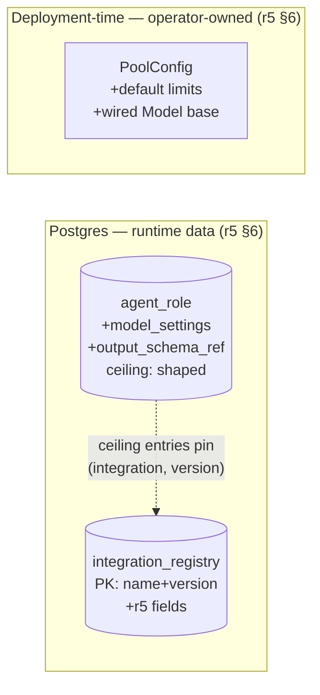
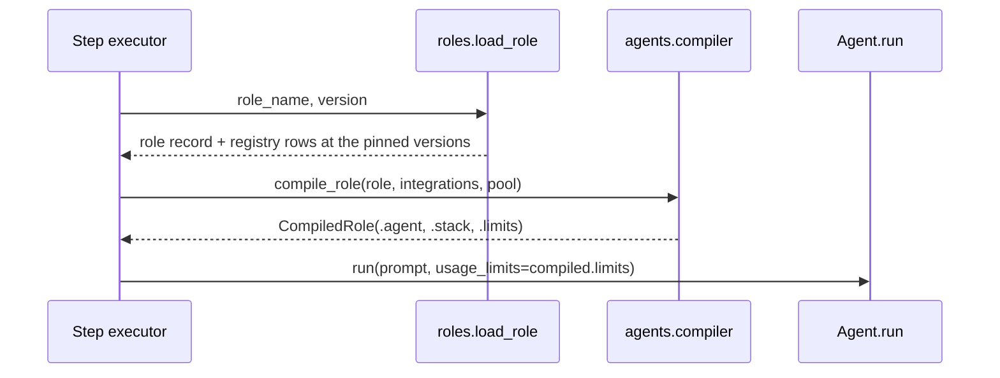

# Architecture Change — role configuration and the compiler's seams

**STATUS: PLANNED** — nothing here is built. `src/ced/agents/` is empty.
[`../README.md`](../README.md) § What is built is the current map.

**Decision ratified 2026-09-21:** closing `agent_role` and `integration_registry` to
the record shapes `worker-runtime.md` r5 ratifies, accept the four construction
seams the compiler needs, and accept the four r5 deviations
[ADR-0006](../../adr/0006-four-r5-deviations-for-phase-1.md) records, as the
precondition for building `walking-skeleton-role-compilation`.

**Author(s):** eugenelim
**Status:** Ratified
**Last updated:** 2026-09-21
**Reviewers:** eugenelim

**Baseline — current architecture:**
[`../pydantic-ai-worker-runtime/worker-runtime.md`](../pydantic-ai-worker-runtime/worker-runtime.md)
(r5, ratified 2026-09-18). Its § 6 "Two kinds of configuration, deliberately not
one" gives the `agent_role` record shape and assigns pool configuration to
deployment time; its § 4 gives the integration-registry block, the binding rule
and where instructions live; its § 2 carries the R-catalogue. Everything
unchanged is linked, not restated.

**Governing decision:** owner ruling of 2026-09-20 to run a design pass before
further spec work, recorded in
[`../../specs/walking-skeleton-role-compilation/notes/pre-execute-gate-findings.md`](../../specs/walking-skeleton-role-compilation/notes/pre-execute-gate-findings.md).

## 1. Scope and Baseline

What is changing, and what baseline does this delta assume?

| Delta item | In scope | Why it's changing |
| --- | --- | --- |
| `agent_role` record shape | yes | Six compile-time guards read attributes no column carries |
| `agent_role.ceiling` entry shape | yes | The column ships; its entry shape is unspecified, and r5 § 2 R1 requires each binding to name the integration and its pinned version |
| `integration_registry` record shape and key | yes | The shipped table carries `trust_class`, an unshaped `config` and `owner_scope`; r5 § 4 specifies the full record, and `walking-skeleton-step-lifecycle`'s AC-0248 reads two missing fields |
| Compiler construction seams | yes | Nothing states where the compiler's inputs come from |
| `PoolConfig` fields | yes | r5 § 6 assigns the default usage limits and the wired `Model` to deployment time; neither exists |
| Where resolved usage limits are applied | yes | `Agent.__init__` accepts no `usage_limits` |
| Four recorded r5 deviations | yes | § 4 lists them; [ADR-0006](../../adr/0006-four-r5-deviations-for-phase-1.md) owns them |
| The toolset stack's composition and order | no | Baseline § 2, unchanged |
| The decision point's position and fail-closed posture | no | Baseline § 4, unchanged |
| The quarantine boundary's guarantee | no | Baseline § 1 scope table routes it upstream to r8 |
| Event log, privilege split, lease protocol, pool | no | [`../README.md`](../README.md) § What is built |

A reader would wrongly assume the toolset stack changes. It does not: this delta
moves where the role's values live, not what the compiler does with them.

## 2. Structural Change

Which elements change, and which are linked because they do not?

| Element | Change type | Baseline reference |
| --- | --- | --- |
| `agent_role.model_settings` | added | r5 § 6, `model_settings → model id, temperature, max_tokens, usage limits` |
| `agent_role.output_schema_ref` | added | r5 § 6 |
| `agent_role.display_name` | added | r5 § 6 |
| `agent_role.ceiling` entry shape | specified | r5 § 6 `tool_allowlist[]`; r5 § 2 R1 binding rule |
| `integration_registry` primary key | modified | r5 § 4, "a version in use is immutable" |
| `integration_registry` — `version`, `kind`, `adapter_ref`, `connection_ref`, `credential_scope`, `arg_schema`, `ceiling_fragment` | added | r5 § 4 registry block |
| `integration_registry.config` | deprecated | Superseded by the shaped columns; see § 5 |
| `ced.adapters.postgres.roles` | new | `load_role(role_name, version)` for one role and its pinned registry rows; `list_roles()` and `list_integration_tools()` for AC-0233, which must read the tables |
| `ced.agents.compiler` | new | Baseline § 8 names `src/ced/agents/` designed and empty. Holds the two-entry `output_schema_ref` mapping as a dict, not a module |
| `ced.agents.models` | new | Calls `PoolConfig.model_factory` with the role's `model_id` after checking `CED_POOL_ALLOWED_MODEL_IDS`, which is where AC-0251 is enforced. It selects no implementation — r5 § 2 R3 keeps that deploy-time |
| `PoolConfig` — `default_limits`, `allowed_model_ids`, `model_factory` | modified | r5 § 6; `allowed_model_ids` from r5 § 2 R5. **The annotation is indirected, and the seam's shape is not.** `PoolConfig` lives in `src/ced/worker/pool.py`, and `tests/architecture/dependency_direction.py` admits a `pydantic_ai` name only in `agents/` and `adapters/` — its AST walk reaches a `TYPE_CHECKING`-guarded import too, so `model_factory: Callable[[str], Model]` written literally here reds the offline gate and breaks the role-compilation spec's own `Never do`. The field is therefore typed by a `Protocol` declared in `worker/` that names no framework type, and `pydantic_ai.models.Model` appears only in `ced.agents.models`, which supplies the factory. Only where the framework name is written moves |
| The containment engine and r5 § 4's canonicalizer | out of scope | Owned by [`walking-skeleton-authority-containment`](../../specs/walking-skeleton-authority-containment/spec.md), which builds the decision point's predicate |
| `agent_role.instructions` | unchanged | Diverges from r5 § 4; see § 4 and § 5 |
| `agent_role.pool_class` | unchanged | Ships already; r5 § 6's guard reads it against `integration_registry.pool_classes` |
| `agent_role.owner_scope`, `integration_registry.owner_scope` | unchanged | Migration 0002's one-way door; read by nothing here |



The binding lives inside `ceiling` rather than an association table because r5
§ 4 requires the pinned version to travel with the predicates R5 re-verifies
against it. Each entry is
`{integration_name, integration_version, tool_name, predicates}`, which
supersedes the shipped column comment's "the compiler owns its shape": the
predicate half moves to the spec that evaluates it, the binding half stays.

r5 § 4 calls the identifier `integration_id`; the shipped column is
`integration_name`, and the column name governs. No new table means no new
grant, which matters because migration 0001 grants `SELECT` per table and a
schema check run as the migration owner would not catch a missing one.

Three fields Phase 1 never reads — `connection_ref`, `credential_scope`,
`adapter_ref` — are added nullable. `AGENTS.md` § Cut before adding exempts an
explicit accepted requirement, r5 § 4 makes `credential_scope` load-bearing for
the least-privilege posture, and a registry half-matching its ratified shape is
what produced the sibling spec's AC-0248 defect.

## 3. Runtime Change

How does the compile path differ from the baseline?

| Journey | Change type | Baseline reference |
| --- | --- | --- |
| Compile a role before the model call | specified | r5 § 2, R1–R2 |
| Resolved usage limits reach the model call | new | No baseline path |
| A guard refuses, or an integration does not resolve at its pinned version | new | r5 § 2, R2 — a step failure, never a smaller toolset |



On the refusal path `compile_role` raises rather than returning, so no caller
holds a partially compiled agent, and the executor appends a compile-refusal
event — which is what distinguishes a bad role file from a runtime fault.
**Naming the refusing guard is deferred**, and the reason is the envelope:
migration 0001's `events` table carries `run_id`, `seq`, `type`, `step_id`,
`agent_role`, `principal`, `payload_ref`, `idempotency_key` and
`schema_version`, and no column among them holds a guard identity. The spec
that opens the payload-object write path owns that half;
`walking-skeleton-role-compilation`'s AC-0261 asserts what the shipped envelope
can carry, which is that the event is distinguishable from a runtime fault and
names the failing role. A record the loader rejects is appended with its own
event type rather than as a step fault — **the type must satisfy the shipped
`events_type_is_canonical` CHECK, `^[a-z0-9]+(\.[a-z0-9]+)+$`, and that pattern
is the constraint — not any example of it.** Each dot-separated segment is
lowercase alphanumeric only: no underscore, no hyphen, which is why
migration 0001's own comment records the admitted set being narrowed off
`tool_invoked` and `tool-invoked`. `role.load.failed` satisfies it;
`role.load_failed` does not, and neither does the bare string `load_role`,
for which the envelope has no `stage` column either. Check a proposed type
against the pattern rather than against a previous example: both earlier
values written here failed it.

`CompiledRole` carries `.limits` because the framework takes `usage_limits` per
call, not per agent — the pinned 2.45.0's `Agent.__init__` has no such
parameter. Without a named carrier a test that passes limits itself goes green
while production bounds nothing.

## 4. Contract and Invariant Change

Which guarantees change?

| Invariant | Change type | Owner |
| --- | --- | --- |
| A quarantined role's four properties are constructed | clarified | This change; derivation below |
| Spend is bounded before the request is sent | **suspended** | [ADR-0006](../../adr/0006-four-r5-deviations-for-phase-1.md) D1; r5 carries the erratum |
| Instruction text is content-addressed and answerable from the event log alone | **suspended** | [ADR-0006](../../adr/0006-four-r5-deviations-for-phase-1.md) D2 |
| A `free-text` integration is bindable, to a quarantined role only | **narrowed to unreachable** | [ADR-0006](../../adr/0006-four-r5-deviations-for-phase-1.md) D3 |
| Effective limits narrow, never widen | **replaced** | [ADR-0006](../../adr/0006-four-r5-deviations-for-phase-1.md) D4; r5 carries the erratum |
| The decision point refuses until a predicate exists | unchanged | Baseline § 4 |
| An unresolvable integration is a step failure | unchanged | Baseline § 2, R2 |

**Role class is derived, not declared: a role is quarantined exactly when its
`ceiling` is empty.** r5 § 7 gives three constructed properties — an empty toolset, tool and output
retry budgets of zero, and a closed-vocabulary output type — and r5 § 4 gives
the fourth, that a quarantined role resolves no integrations at all. An empty ceiling entails the first and the fourth directly — nothing to bind is
nothing to resolve.

The compiler applies the retry budgets and the output type as consequences of
the same derivation. A
role with an empty ceiling whose `output_schema_ref` is anything other than
`reference-selection` fails to compile; the compiler never overrides a declared
value, because a silent override makes the record and the agent disagree.

Nothing is declared, so r5 § 4's "`trust_class` is a construction, not a
declaration" is satisfied rather than circumvented — that rule bites on a label
standing in for a parse of output.

AC-0219 today asserts that a quarantined role resolves no integrations, which
is tautological once the class is defined by an empty allowlist. § 8 asks that
it be reworded to the two consequences the derivation leaves contentful: no
domain tools on the compiled stack, and the closed-vocabulary output type.
AC-0205 already asserts both retry budgets.

## 5. Data/State Migration

What changes in stored state?

| Change | Shape | Note |
| --- | --- | --- |
| `agent_role.model_settings` | `jsonb NOT NULL DEFAULT '{}'::jsonb` | Keys below. `model_id` is required; a record without it fails to load. The default exists only so the `ADD COLUMN` succeeds |
| `agent_role.output_schema_ref` | `text NOT NULL DEFAULT 'finding-set'` | A closed-set name, not a hash; members below |
| `agent_role.display_name` | `text` | Read by nothing here; taken because r5 § 6 ratifies it and the column is free on an empty table |
| `agent_role.ceiling` entries | `[{integration_name, integration_version, tool_name, predicates}]` | Binding fields only; no DDL change. The canonical empty value is `[]`; `{}` or any non-array fails to load, so role class never turns on a loader accident. `predicates`' shape is out of scope — see below |
| `integration_registry` currency and immutability | A ceiling entry's pinned `(integration_name, integration_version)` is the only way a version is selected — there is no "current version" concept, so nothing is ambiguous when a second version exists, and `list_integration_tools()` spans every row because AC-0233 enumerates the whole tool surface rather than the bound subset. r5 § 4's "a version in use is immutable" needs enforcement this delta does not build: `walking-skeleton-step-lifecycle` owns it, since AC-0248 depends on it | Stated here, built there |
| `integration_registry` PK | `(integration_name, version)` | **Not a plain `ADD COLUMN`.** Trivial on today's empty table, a rewrite on a populated one. A failure leaves the old key and the revision unapplied: it runs in one transaction |
| `integration_registry.pool_classes` | `jsonb NOT NULL DEFAULT '[]'::jsonb`, pool-class names; empty means every class | The other half of r5 § 6's sixth guard — the compiler refuses a role whose integrations are not all available to its `pool_class`, which already ships |
| `integration_registry.tools` | `jsonb`, nullable with **no default**, an array of tool names | What `list_integration_tools()` reads, making AC-0233's enumeration a table read. A default of `'[]'` would make every row inserted without it born valid and unloadable; nullable-with-no-default makes the omission visible where it happens. A non-array or an empty array fails to load, and a ceiling entry naming a `tool_name` absent from the pinned row fails to compile |
| `integration_registry` new columns | `version integer NOT NULL DEFAULT 1`, `arg_schema jsonb NOT NULL DEFAULT '{}'::jsonb`, `ceiling_fragment jsonb NOT NULL DEFAULT '{}'::jsonb`, `kind text`, `adapter_ref text`, `connection_ref text`, `credential_scope text` | |
| `integration_registry.config` | left in place, unread, deprecated | No backfill: the table is empty. Dropping it is a later contract change |
| Grants | none needed | Both tables carry `GRANT SELECT … TO app_api, app_worker` from migration 0001 |

`model_settings` carries three keys:

```
{"model_id": str,
 "settings": {"max_tokens": int, "temperature": float, "thinking": False},
 "limits":   {"per_request_input_tokens_limit": int,
              "input_tokens_limit":             int,
              "request_limit":                  int,
              "tool_calls_limit":               int}}
```

**The compiler sets `thinking=False` on every compiled role and refuses a role
declaring anything else.** Omission leaves the model's default, which may
reason, so refusing only truthy declarations would not give r5 § 4's
"`thinking=False` asserted at compile time". That row's second half — stripping
reasoning parts before serializing — is `walking-skeleton-step-lifecycle`'s.

`per_request_input_tokens_limit` is the ceiling AC-0246 reads, not
`input_tokens_limit`: the latter is cumulative across a run and cannot bound a
single request. `count_tokens_before_request` enforces both ahead of time, so
the distinction is the window each bounds, not when it is checked.
`output_tokens_limit` and `total_tokens_limit` are excluded, and the ground is
**not** that neither is knowable before the request — that reading does not
survive the pinned version. On 2.45.0, `UsageLimits.check_before_request`
carries a `total_tokens_limit` arm that raises against run-to-date usage before
the next request is issued, and `check_tokens` enforces both
`output_tokens_limit` and `total_tokens_limit` after every response. Both are
enforceable bounds this configuration declines to set. They are excluded
because Phase 1 issues no provider call outside
[`walking-skeleton-step-lifecycle`](../../specs/walking-skeleton-step-lifecycle/spec.md)'s
AC-0223, so neither has anything to bound here;
[ADR-0006](../../adr/0006-four-r5-deviations-for-phase-1.md) D1 records the
residual output- and total-token exposure that leaves, alongside the suspended
pre-request input bound.

`cost_limit` is excluded because ADR-0006 D1 suspends the pre-request spend
bound it would serve. The exclusion assumes AC-0246's reworded text, which § 8
asks for.

**A role value wider than the pool default is a compile failure; a narrower one
compiles to its own value; a key absent from the role inherits the pool's.**
That is the strict reading, recorded as
[ADR-0006](../../adr/0006-four-r5-deviations-for-phase-1.md) D4 because it
replaces r5 § 4's `min()` formula rather than implementing it.

All four keys are integers and all four compare. Retry budgets are not
declarable: the compiler sets both to zero for a quarantined role and leaves the
framework default otherwise.
`count_tokens_before_request` is pool-owned: the pool supplies it from
`CED_POOL_DEFAULT_LIMITS`, and a role declaring it fails to compile.

**The encodings of `arg_schema`, `ceiling_fragment` and a ceiling entry's
`predicates` are out of scope.** They are read by the decision point's predicate
and by R5's re-verification, both
[`walking-skeleton-authority-containment`](../../specs/walking-skeleton-authority-containment/spec.md)'s.
No guard here reads them: the `thinking` rule, the model-id and pool-class
checks, the limit comparison, the output-type name and the quarantined
derivation read `model_settings`, `output_schema_ref`, `pool_class` or the
ceiling's emptiness.

That encoding is a live decision crossing the authorization trust boundary, so
the `architect-design` rubric's `D1` and `D2` give it its own treatment. This
delta adds the columns — r5 § 4 ratifies them, AC-0248 reads `arg_schema` — and
leaves their shape to the spec that evaluates them, fixing only the ceiling
entry's *binding* fields: `integration_name`, `integration_version`,
`tool_name`.

The output-contract set has two members: `reference-selection`, the
closed-vocabulary type the quarantined role's derivation requires, and
`finding-set`, the analysis role's typed result. A name outside the set fails to
compile. A permissive third member would be the only way a planning role could
obtain an unparsed `str`, so the spec that needs one for a widening
demonstration adds it with the criterion that reads it.

Every added column is nullable or defaulted: `ALTER TABLE … ADD COLUMN … NOT
NULL` without a default errors on a non-empty table, which is why migration
0002's `owner_scope` widening used `NOT NULL DEFAULT 'default'`. The revision is
expand-only with no downgrade, matching both shipped revisions and
[`../../../AGENTS.md`](../../../AGENTS.md) § Build and test commands.

`output_schema_ref` holds a closed-set name rather than r5 § 4's content hash,
and `instructions` stays inline: both need the object-store write path
`walking-skeleton-step-lifecycle` introduces. ADR-0006 D2 records it.

## 6. Deployment/Operational Change

What must an operator do differently?

| Surface | Change | Consequence if missed |
| --- | --- | --- |
| `CED_POOL_DEFAULT_LIMITS` | new, required. A JSON object in the `limits` shape above | A worker that cannot start |
| `CED_POOL_ALLOWED_MODEL_IDS` | new, required. A JSON array of model ids; an id absent from it fails AC-0251 | A worker that cannot start |
| `deploy/compose.yaml` | both worker services | `restart: "no"` keeps a failed worker dead, and `tests/fault_injection` fails its two-worker precondition |
| `AGENTS.md` § Running the two deployables | the documented `ced-worker` invocation | A developer follows the documented command and it fails |
| `tests/worker/test_pool_paths.py` | four `PoolConfig(...)` constructions | The offline suite fails |
| A role that stops compiling | the compiler raises; the executor appends a compile-refusal event naming the failing role, distinguishable by type from a runtime fault. Naming the refusing *guard* is deferred — the `events` envelope has no column for it; see § 3 | An operator cannot tell a bad role file from a runtime fault |

Both variables are required with no in-code default: r5 § 6 assigns these to
deployment-time configuration whose change alters failure behaviour, and a
silent default is a spend bound nobody chose. That is what makes the first five
surfaces move together.

Compilation happens at step start, so every refusal here is a production event
as well as a test assertion. The guards reading only the role record are also
checkable offline before deploy; those reading the registry need the pinned
rows.

## 7. Quality Regression and Verification

Does the change hold the baseline's quality posture?

| Attribute | Scenario and measure | Verified by |
| --- | --- | --- |
| Inspectability ([r8](../inspectable-multi-agent-diligence/runtime-architecture.md) § 1, first) | One `SELECT` on `agent_role` returns the model id, the four declarable limits, the output-contract name and the ceiling | A loader test asserting all four from one row |
| Untrusted-content boundary (r8 § 1, second) | A compiled quarantined role carries zero domain tools, both retries at zero, and `reference-selection` | AC-0219 and AC-0205 on the compiled agent |
| Reviewable deploy | A role declaring any of the four integer limits above the pool default fails to compile; a narrower one compiles to its own value | AC-0206, offline against a role file and a pool-default fixture |
| Spend bound (r5 § 7, Cost) | **Regressed for Phase 1.** `request_limit` and `tool_calls_limit` bound a runaway loop after the tokens are spent, not before | AC-0246 against the counting stub only; no production verification until ADR-0006 D1's condition is met |

ADR-0006 § Context holds the mechanism and the Bedrock constraint. Only the test
path belongs here: a counting stub sets `count_tokens_before_request`, which is
how AC-0246 exercises the ceiling without a provider.

## 8. Build Mapping

Who builds each part?

| Item | Spec |
| --- | --- |
| Migration, loader, compiler, `models`, `PoolConfig` fields, the operational surfaces | `walking-skeleton-role-compilation` |
| AC-0246 against the counting stub, and its rewording from *cost ceiling* to *per-request input-token ceiling*; AC-0219's rewording to the two consequences § 4 names; AC-0204's rewording from *enables thinking* to *declares any `thinking` value other than `False`, including omitting the key* | `walking-skeleton-role-compilation` |
| Applying `CompiledRole.limits` at the call | `walking-skeleton-step-lifecycle` |
| Re-deriving the Bedrock IAM shape, then lifting ADR-0006 D1 | `walking-skeleton-step-lifecycle` |
| Content-hash conversion for `instructions` and `output_schema_ref`, then lifting ADR-0006 D2 | `walking-skeleton-step-lifecycle` |
| Stripping reasoning parts before serializing, r5 § 4's second half | `walking-skeleton-step-lifecycle` |
| Two further criteria asserting ADR-0006 D1's and D2's return conditions | `walking-skeleton-step-lifecycle` |
| Amending `0001_base_schema.py`'s `ceiling` column comment, which assigns the predicate shape to this spec, to name `walking-skeleton-authority-containment` | `walking-skeleton-role-compilation` |
| Replacing § Testing Strategy's free-text paragraph with a citation of ADR-0006 D3 | `walking-skeleton-role-compilation` |

**Criterion placement has landed.** `walking-skeleton-role-compilation` no
longer carries AC-0222 or AC-0242.

This design asks that both move to `walking-skeleton-step-lifecycle`, under
[`../../specs/README.md`](../../specs/README.md) § Cutting one outcome into
several specs, since neither can be observed without a running step. It also
asks for two new criteria there: one putting the runtime's parser on a
quarantined agent's own output, one asserting a planning role's context by
destination rather than provenance.

Both moved to `walking-skeleton-step-lifecycle`, which also gained AC-0255,
AC-0256 and AC-0263 and a T5 owning the context assembler they fail through.
A builder should still read the live specs, which are authoritative over this
row.
